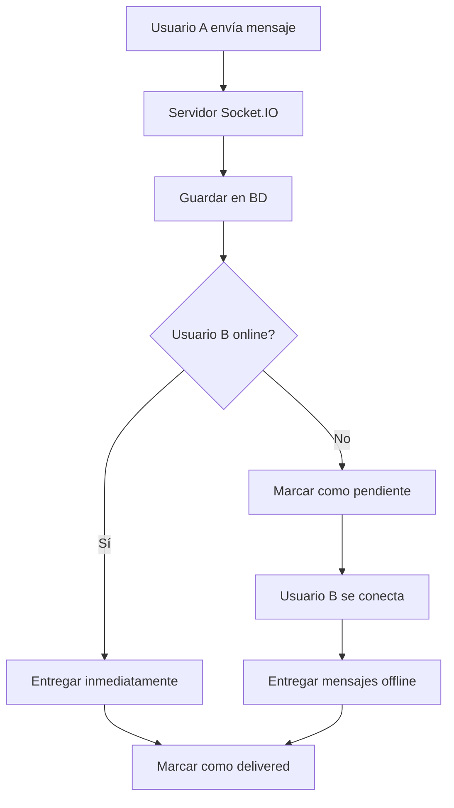

# 📱 Sistema de Mensajes Persistentes - Offline Message Delivery

## ⚡ Problema Resuelto

**Antes:** Los mensajes solo se entregaban si ambos usuarios estaban conectados simultáneamente.

**Después:** Los mensajes se guardan en la base de datos y se entregan automáticamente cuando el usuario se conecta.

---

## 🚀 Funcionalidades Implementadas

### **1. Persistencia de Mensajes**
- ✅ **Guardado automático** en base de datos
- ✅ **Entrega garantizada** aunque el receptor esté offline
- ✅ **Estados de mensaje** (sent → delivered → read)
- ✅ **Sincronización** al reconectarse

### **2. Entrega de Mensajes Offline**
- ✅ **Detección automática** de mensajes pendientes
- ✅ **Entrega en lote** para mejor performance
- ✅ **Prevención de duplicados** en el cliente
- ✅ **Marcado de entrega** automático

### **3. Estados de Mensaje**
```typescript
type MessageStatus = 'sending' | 'sent' | 'delivered' | 'read';
```

- **sending**: Mensaje siendo enviado
- **sent**: Guardado en base de datos
- **delivered**: Entregado al cliente receptor
- **read**: Leído por el receptor

---

## 🏗️ Arquitectura del Sistema

### **Flujo de Mensajes:**



### **Componentes Principales:**

1. **Server.js**: Manejo de Socket.IO y persistencia
2. **deliverOfflineMessages()**: Función de entrega offline
3. **simple-page.tsx**: Cliente con manejo de mensajes offline
4. **mark-delivered API**: Endpoint para marcar entrega

---

## 📁 Archivos Modificados

### **Backend:**
- **`server.js`**
  - Persistencia en base de datos con Supabase
  - Función `deliverOfflineMessages()`
  - Entrega en lote de mensajes offline
  - Auto-marcado de entrega

- **`app/api/messages/mark-delivered/route.ts`**
  - Endpoint para marcar mensajes como entregados
  - Estadísticas de entrega por conversación
  - Autenticación segura

### **Frontend:**
- **`app/messages/simple-page.tsx`**
  - Manejo de eventos `offline-message` y `offline-messages-batch`
  - Función `markMessagesAsDelivered()`
  - Prevención de duplicados
  - Auto-scroll en mensajes offline

### **Base de Datos:**
- **`sql/add_delivered_at_field.sql`**
  - Migración para campo `delivered_at`
  - Índices para consultas optimizadas
  - Actualización de mensajes existentes

---

## 🔧 Configuración

### **1. Variables de Entorno**
```env
NEXT_PUBLIC_SUPABASE_URL=your_supabase_url
SUPABASE_SERVICE_ROLE_KEY=your_service_role_key
```

### **2. Migración de Base de Datos**
```sql
-- Ejecutar la migración
\i sql/add_delivered_at_field.sql
```

### **3. Configuración del Server**
```bash
# Usar servidor Socket.IO
npm run dev:socket
# o
node server.js
```

---

## 🧪 Casos de Uso

### **Escenario 1: Usuario Offline**
1. Usuario A envía mensaje a Usuario B (offline)
2. Mensaje se guarda en BD con `delivered_at = null`
3. Usuario B se conecta más tarde
4. `deliverOfflineMessages()` encuentra mensajes pendientes
5. Mensajes se entregan automáticamente
6. `delivered_at` se actualiza en BD

### **Escenario 2: Usuario Online**
1. Usuario A envía mensaje a Usuario B (online)
2. Mensaje se guarda en BD
3. Socket.IO entrega inmediatamente
4. Cliente B recibe y marca como entregado

### **Escenario 3: Múltiples Mensajes Offline**
1. Usuario A envía 10 mensajes mientras B está offline
2. Usuario B se conecta
3. Mensajes se entregan en lote (`offline-messages-batch`)
4. Cliente optimiza la actualización de UI
5. API marca todos como entregados de una vez

---

## 📊 Métricas y Monitoreo

### **Logs del Servidor:**
```
📬 Verificando mensajes offline para usuario: user-123
📬 Entregando 5 mensajes offline a user-123
✅ 5 mensajes offline entregados a user-123
```

### **Estadísticas de Entrega:**
```javascript
GET /api/messages/mark-delivered?conversationId=123

{
  "total": 15,
  "delivered": 12,
  "read": 8,
  "pending": 3
}
```

---

## 🚀 Beneficios

1. **📱 Experiencia Móvil**: Como WhatsApp/Telegram
2. **🔄 Confiabilidad**: Mensajes nunca se pierden
3. **⚡ Performance**: Entrega en lote optimizada
4. **📊 Visibilidad**: Estados claros de mensaje
5. **🔒 Seguridad**: Autenticación en todos los endpoints

---

## 🔄 Próximas Mejoras

- [ ] **Push Notifications** para usuarios completamente offline
- [ ] **Read Receipts** (confirmación de lectura)
- [ ] **Typing Indicators** persistentes
- [ ] **Message Reactions** con entrega offline
- [ ] **File Attachments** con delivery tracking
- [ ] **Message Search** en mensajes offline

El sistema ahora garantiza que **ningún mensaje se pierde** y todos los usuarios reciben sus mensajes independientemente de cuándo se conecten. 🎉
