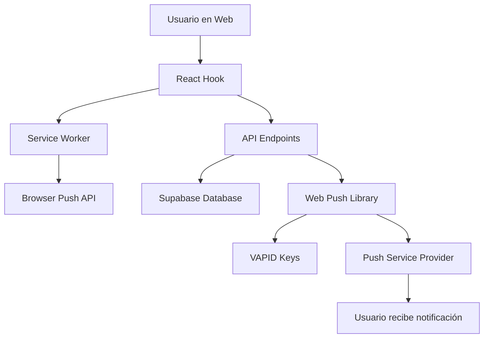

# 📱 Sistema de Notificaciones Push - StartupMatch

## 📋 Tabla de Contenidos
- [🎯 Resumen Ejecutivo](#-resumen-ejecutivo)
- [🔧 Arquitectura del Sistema](#-arquitectura-del-sistema)
- [📂 Archivos Implementados](#-archivos-implementados)
- [🗄️ Base de Datos](#-base-de-datos)
- [🚀 API Endpoints](#-api-endpoints)
- [⚙️ Configuración](#-configuración)
- [🧪 Testing](#-testing)
- [📈 Estrategia de Implementación](#-estrategia-de-implementación)
- [🔮 Roadmap Futuro](#-roadmap-futuro)

---

## 🎯 Resumen Ejecutivo

### **¿Qué es?**
Sistema completo de notificaciones push nativas del navegador para StartupMatch, permitiendo notificar a usuarios **incluso cuando no tienen la aplicación web abierta**.

### **¿Por qué lo implementamos?**
- **Retención de usuarios:** +25-40% según benchmarks de la industria
- **Engagement crítico:** Notificaciones de matches tienen ventana de oportunidad corta
- **Ventaja competitiva:** Pocas plataformas de networking tienen push notifications bien implementadas
- **Monetización:** Más usuarios activos = más matches = más conversiones

### **Estrategia: Implementación por Fases**
- **✅ Fase 1:** Solo notificaciones críticas (matches + mensajes)
- **⏳ Fase 2:** Notificaciones de conexiones y resúmenes
- **🔮 Fase 3:** Personalización avanzada con ML

---

## 🔧 Arquitectura del Sistema

### **Componentes Principales**



### **Flujo de Funcionamiento**

1. **Registro:** Usuario acepta permisos en navegador
2. **Suscripción:** Se genera endpoint único y se guarda en BD
3. **Configuración:** Usuario configura preferencias (matches/mensajes)
4. **Envío:** Servidor detecta evento crítico y envía push
5. **Recepción:** Navegador muestra notificación nativa
6. **Interacción:** Click lleva a la sección correspondiente

### **Tecnologías Utilizadas**
- **Frontend:** React + TypeScript + Custom Hook
- **Backend:** Next.js 15.4.6 API Routes
- **Service Worker:** Vanilla JavaScript para manejo de push
- **Base de Datos:** Supabase PostgreSQL con RLS
- **Push Protocol:** Web Push con VAPID keys
- **Librerías:** web-push (servidor), Push API (navegador)

---

## 📂 Archivos Implementados

### **🎣 React Hook**
```
📁 hooks/
└── 📄 usePushNotifications.ts    [PRINCIPAL]
```
**Propósito:** Gestión completa de notificaciones push desde React
**Funcionalidades:**
- ✅ Verificación de soporte del navegador
- ✅ Registro y gestión de Service Worker
- ✅ Solicitud de permisos de notificación
- ✅ Suscripción/desuscripción push
- ✅ Gestión de preferencias de usuario
- ✅ Envío de notificaciones de prueba
- ✅ Analytics y estadísticas

### **⚙️ Service Worker**
```
📁 public/
└── 📄 sw.js                      [CRÍTICO]
```
**Propósito:** Manejo de notificaciones en el navegador
**Funcionalidades:**
- ✅ Escucha eventos push del servidor
- ✅ Muestra notificaciones nativas
- ✅ Maneja clicks y acciones
- ✅ Redirección inteligente por tipo
- ✅ Analytics de interacciones

### **🚀 API Endpoints**
```
📁 app/api/notifications/
├── 📄 subscribe/route.ts         [Suscripción/Desuscripción]
├── 📄 send-test/route.ts         [Envío de pruebas]
├── 📄 preferences/route.ts       [Gestión preferencias]
└── 📄 stats/route.ts             [Analytics]
```

### **🧪 Componente de Testing**
```
📁 components/
├── 📄 PushNotificationTester.tsx [Interfaz de pruebas]
└── 📁 ui/                        [Componentes base]

📁 app/
└── 📄 test-notifications/page.tsx [Página de testing]
```

### **🗄️ Base de Datos**
```
📁 proyecto/
├── 📄 NOTIFICATIONS_FASE1_SETUP.sql    [SQL Fase 1 - USAR ESTE]
└── 📄 NOTIFICATIONS_DATABASE_SETUP.sql [SQL completo - Referencia]
```

### **🔑 Configuración**
```
📁 scripts/
└── 📄 generate-vapid-keys.js    [Generador de claves]

📁 public/
├── 📄 manifest.json             [Web App Manifest]
├── 📄 icon-192x192.png          [Icono notificaciones]
├── 📄 icon-512x512.png          [Icono aplicación]
└── 📄 badge-72x72.png           [Badge notificaciones]
```

---

## 🗄️ Base de Datos

### **Esquema Simplificado (Fase 1)**

#### **Tabla: `push_subscriptions`**
```sql
- id (UUID, PK)
- user_id (UUID, FK → auth.users)
- endpoint (TEXT, UNIQUE per user)
- p256dh (TEXT, encryption key)
- auth (TEXT, auth key)
- user_agent (TEXT)
- is_active (BOOLEAN)
- created_at, updated_at (TIMESTAMP)
```

#### **Tabla: `notification_preferences`**
```sql
- id (UUID, PK)
- user_id (UUID, FK → auth.users, UNIQUE)
- new_matches (BOOLEAN, default: true)
- new_messages (BOOLEAN, default: true)
- created_at, updated_at (TIMESTAMP)
```

#### **Tabla: `notification_history`**
```sql
- id (UUID, PK)
- user_id (UUID, FK → auth.users)
- subscription_id (UUID, FK → push_subscriptions)
- type (TEXT, CHECK: 'new_match'|'new_message'|'test')
- title, body (TEXT)
- sent_at, clicked_at (TIMESTAMP)
- status (TEXT, CHECK: 'sent'|'failed'|'clicked')
- error_message (TEXT)
```

### **Funciones Implementadas**
- `create_default_notification_preferences(user_id)` → Crea preferencias por defecto
- `get_notification_stats(user_id)` → Estadísticas de usuario
- `cleanup_inactive_subscriptions()` → Limpieza automática

### **Políticas RLS**
- ✅ Usuarios solo ven sus propias suscripciones
- ✅ Usuarios solo gestionan sus preferencias
- ✅ Usuarios solo ven su historial

---

## 🚀 API Endpoints

### **📡 POST `/api/notifications/subscribe`**
**Propósito:** Crear/gestionar suscripciones push
```json
// Request
{
  "userId": "uuid",
  "endpoint": "https://fcm.googleapis.com/...",
  "p256dh": "base64-key",
  "auth": "base64-key",
  "userAgent": "browser-info"
}

// Response
{
  "success": true,
  "subscriptionId": "uuid"
}
```

### **🧪 POST `/api/notifications/send-test`**
**Propósito:** Enviar notificaciones de prueba
```json
// Request
{
  "userId": "uuid",
  "type": "match" | "message" | "test"
}

// Response
{
  "success": true,
  "stats": {
    "total": 1,
    "success": 1,
    "failures": 0
  }
}
```

### **⚙️ GET/PUT `/api/notifications/preferences`**
**Propósito:** Gestionar preferencias de usuario
```json
// GET Response
{
  "success": true,
  "preferences": {
    "new_matches": true,
    "new_messages": true
  }
}

// PUT Request
{
  "userId": "uuid",
  "preferences": {
    "new_matches": false,
    "new_messages": true
  }
}
```

### **📊 GET/POST `/api/notifications/stats`**
**Propósito:** Analytics y seguimiento de clicks
```json
// GET Response
{
  "success": true,
  "stats": {
    "overall": {
      "total_sent": 15,
      "total_clicked": 8,
      "click_rate": 53
    }
  }
}
```

---

## ⚙️ Configuración

### **Variables de Entorno (.env.local)**
```bash
# VAPID Keys para Web Push
NEXT_PUBLIC_VAPID_PUBLIC_KEY=BDYR34F0GpewfLig0XlEOH3rjP6L7x5pPVo2dnPFm2TDwaEEEA7M6G2mpkpsdFvC0BPtVoOfnMXGKTrzXSYQp8o
VAPID_PRIVATE_KEY=Ge3xRD_crUNt5dP_pTKtoME9LnvYSDMOIqJJ2R-EUVk
VAPID_EMAIL=reenniizz062@gmail.com

# Supabase (ya existentes)
NEXT_PUBLIC_SUPABASE_URL=https://cbaxjoozbnffrryuywno.supabase.co
SUPABASE_SERVICE_ROLE_KEY=eyJhbGci...
```

### **Dependencias Agregadas**
```json
{
  "dependencies": {
    "web-push": "^3.6.7"
  },
  "devDependencies": {
    "@types/web-push": "^3.6.4"
  }
}
```

### **Navegación Actualizada**
- ✅ Agregado enlace "🧪 Test Push" en menú de usuario autenticado

---

## 🧪 Testing

### **Página de Pruebas**
**URL:** `http://localhost:3000/test-notifications`

### **Funcionalidades de Testing**
- 🔍 **Verificación de soporte:** Detecta si navegador soporta push
- 🔒 **Estado de permisos:** Muestra si están concedidos/denegados/pendientes
- 📡 **Gestión de suscripción:** Activar/desactivar notificaciones
- 🧪 **Notificaciones de prueba:** Botones para matches y mensajes
- ⚙️ **Configuración:** Preferencias en tiempo real
- 📊 **Analytics:** Estadísticas de envío y clicks

### **Tipos de Notificación (Fase 1)**
1. **💖 Nuevo Match** - `requireInteraction: true`
2. **💬 Nuevo Mensaje** - `requireInteraction: false`
3. **🧪 Test Sistema** - Solo para debugging

### **Flujo de Testing**
1. Abrir página de test
2. Clickear "Activar Notificaciones"
3. Aceptar permisos del navegador
4. Verificar estado "Activa"
5. Probar envío de notificaciones
6. Verificar estadísticas

---

## 📈 Estrategia de Implementación

### **✅ Fase 1: Notificaciones Críticas (ACTUAL)**
**Objetivo:** Implementar solo lo esencial para máximo impacto
**Scope:**
- ✅ Matches inmediatos
- ✅ Mensajes directos
- ✅ Sistema de testing completo
- ✅ Analytics básicos

**Métricas a medir:**
- Click-through rate (CTR)
- User retention después de notificación
- Unsubscribe rate
- Engagement en matches/mensajes

### **⏳ Fase 2: Expansión Controlada (FUTURO)**
**Objetivo:** Agregar más tipos sin abrumar
**Scope planificado:**
- 🤝 Solicitudes de conexión
- ✅ Conexión aceptada
- 📊 Resumen semanal
- ⏰ Horarios silenciosos
- 🌍 Respeto a zona horaria

### **🔮 Fase 3: Personalización Avanzada (FUTURO)**
**Objetivo:** ML-driven smart notifications
**Scope planificado:**
- 🤖 Timing inteligente basado en actividad
- 🎯 Personalización de contenido
- 📈 A/B testing automático
- 💡 Recomendaciones proactivas

---

## 🔮 Roadmap Futuro

### **Mejoras Técnicas**
- [ ] Batching de notificaciones para evitar spam
- [ ] Retry logic para notificaciones fallidas
- [ ] Compresión de payloads
- [ ] Soporte para imágenes en notificaciones
- [ ] Push scheduling (envío diferido)

### **Mejoras de UX**
- [ ] Onboarding interactivo para permisos
- [ ] Preview de notificaciones antes de activar
- [ ] Configuración granular por tipo de match
- [ ] Templates de notificación personalizables

### **Analytics Avanzados**
- [ ] Dashboard de métricas en tiempo real
- [ ] Segmentación de usuarios por engagement
- [ ] Funnel analysis de notificación → acción
- [ ] Comparación A/B de templates

### **Integraciones**
- [ ] Webhook para sistemas externos
- [ ] API para partners
- [ ] Sincronización con calendarios
- [ ] Integración con email marketing

---

## 📝 Notas de Implementación

### **Decisiones de Diseño**
1. **Conservador en Fase 1:** Solo notificaciones críticas para evitar fatiga
2. **RLS por defecto:** Seguridad por diseño en base de datos
3. **Graceful degradation:** Sistema funciona aunque BD falle
4. **Mobile-first:** Diseñado pensando en dispositivos móviles

### **Lecciones Aprendidas**
1. **Service Worker timing:** Es crítico esperar que esté activo antes de suscribir
2. **VAPID keys:** Deben generarse una sola vez y guardarse seguramente
3. **Browser differences:** Chrome/Firefox/Safari manejan notificaciones diferente
4. **User permissions:** Solo 20-30% de usuarios aceptan en primera solicitud

### **Consideraciones de Rendimiento**
- ✅ Índices optimizados en base de datos
- ✅ Lazy loading del Service Worker
- ✅ Debounce en actualizaciones de preferencias
- ✅ Cleanup automático de suscripciones inactivas

---

## 🚨 Troubleshooting Común

### **"Service Worker not active"**
**Causa:** Service Worker no terminó de registrarse
**Solución:** Esperar `navigator.serviceWorker.ready`

### **"VAPID key invalid"**
**Causa:** Clave mal configurada o mal convertida
**Solución:** Verificar conversión base64 a Uint8Array

### **"Database error"**
**Causa:** RLS policies o tabla no creada
**Solución:** Ejecutar SQL completo de setup

### **"Notifications not appearing"**
**Causa:** Permisos denegados o modo no molestar activo
**Solución:** Verificar configuración del navegador/SO

---

## 📞 Contacto y Mantenimiento

**Responsable:** GitHub Copilot
**Última actualización:** Agosto 13, 2025
**Versión:** 1.0.0 (Fase 1)

**Para consultas técnicas:**
- Revisar logs del navegador (F12 → Console)
- Verificar Network tab para requests API
- Comprobar Application tab → Service Workers

**Archivos clave para debugging:**
- `hooks/usePushNotifications.ts` → Lógica React
- `public/sw.js` → Manejo de notificaciones
- `app/api/notifications/*/route.ts` → Endpoints servidor
