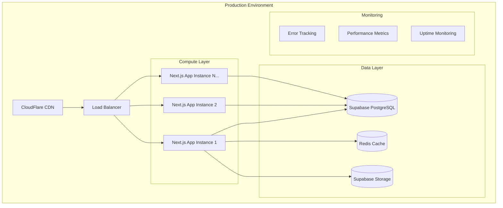

# 🚀 DEPLOYMENT ARCHITECTURE - StartupMatch

## 🏗️ **INFRASTRUCTURE OVERVIEW**

### **🎯 Architecture Philosophy**
StartupMatch utiliza una arquitectura cloud-native con enfoque en **scalabilidad automática**, **zero-downtime deployments** y **observabilidad completa**.



### **🌐 Environment Strategy**
```typescript
interface EnvironmentConfig {
  development: {
    domain: 'localhost:3000';
    database: 'supabase-local';
    storage: 'local-storage';
    monitoring: false;
  };
  staging: {
    domain: 'staging.startupmatch.app';
    database: 'supabase-staging';
    storage: 'supabase-staging-storage';
    monitoring: 'basic';
  };
  production: {
    domain: 'startupmatch.app';
    database: 'supabase-prod';
    storage: 'supabase-prod-storage';
    monitoring: 'full';
    cdn: 'cloudflare';
    ssl: 'required';
  };
}
```

---

## 🔄 **CI/CD PIPELINE**

### **GitHub Actions Workflow**
```yaml
# .github/workflows/deploy.yml
name: Deploy StartupMatch

on:
  push:
    branches: [main]
  pull_request:
    branches: [main]

env:
  NODE_VERSION: '18.x'

jobs:
  test:
    runs-on: ubuntu-latest
    steps:
      - uses: actions/checkout@v3
      - uses: actions/setup-node@v3
        with:
          node-version: ${{ env.NODE_VERSION }}
          cache: 'npm'
      
      - name: Install dependencies
        run: npm ci
      
      - name: Run type checking
        run: npm run type-check
      
      - name: Run linting
        run: npm run lint
      
      - name: Run unit tests
        run: npm run test:unit
      
      - name: Run integration tests
        run: npm run test:integration
        env:
          SUPABASE_URL: ${{ secrets.SUPABASE_URL }}
          SUPABASE_ANON_KEY: ${{ secrets.SUPABASE_ANON_KEY }}

  build:
    needs: test
    runs-on: ubuntu-latest
    steps:
      - uses: actions/checkout@v3
      - uses: actions/setup-node@v3
        with:
          node-version: ${{ env.NODE_VERSION }}
          cache: 'npm'
      
      - name: Install dependencies
        run: npm ci
      
      - name: Build application
        run: npm run build
        env:
          NEXT_PUBLIC_SUPABASE_URL: ${{ secrets.NEXT_PUBLIC_SUPABASE_URL }}
          NEXT_PUBLIC_SUPABASE_ANON_KEY: ${{ secrets.NEXT_PUBLIC_SUPABASE_ANON_KEY }}
      
      - name: Run bundle analysis
        run: npm run analyze

  deploy-staging:
    needs: [test, build]
    runs-on: ubuntu-latest
    if: github.ref == 'refs/heads/develop'
    steps:
      - uses: actions/checkout@v3
      - name: Deploy to Staging
        uses: vercel/action@v25
        with:
          vercel-token: ${{ secrets.VERCEL_TOKEN }}
          vercel-args: '--env staging'

  deploy-production:
    needs: [test, build]
    runs-on: ubuntu-latest
    if: github.ref == 'refs/heads/main'
    steps:
      - uses: actions/checkout@v3
      - name: Deploy to Production
        uses: vercel/action@v25
        with:
          vercel-token: ${{ secrets.VERCEL_TOKEN }}
          vercel-args: '--prod'
      
      - name: Run smoke tests
        run: npm run test:smoke
        env:
          APP_URL: https://startupmatch.app
      
      - name: Notify team
        uses: 8398a7/action-slack@v3
        with:
          status: ${{ job.status }}
          webhook_url: ${{ secrets.SLACK_WEBHOOK }}
```

### **Database Migration Pipeline**
```yaml
# .github/workflows/db-migrate.yml
name: Database Migration

on:
  push:
    paths: ['sql/migrations/**']

jobs:
  migrate-staging:
    runs-on: ubuntu-latest
    steps:
      - uses: actions/checkout@v3
      - name: Run migrations on staging
        run: |
          npm run db:migrate:staging
        env:
          SUPABASE_URL: ${{ secrets.SUPABASE_STAGING_URL }}
          SUPABASE_SERVICE_KEY: ${{ secrets.SUPABASE_STAGING_SERVICE_KEY }}
      
      - name: Validate migration
        run: npm run db:validate:staging

  migrate-production:
    needs: migrate-staging
    runs-on: ubuntu-latest
    if: github.ref == 'refs/heads/main'
    steps:
      - uses: actions/checkout@v3
      - name: Create backup
        run: npm run db:backup:prod
      
      - name: Run migrations on production
        run: npm run db:migrate:prod
        env:
          SUPABASE_URL: ${{ secrets.SUPABASE_PROD_URL }}
          SUPABASE_SERVICE_KEY: ${{ secrets.SUPABASE_PROD_SERVICE_KEY }}
      
      - name: Validate production migration
        run: npm run db:validate:prod
      
      - name: Health check
        run: npm run health-check
```

---

## 🏭 **INFRASTRUCTURE AS CODE**

### **Vercel Configuration**
```json
// vercel.json
{
  "version": 2,
  "framework": "nextjs",
  "buildCommand": "npm run build",
  "installCommand": "npm ci",
  "regions": ["iad1", "fra1", "hnd1"],
  "env": {
    "NEXT_PUBLIC_APP_URL": "@app-url",
    "NEXT_PUBLIC_SUPABASE_URL": "@supabase-url",
    "NEXT_PUBLIC_SUPABASE_ANON_KEY": "@supabase-anon-key"
  },
  "build": {
    "env": {
      "ANALYZE": "true"
    }
  },
  "functions": {
    "app/api/**": {
      "maxDuration": 30
    }
  },
  "headers": [
    {
      "source": "/(.*)",
      "headers": [
        {
          "key": "X-Content-Type-Options",
          "value": "nosniff"
        },
        {
          "key": "X-Frame-Options",
          "value": "DENY"
        },
        {
          "key": "X-XSS-Protection",
          "value": "1; mode=block"
        },
        {
          "key": "Strict-Transport-Security",
          "value": "max-age=63072000; includeSubDomains; preload"
        }
      ]
    },
    {
      "source": "/api/(.*)",
      "headers": [
        {
          "key": "Access-Control-Allow-Origin",
          "value": "https://startupmatch.app"
        },
        {
          "key": "Access-Control-Allow-Methods",
          "value": "GET, POST, PUT, DELETE, OPTIONS"
        }
      ]
    }
  ],
  "rewrites": [
    {
      "source": "/api/v1/(.*)",
      "destination": "/api/$1"
    }
  ],
  "redirects": [
    {
      "source": "/dashboard",
      "destination": "/app/dashboard",
      "permanent": false
    }
  ]
}
```

### **Environment Configuration**
```typescript
// config/environment.ts
interface Environment {
  APP_URL: string;
  SUPABASE_URL: string;
  SUPABASE_ANON_KEY: string;
  SUPABASE_SERVICE_KEY: string;
  REDIS_URL?: string;
  SENTRY_DSN?: string;
  ANALYTICS_ID?: string;
}

const environments: Record<string, Environment> = {
  development: {
    APP_URL: 'http://localhost:3000',
    SUPABASE_URL: process.env.NEXT_PUBLIC_SUPABASE_URL!,
    SUPABASE_ANON_KEY: process.env.NEXT_PUBLIC_SUPABASE_ANON_KEY!,
    SUPABASE_SERVICE_KEY: process.env.SUPABASE_SERVICE_ROLE_KEY!,
  },
  staging: {
    APP_URL: 'https://staging.startupmatch.app',
    SUPABASE_URL: process.env.NEXT_PUBLIC_SUPABASE_URL!,
    SUPABASE_ANON_KEY: process.env.NEXT_PUBLIC_SUPABASE_ANON_KEY!,
    SUPABASE_SERVICE_KEY: process.env.SUPABASE_SERVICE_ROLE_KEY!,
    REDIS_URL: process.env.REDIS_URL,
    SENTRY_DSN: process.env.SENTRY_DSN,
  },
  production: {
    APP_URL: 'https://startupmatch.app',
    SUPABASE_URL: process.env.NEXT_PUBLIC_SUPABASE_URL!,
    SUPABASE_ANON_KEY: process.env.NEXT_PUBLIC_SUPABASE_ANON_KEY!,
    SUPABASE_SERVICE_KEY: process.env.SUPABASE_SERVICE_ROLE_KEY!,
    REDIS_URL: process.env.REDIS_URL!,
    SENTRY_DSN: process.env.SENTRY_DSN!,
    ANALYTICS_ID: process.env.ANALYTICS_ID,
  }
};

export const getEnvironment = (): Environment => {
  const env = process.env.NODE_ENV || 'development';
  return environments[env] || environments.development;
};
```

---

## 📊 **MONITORING & OBSERVABILITY**

### **Performance Monitoring**
```typescript
// lib/monitoring.ts
import { Analytics } from '@vercel/analytics/react';
import * as Sentry from '@sentry/nextjs';

// Sentry Configuration
Sentry.init({
  dsn: process.env.SENTRY_DSN,
  tracesSampleRate: 0.1,
  environment: process.env.NODE_ENV,
  beforeSend(event) {
    // Don't send development errors
    if (process.env.NODE_ENV === 'development') {
      return null;
    }
    return event;
  },
});

// Custom Performance Metrics
export const trackPageLoad = (pageName: string, duration: number) => {
  if (typeof window !== 'undefined' && window.gtag) {
    window.gtag('event', 'page_load_time', {
      event_category: 'Performance',
      event_label: pageName,
      value: Math.round(duration),
    });
  }
};

export const trackUserAction = (action: string, metadata?: Record<string, any>) => {
  Sentry.addBreadcrumb({
    message: action,
    category: 'user_action',
    data: metadata,
    level: 'info',
  });
};
```

### **Health Check Endpoints**
```typescript
// app/api/health/route.ts
import { NextResponse } from 'next/server';
import { createClient } from '@supabase/supabase-js';

export async function GET() {
  const checks = {
    timestamp: new Date().toISOString(),
    status: 'healthy',
    version: process.env.npm_package_version || '1.0.0',
    environment: process.env.NODE_ENV,
    checks: {
      database: false,
      storage: false,
      redis: false,
    },
  };

  try {
    // Database Health Check
    const supabase = createClient(
      process.env.NEXT_PUBLIC_SUPABASE_URL!,
      process.env.SUPABASE_SERVICE_ROLE_KEY!
    );

    const { error: dbError } = await supabase
      .from('user_profiles')
      .select('id')
      .limit(1);
    
    checks.checks.database = !dbError;

    // Storage Health Check
    const { data: storageData, error: storageError } = await supabase.storage
      .from('avatars')
      .list('', { limit: 1 });
    
    checks.checks.storage = !storageError;

    // Redis Health Check (if available)
    if (process.env.REDIS_URL) {
      // Implement Redis health check
      checks.checks.redis = true;
    }

    const allHealthy = Object.values(checks.checks).every(Boolean);
    checks.status = allHealthy ? 'healthy' : 'degraded';

    return NextResponse.json(checks, {
      status: allHealthy ? 200 : 503
    });

  } catch (error) {
    return NextResponse.json({
      ...checks,
      status: 'unhealthy',
      error: error instanceof Error ? error.message : 'Unknown error'
    }, { status: 503 });
  }
}
```

### **Uptime Monitoring Script**
```bash
#!/bin/bash
# scripts/health-check.sh

APP_URL=${1:-"https://startupmatch.app"}
SLACK_WEBHOOK=${2:-""}

echo "🔍 Checking health of $APP_URL..."

# Check main app
RESPONSE=$(curl -s -o /dev/null -w "%{http_code}" "$APP_URL")
if [ "$RESPONSE" -eq 200 ]; then
    echo "✅ Main app is healthy"
else
    echo "❌ Main app returned $RESPONSE"
    if [ -n "$SLACK_WEBHOOK" ]; then
        curl -X POST -H 'Content-type: application/json' \
            --data '{"text":"🚨 StartupMatch main app is down! Status: '$RESPONSE'"}' \
            "$SLACK_WEBHOOK"
    fi
    exit 1
fi

# Check health endpoint
HEALTH_RESPONSE=$(curl -s "$APP_URL/api/health")
HEALTH_STATUS=$(echo "$HEALTH_RESPONSE" | jq -r '.status')

if [ "$HEALTH_STATUS" = "healthy" ]; then
    echo "✅ Health check passed"
else
    echo "❌ Health check failed: $HEALTH_STATUS"
    if [ -n "$SLACK_WEBHOOK" ]; then
        curl -X POST -H 'Content-type: application/json' \
            --data '{"text":"🚨 StartupMatch health check failed! Status: '$HEALTH_STATUS'"}' \
            "$SLACK_WEBHOOK"
    fi
    exit 1
fi

echo "🎉 All checks passed!"
```

---

## 🆘 **DISASTER RECOVERY**

### **Backup Strategy**
```typescript
// scripts/backup.ts
import { createClient } from '@supabase/supabase-js';
import AWS from 'aws-sdk';

const supabase = createClient(
  process.env.SUPABASE_URL!,
  process.env.SUPABASE_SERVICE_KEY!
);

const s3 = new AWS.S3({
  accessKeyId: process.env.AWS_ACCESS_KEY_ID,
  secretAccessKey: process.env.AWS_SECRET_ACCESS_KEY,
  region: 'us-east-1',
});

async function createBackup() {
  const timestamp = new Date().toISOString().replace(/[:.]/g, '-');
  
  try {
    // 1. Database Backup (via Supabase CLI)
    console.log('🗄️ Creating database backup...');
    const dbBackupCommand = `supabase db dump --db-url="${process.env.SUPABASE_DB_URL}" > backup_${timestamp}.sql`;
    
    // 2. Storage Backup
    console.log('📁 Creating storage backup...');
    const { data: files } = await supabase.storage
      .from('avatars')
      .list('', { limit: 1000 });

    // Upload backup metadata to S3
    await s3.upload({
      Bucket: 'startupmatch-backups',
      Key: `database/backup_${timestamp}.sql`,
      Body: 'DATABASE_BACKUP_PLACEHOLDER', // In real implementation, use actual backup data
    }).promise();

    console.log(`✅ Backup completed: backup_${timestamp}`);
    return { success: true, timestamp };
    
  } catch (error) {
    console.error('❌ Backup failed:', error);
    return { success: false, error };
  }
}

// Scheduled backup (run daily)
export async function scheduledBackup() {
  const result = await createBackup();
  
  if (!result.success) {
    // Notify team of backup failure
    await fetch(process.env.SLACK_WEBHOOK!, {
      method: 'POST',
      headers: { 'Content-Type': 'application/json' },
      body: JSON.stringify({
        text: `🚨 Daily backup failed: ${result.error}`
      }),
    });
  }
  
  return result;
}
```

### **Rollback Procedures**
```bash
#!/bin/bash
# scripts/rollback.sh

set -e

ROLLBACK_VERSION=${1:-""}
ENVIRONMENT=${2:-"production"}

if [ -z "$ROLLBACK_VERSION" ]; then
    echo "❌ Please specify rollback version"
    echo "Usage: ./rollback.sh <version> [environment]"
    exit 1
fi

echo "🔄 Rolling back to version $ROLLBACK_VERSION in $ENVIRONMENT..."

# 1. Rollback application
echo "📦 Rolling back application..."
vercel rollback --token="$VERCEL_TOKEN" --scope="startupmatch" "$ROLLBACK_VERSION"

# 2. Rollback database (if needed)
if [ -f "sql/rollback_${ROLLBACK_VERSION}.sql" ]; then
    echo "🗄️ Rolling back database..."
    psql "$DATABASE_URL" -f "sql/rollback_${ROLLBACK_VERSION}.sql"
fi

# 3. Verify rollback
echo "🔍 Verifying rollback..."
sleep 30  # Wait for deployment

RESPONSE=$(curl -s -o /dev/null -w "%{http_code}" "https://startupmatch.app")
if [ "$RESPONSE" -eq 200 ]; then
    echo "✅ Rollback successful!"
    
    # Notify team
    curl -X POST -H 'Content-type: application/json' \
        --data '{"text":"✅ StartupMatch rolled back to version '$ROLLBACK_VERSION' successfully"}' \
        "$SLACK_WEBHOOK"
else
    echo "❌ Rollback verification failed: $RESPONSE"
    exit 1
fi
```

---

## 🔧 **OPERATIONAL PROCEDURES**

### **Deployment Checklist**
```markdown
## Pre-Deployment Checklist ✅

### Development
- [ ] All tests pass locally
- [ ] TypeScript compilation successful
- [ ] ESLint passes with no warnings
- [ ] Bundle analysis shows acceptable size
- [ ] Database migrations tested locally

### Staging Validation
- [ ] Deploy to staging successful
- [ ] Smoke tests pass on staging
- [ ] Performance tests within acceptable range
- [ ] Security scan shows no critical issues
- [ ] Database migration successful on staging

### Production Deployment
- [ ] Database backup created
- [ ] Team notified of deployment
- [ ] Monitoring alerts configured
- [ ] Rollback plan prepared
- [ ] Deploy during low-traffic window

### Post-Deployment
- [ ] Health check passes
- [ ] Key user flows tested
- [ ] Error rates within normal range
- [ ] Performance metrics acceptable
- [ ] Team notified of successful deployment
```

### **Incident Response Procedure**
```markdown
## Incident Response Playbook 🚨

### Severity Levels
- **P0 - Critical**: App completely down, data loss
- **P1 - High**: Major functionality broken, security issue
- **P2 - Medium**: Minor functionality broken, performance degradation
- **P3 - Low**: Cosmetic issues, minor bugs

### Response Steps
1. **Assess & Triage** (5 min)
   - Determine severity level
   - Check monitoring dashboards
   - Identify affected users/features

2. **Immediate Response** (15 min)
   - If P0/P1: Consider immediate rollback
   - Post status update to team channel
   - Begin investigation

3. **Investigation** (60 min)
   - Check recent deployments
   - Review error logs and metrics
   - Identify root cause

4. **Resolution** (Variable)
   - Apply fix or rollback
   - Monitor resolution effectiveness
   - Document findings

5. **Post-Incident** (24 hours)
   - Conduct post-mortem
   - Update runbooks
   - Implement preventive measures
```

---

## 🎯 **PERFORMANCE TARGETS**

### **SLA Commitments**
```typescript
interface PerformanceSLA {
  uptime: '99.9%';           // 43 minutes downtime per month max
  responseTime: '<2s';        // 95th percentile API response time
  pageLoad: '<3s';           // First Contentful Paint
  errorRate: '<0.1%';        // Error rate threshold
  deployment: '<5min';       // Zero-downtime deployment target
}
```

### **Monitoring Thresholds**
```yaml
# monitoring/alerts.yml
alerts:
  uptime:
    threshold: 99.9%
    window: 30d
    channels: ['slack', 'pagerduty']
  
  response_time:
    threshold: 2000ms
    percentile: 95
    window: 5m
    channels: ['slack']
  
  error_rate:
    threshold: 0.1%
    window: 5m
    channels: ['slack', 'email']
  
  database_connections:
    threshold: 80%
    of: max_connections
    channels: ['slack']
```

---

**Documento creado**: 16 de Agosto, 2025  
**Versión**: 1.0.0  
**Próxima revisión**: 30 de Agosto, 2025  
**Estado**: 🎯 **PRODUCTION READY**
