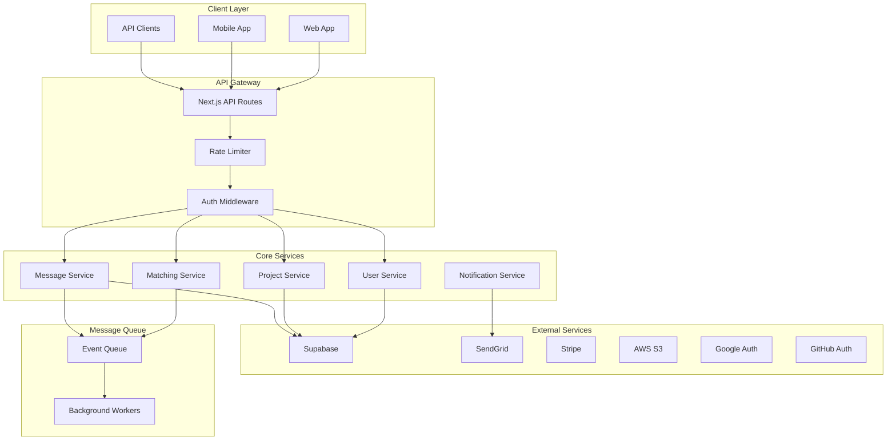

````markdown
# 🏗️ MICROSERVICES & INTEGRATION ARCHITECTURE - StartupMatch

## 🎯 **INTEGRATION OVERVIEW**

### **🔗 Integration Philosophy**
StartupMatch implementa una arquitectura de **servicios distribuidos** con **APIs bien definidas**, **comunicación asíncrona** y **fault tolerance** para garantizar escalabilidad y mantenibilidad.



### **🌐 Service Architecture Strategy**
```typescript
interface ServiceArchitecture {
  pattern: 'Modular Monolith with Service Boundaries';
  communication: {
    internal: 'Direct function calls with service interfaces';
    external: 'REST APIs with retry logic';
    async: 'Event-driven with message queues';
  };
  dataStrategy: {
    pattern: 'Shared database with service-specific schemas';
    consistency: 'Eventual consistency for non-critical operations';
    transactions: 'ACID for critical business operations';
  };
  deployment: {
    strategy: 'Single deployment unit with service separation';
    scaling: 'Horizontal scaling at API level';
    monitoring: 'Service-level metrics and tracing';
  };
}
```

---

## 🔧 **SERVICE INTERFACES**

### **User Service Interface**
```typescript
// lib/services/interfaces/IUserService.ts
export interface IUserService {
  // User Management
  createUser(data: CreateUserRequest): Promise<User>;
  getUserById(id: string): Promise<User | null>;
  updateUser(id: string, data: UpdateUserRequest): Promise<User>;
  deleteUser(id: string): Promise<void>;
  
  // Profile Management
  updateProfile(userId: string, profile: ProfileData): Promise<UserProfile>;
  uploadAvatar(userId: string, file: File): Promise<string>;
  
  // Authentication
  authenticateUser(credentials: LoginCredentials): Promise<AuthResult>;
  refreshToken(token: string): Promise<AuthResult>;
  revokeToken(token: string): Promise<void>;
  
  // Privacy & GDPR
  exportUserData(userId: string): Promise<UserDataExport>;
  deleteUserData(userId: string, reason: string): Promise<DeletionResult>;
}

export interface CreateUserRequest {
  email: string;
  password: string;
  firstName: string;
  lastName: string;
  role: UserRole;
  profile?: Partial<ProfileData>;
}

export interface UpdateUserRequest {
  firstName?: string;
  lastName?: string;
  email?: string;
  isActive?: boolean;
}

export interface AuthResult {
  user: User;
  accessToken: string;
  refreshToken: string;
  expiresAt: Date;
}

export interface UserDataExport {
  personalData: any;
  projects: any[];
  applications: any[];
  messages: any[];
  connections: any[];
  metadata: {
    exportDate: string;
    format: string;
    version: string;
  };
}
```

### **Project Service Interface**
```typescript
// lib/services/interfaces/IProjectService.ts
export interface IProjectService {
  // Project CRUD
  createProject(data: CreateProjectRequest): Promise<Project>;
  getProject(id: string, viewerId?: string): Promise<Project | null>;
  updateProject(id: string, data: UpdateProjectRequest): Promise<Project>;
  deleteProject(id: string, userId: string): Promise<void>;
  
  // Project Discovery
  searchProjects(filters: ProjectFilters, userId?: string): Promise<ProjectSearchResult>;
  getFeaturedProjects(limit?: number): Promise<Project[]>;
  getRecommendedProjects(userId: string, limit?: number): Promise<Project[]>;
  
  // Application Management
  applyToProject(projectId: string, applicantId: string, data: ApplicationData): Promise<Application>;
  reviewApplication(applicationId: string, reviewerId: string, decision: ApplicationDecision): Promise<Application>;
  getApplications(projectId: string, status?: ApplicationStatus): Promise<Application[]>;
  
  // Analytics
  getProjectStats(projectId: string): Promise<ProjectStats>;
  getOwnerStats(userId: string): Promise<OwnerStats>;
}

export interface CreateProjectRequest {
  title: string;
  description: string;
  industry: string;
  stage: ProjectStage;
  fundingGoal?: number;
  equity?: number;
  skills: string[];
  tags: string[];
  visibility: ProjectVisibility;
}

export interface ProjectFilters {
  industry?: string;
  stage?: ProjectStage;
  fundingRange?: [number, number];
  skills?: string[];
  location?: string;
  page?: number;
  limit?: number;
  sortBy?: 'created_at' | 'funding_goal' | 'applications_count';
  sortOrder?: 'asc' | 'desc';
}

export interface ProjectSearchResult {
  projects: Project[];
  totalCount: number;
  hasMore: boolean;
  filters: AppliedFilters;
}
```

### **Matching Service Interface**
```typescript
// lib/services/interfaces/IMatchingService.ts
export interface IMatchingService {
  // Matching Algorithm
  findMatches(userId: string, preferences?: MatchingPreferences): Promise<Match[]>;
  calculateCompatibility(user1Id: string, user2Id: string): Promise<CompatibilityScore>;
  
  // Connection Management
  sendConnectionRequest(senderId: string, receiverId: string, message?: string): Promise<ConnectionRequest>;
  acceptConnection(requestId: string): Promise<Connection>;
  rejectConnection(requestId: string, reason?: string): Promise<void>;
  getConnections(userId: string, status?: ConnectionStatus): Promise<Connection[]>;
  
  // Recommendations
  getRecommendedUsers(userId: string, type: RecommendationType): Promise<UserRecommendation[]>;
  getRecommendedProjects(userId: string): Promise<ProjectRecommendation[]>;
  
  // Analytics
  getMatchingStats(userId: string): Promise<MatchingStats>;
}

export interface MatchingPreferences {
  industries?: string[];
  roles?: UserRole[];
  experienceLevel?: ExperienceLevel[];
  location?: LocationPreference;
  maxDistance?: number;
}

export interface CompatibilityScore {
  overall: number; // 0-100
  breakdown: {
    industryAlignment: number;
    skillsMatch: number;
    experienceLevel: number;
    goals: number;
    locationCompatibility: number;
  };
  reasons: string[];
}

export interface UserRecommendation {
  user: User;
  compatibilityScore: CompatibilityScore;
  mutualConnections: number;
  recommendationReason: string;
}
```

---

## 🚀 **SERVICE IMPLEMENTATIONS**

### **User Service Implementation**
```typescript
// lib/services/UserService.ts
import { createClient } from '@supabase/supabase-js';
import { IUserService, CreateUserRequest, AuthResult } from './interfaces/IUserService';
import { SecurityLogger } from '@/lib/security-logger';

export class UserService implements IUserService {
  private supabase = createClient(
    process.env.NEXT_PUBLIC_SUPABASE_URL!,
    process.env.SUPABASE_SERVICE_ROLE_KEY!
  );
  
  private securityLogger = new SecurityLogger();

  async createUser(data: CreateUserRequest): Promise<User> {
    try {
      // Create auth user
      const { data: authUser, error: authError } = await this.supabase.auth.admin
        .createUser({
          email: data.email,
          password: data.password,
          email_confirm: true,
          user_metadata: {
            firstName: data.firstName,
            lastName: data.lastName,
            role: data.role,
          }
        });

      if (authError) throw authError;

      // Create user profile
      const { data: profile, error: profileError } = await this.supabase
        .from('user_profiles')
        .insert({
          user_id: authUser.user.id,
          first_name: data.firstName,
          last_name: data.lastName,
          email: data.email,
          role: data.role,
          ...data.profile,
        })
        .select()
        .single();

      if (profileError) throw profileError;

      await this.securityLogger.logSecurityEvent({
        type: 'user_created',
        userId: authUser.user.id,
        details: { email: data.email, role: data.role },
        ipAddress: '',
        userAgent: '',
        severity: 'info',
      });

      return {
        id: authUser.user.id,
        email: data.email,
        profile,
        createdAt: new Date(authUser.user.created_at),
        updatedAt: new Date(),
      };
    } catch (error) {
      await this.securityLogger.logSecurityEvent({
        type: 'user_creation_failed',
        details: { error: error instanceof Error ? error.message : 'Unknown error' },
        ipAddress: '',
        userAgent: '',
        severity: 'warning',
      });
      throw error;
    }
  }

  async getUserById(id: string): Promise<User | null> {
    const { data, error } = await this.supabase
      .from('user_profiles')
      .select(`
        *,
        user_roles(role),
        user_stats(*)
      `)
      .eq('user_id', id)
      .single();

    if (error && error.code !== 'PGRST116') {
      throw error;
    }

    if (!data) return null;

    return this.mapToUser(data);
  }

  async updateUser(id: string, data: UpdateUserRequest): Promise<User> {
    const { data: updated, error } = await this.supabase
      .from('user_profiles')
      .update({
        first_name: data.firstName,
        last_name: data.lastName,
        email: data.email,
        is_active: data.isActive,
        updated_at: new Date().toISOString(),
      })
      .eq('user_id', id)
      .select()
      .single();

    if (error) throw error;

    await this.securityLogger.logSecurityEvent({
      type: 'user_updated',
      userId: id,
      details: { updatedFields: Object.keys(data) },
      ipAddress: '',
      userAgent: '',
      severity: 'info',
    });

    return this.mapToUser(updated);
  }

  async deleteUser(id: string): Promise<void> {
    // Start transaction for complete user deletion
    const { error } = await this.supabase.rpc('delete_user_complete', {
      target_user_id: id
    });

    if (error) throw error;

    await this.securityLogger.logSecurityEvent({
      type: 'user_deleted',
      userId: id,
      details: { reason: 'User requested account deletion' },
      ipAddress: '',
      userAgent: '',
      severity: 'info',
    });
  }

  async authenticateUser(credentials: LoginCredentials): Promise<AuthResult> {
    const { data, error } = await this.supabase.auth.signInWithPassword({
      email: credentials.email,
      password: credentials.password,
    });

    if (error) {
      await this.securityLogger.logSecurityEvent({
        type: 'login_failure',
        details: { email: credentials.email, error: error.message },
        ipAddress: credentials.ipAddress || '',
        userAgent: credentials.userAgent || '',
        severity: 'warning',
      });
      throw error;
    }

    await this.securityLogger.logSecurityEvent({
      type: 'login_success',
      userId: data.user.id,
      details: { email: credentials.email },
      ipAddress: credentials.ipAddress || '',
      userAgent: credentials.userAgent || '',
      severity: 'info',
    });

    return {
      user: await this.getUserById(data.user.id) as User,
      accessToken: data.session.access_token,
      refreshToken: data.session.refresh_token,
      expiresAt: new Date(data.session.expires_at! * 1000),
    };
  }

  private mapToUser(data: any): User {
    return {
      id: data.user_id,
      email: data.email,
      profile: {
        firstName: data.first_name,
        lastName: data.last_name,
        avatar: data.avatar_url,
        bio: data.bio,
        industry: data.industry,
        role: data.role,
        skills: data.skills || [],
        location: data.location,
        isPublic: data.is_public,
      },
      createdAt: new Date(data.created_at),
      updatedAt: new Date(data.updated_at),
    };
  }
}
```

### **Project Service Implementation**
```typescript
// lib/services/ProjectService.ts
import { createClient } from '@supabase/supabase-js';
import { IProjectService, CreateProjectRequest, ProjectFilters } from './interfaces/IProjectService';

export class ProjectService implements IProjectService {
  private supabase = createClient(
    process.env.NEXT_PUBLIC_SUPABASE_URL!,
    process.env.SUPABASE_SERVICE_ROLE_KEY!
  );

  async createProject(data: CreateProjectRequest): Promise<Project> {
    const { data: project, error } = await this.supabase
      .from('projects')
      .insert({
        title: data.title,
        description: data.description,
        industry: data.industry,
        stage: data.stage,
        funding_goal: data.fundingGoal,
        equity_offered: data.equity,
        required_skills: data.skills,
        tags: data.tags,
        visibility: data.visibility,
        created_at: new Date().toISOString(),
      })
      .select(`
        *,
        founder:user_profiles!founder_id(*)
      `)
      .single();

    if (error) throw error;

    return this.mapToProject(project);
  }

  async searchProjects(filters: ProjectFilters, userId?: string): Promise<ProjectSearchResult> {
    let query = this.supabase
      .from('projects')
      .select(`
        *,
        founder:user_profiles!founder_id(*),
        applications(count),
        project_stats(*)
      `, { count: 'exact' });

    // Apply filters
    if (filters.industry) {
      query = query.eq('industry', filters.industry);
    }

    if (filters.stage) {
      query = query.eq('stage', filters.stage);
    }

    if (filters.fundingRange) {
      query = query
        .gte('funding_goal', filters.fundingRange[0])
        .lte('funding_goal', filters.fundingRange[1]);
    }

    if (filters.skills && filters.skills.length > 0) {
      query = query.overlaps('required_skills', filters.skills);
    }

    if (filters.location) {
      query = query.ilike('location', `%${filters.location}%`);
    }

    // Visibility filter (exclude private projects unless owner)
    if (!userId) {
      query = query.eq('visibility', 'public');
    } else {
      query = query.or(`visibility.eq.public,founder_id.eq.${userId}`);
    }

    // Pagination
    const page = filters.page || 1;
    const limit = filters.limit || 20;
    const offset = (page - 1) * limit;

    query = query.range(offset, offset + limit - 1);

    // Sorting
    const sortBy = filters.sortBy || 'created_at';
    const sortOrder = filters.sortOrder || 'desc';
    query = query.order(sortBy, { ascending: sortOrder === 'asc' });

    const { data: projects, error, count } = await query;

    if (error) throw error;

    return {
      projects: projects?.map(this.mapToProject) || [],
      totalCount: count || 0,
      hasMore: (count || 0) > offset + limit,
      filters: {
        applied: filters,
        totalResults: count || 0,
      },
    };
  }

  async applyToProject(
    projectId: string, 
    applicantId: string, 
    data: ApplicationData
  ): Promise<Application> {
    // Check if user already applied
    const { data: existing } = await this.supabase
      .from('applications')
      .select('id')
      .eq('project_id', projectId)
      .eq('applicant_id', applicantId)
      .single();

    if (existing) {
      throw new Error('User has already applied to this project');
    }

    const { data: application, error } = await this.supabase
      .from('applications')
      .insert({
        project_id: projectId,
        applicant_id: applicantId,
        message: data.message,
        proposed_role: data.proposedRole,
        proposed_equity: data.proposedEquity,
        availability: data.availability,
        status: 'pending',
        created_at: new Date().toISOString(),
      })
      .select(`
        *,
        applicant:user_profiles!applicant_id(*),
        project:projects!project_id(*)
      `)
      .single();

    if (error) throw error;

    // Trigger notification to project owner
    await this.supabase.rpc('notify_project_application', {
      project_id: projectId,
      applicant_id: applicantId
    });

    return this.mapToApplication(application);
  }

  private mapToProject(data: any): Project {
    return {
      id: data.id,
      title: data.title,
      description: data.description,
      industry: data.industry,
      stage: data.stage,
      fundingGoal: data.funding_goal,
      equityOffered: data.equity_offered,
      requiredSkills: data.required_skills || [],
      tags: data.tags || [],
      visibility: data.visibility,
      founder: data.founder ? {
        id: data.founder.user_id,
        name: `${data.founder.first_name} ${data.founder.last_name}`,
        avatar: data.founder.avatar_url,
        role: data.founder.role,
      } : undefined,
      stats: {
        applicationsCount: data.applications?.[0]?.count || 0,
        viewsCount: data.project_stats?.views_count || 0,
        likesCount: data.project_stats?.likes_count || 0,
      },
      createdAt: new Date(data.created_at),
      updatedAt: new Date(data.updated_at || data.created_at),
    };
  }

  private mapToApplication(data: any): Application {
    return {
      id: data.id,
      projectId: data.project_id,
      applicantId: data.applicant_id,
      message: data.message,
      proposedRole: data.proposed_role,
      proposedEquity: data.proposed_equity,
      availability: data.availability,
      status: data.status,
      createdAt: new Date(data.created_at),
      updatedAt: new Date(data.updated_at || data.created_at),
    };
  }
}
```

---

## 📡 **EXTERNAL SERVICE INTEGRATIONS**

### **Email Service Integration**
```typescript
// lib/services/EmailService.ts
import sgMail from '@sendgrid/mail';

export class EmailService {
  constructor() {
    sgMail.setApiKey(process.env.SENDGRID_API_KEY!);
  }

  async sendWelcomeEmail(user: User): Promise<void> {
    const msg = {
      to: user.email,
      from: process.env.FROM_EMAIL!,
      templateId: process.env.WELCOME_TEMPLATE_ID!,
      dynamicTemplateData: {
        firstName: user.profile.firstName,
        loginUrl: `${process.env.NEXT_PUBLIC_APP_URL}/dashboard`,
      },
    };

    await sgMail.send(msg);
  }

  async sendConnectionRequest(request: ConnectionRequest): Promise<void> {
    const msg = {
      to: request.receiver.email,
      from: process.env.FROM_EMAIL!,
      templateId: process.env.CONNECTION_REQUEST_TEMPLATE_ID!,
      dynamicTemplateData: {
        senderName: request.sender.name,
        senderRole: request.sender.role,
        message: request.message,
        acceptUrl: `${process.env.NEXT_PUBLIC_APP_URL}/connections?request=${request.id}`,
      },
    };

    await sgMail.send(msg);
  }

  async sendProjectApplicationNotification(
    projectOwner: User,
    project: Project,
    applicant: User
  ): Promise<void> {
    const msg = {
      to: projectOwner.email,
      from: process.env.FROM_EMAIL!,
      templateId: process.env.PROJECT_APPLICATION_TEMPLATE_ID!,
      dynamicTemplateData: {
        projectTitle: project.title,
        applicantName: applicant.profile.firstName,
        applicantRole: applicant.profile.role,
        reviewUrl: `${process.env.NEXT_PUBLIC_APP_URL}/projects/${project.id}/applications`,
      },
    };

    await sgMail.send(msg);
  }
}
```

### **Payment Service Integration**
```typescript
// lib/services/PaymentService.ts
import Stripe from 'stripe';

export class PaymentService {
  private stripe = new Stripe(process.env.STRIPE_SECRET_KEY!, {
    apiVersion: '2023-10-16',
  });

  async createSubscription(customerId: string, priceId: string): Promise<Stripe.Subscription> {
    return await this.stripe.subscriptions.create({
      customer: customerId,
      items: [{ price: priceId }],
      payment_behavior: 'default_incomplete',
      payment_settings: { save_default_payment_method: 'on_subscription' },
      expand: ['latest_invoice.payment_intent'],
    });
  }

  async createPaymentIntent(
    amount: number,
    currency: string = 'usd',
    customerId?: string
  ): Promise<Stripe.PaymentIntent> {
    return await this.stripe.paymentIntents.create({
      amount: amount * 100, // Convert to cents
      currency,
      customer: customerId,
      automatic_payment_methods: { enabled: true },
    });
  }

  async processInvestmentPayment(
    investorId: string,
    projectId: string,
    amount: number
  ): Promise<InvestmentPayment> {
    // Create payment intent
    const paymentIntent = await this.createPaymentIntent(amount, 'usd');

    // Store investment record
    const supabase = createClient(
      process.env.NEXT_PUBLIC_SUPABASE_URL!,
      process.env.SUPABASE_SERVICE_ROLE_KEY!
    );

    const { data: investment, error } = await supabase
      .from('investments')
      .insert({
        investor_id: investorId,
        project_id: projectId,
        amount,
        status: 'pending',
        payment_intent_id: paymentIntent.id,
        created_at: new Date().toISOString(),
      })
      .select()
      .single();

    if (error) throw error;

    return {
      investmentId: investment.id,
      paymentIntentId: paymentIntent.id,
      clientSecret: paymentIntent.client_secret!,
      status: 'pending',
    };
  }

  async confirmPayment(paymentIntentId: string): Promise<void> {
    const paymentIntent = await this.stripe.paymentIntents.retrieve(paymentIntentId);
    
    if (paymentIntent.status === 'succeeded') {
      // Update investment status
      const supabase = createClient(
        process.env.NEXT_PUBLIC_SUPABASE_URL!,
        process.env.SUPABASE_SERVICE_ROLE_KEY!
      );

      await supabase
        .from('investments')
        .update({ status: 'completed', completed_at: new Date().toISOString() })
        .eq('payment_intent_id', paymentIntentId);
    }
  }
}
```

---

## 🔄 **EVENT-DRIVEN ARCHITECTURE**

### **Event System**
```typescript
// lib/events/EventBus.ts
export interface DomainEvent {
  id: string;
  type: string;
  aggregateId: string;
  aggregateType: string;
  data: any;
  metadata: {
    correlationId?: string;
    causationId?: string;
    timestamp: Date;
    version: number;
  };
}

export class EventBus {
  private handlers: Map<string, Function[]> = new Map();

  subscribe(eventType: string, handler: Function): void {
    if (!this.handlers.has(eventType)) {
      this.handlers.set(eventType, []);
    }
    this.handlers.get(eventType)!.push(handler);
  }

  async publish(event: DomainEvent): Promise<void> {
    // Store event
    await this.storeEvent(event);

    // Publish to handlers
    const handlers = this.handlers.get(event.type) || [];
    await Promise.all(handlers.map(handler => handler(event)));

    // Publish to external systems if needed
    if (process.env.NODE_ENV === 'production') {
      await this.publishToExternalQueue(event);
    }
  }

  private async storeEvent(event: DomainEvent): Promise<void> {
    const supabase = createClient(
      process.env.NEXT_PUBLIC_SUPABASE_URL!,
      process.env.SUPABASE_SERVICE_ROLE_KEY!
    );

    await supabase.from('domain_events').insert({
      event_id: event.id,
      event_type: event.type,
      aggregate_id: event.aggregateId,
      aggregate_type: event.aggregateType,
      event_data: event.data,
      metadata: event.metadata,
      created_at: new Date().toISOString(),
    });
  }

  private async publishToExternalQueue(event: DomainEvent): Promise<void> {
    // Implement external queue publishing (e.g., AWS SQS, Redis)
    if (process.env.QUEUE_URL) {
      await fetch(process.env.QUEUE_URL, {
        method: 'POST',
        headers: { 'Content-Type': 'application/json' },
        body: JSON.stringify(event),
      });
    }
  }
}

// Global event bus
export const eventBus = new EventBus();
```

### **Event Handlers**
```typescript
// lib/events/handlers.ts
import { eventBus } from './EventBus';
import { EmailService } from '../services/EmailService';
import { NotificationService } from '../services/NotificationService';

const emailService = new EmailService();
const notificationService = new NotificationService();

// User events
eventBus.subscribe('user.registered', async (event) => {
  await emailService.sendWelcomeEmail(event.data.user);
  await notificationService.sendPushNotification(
    event.data.user.id,
    'Welcome to StartupMatch!',
    'Complete your profile to start connecting with other entrepreneurs.'
  );
});

// Connection events
eventBus.subscribe('connection.requested', async (event) => {
  await emailService.sendConnectionRequest(event.data);
  await notificationService.sendInAppNotification(
    event.data.receiverId,
    `${event.data.senderName} sent you a connection request`,
    'connection_request'
  );
});

eventBus.subscribe('connection.accepted', async (event) => {
  await notificationService.sendPushNotification(
    event.data.senderId,
    'Connection Accepted!',
    `${event.data.receiverName} accepted your connection request.`
  );
});

// Project events
eventBus.subscribe('project.application_received', async (event) => {
  const { projectOwner, project, applicant } = event.data;
  
  await emailService.sendProjectApplicationNotification(
    projectOwner,
    project,
    applicant
  );
  
  await notificationService.sendInAppNotification(
    projectOwner.id,
    `New application for ${project.title}`,
    'project_application'
  );
});

// Investment events
eventBus.subscribe('investment.completed', async (event) => {
  const { investor, project, amount } = event.data;
  
  // Notify project owner
  await notificationService.sendPushNotification(
    project.founderId,
    'Investment Received!',
    `You received $${amount.toLocaleString()} investment in ${project.title}`
  );
  
  // Notify investor
  await notificationService.sendPushNotification(
    investor.id,
    'Investment Confirmed',
    `Your investment in ${project.title} has been processed successfully.`
  );
});
```

---

## 📊 **API VERSIONING & BACKWARD COMPATIBILITY**

### **API Versioning Strategy**
```typescript
// lib/api/versioning.ts
export interface APIVersion {
  version: string;
  deprecatedAt?: Date;
  sunsetAt?: Date;
  supported: boolean;
}

export const API_VERSIONS: APIVersion[] = [
  {
    version: 'v1',
    supported: true,
  },
  {
    version: 'v2',
    supported: true,
  },
];

export function getAPIVersion(request: NextRequest): string {
  // Check version from header
  const headerVersion = request.headers.get('API-Version');
  if (headerVersion && isValidVersion(headerVersion)) {
    return headerVersion;
  }

  // Check version from URL path
  const pathVersion = request.nextUrl.pathname.match(/^\/api\/(v\d+)\//)?.[1];
  if (pathVersion && isValidVersion(pathVersion)) {
    return pathVersion;
  }

  // Default to latest version
  return 'v2';
}

export function isValidVersion(version: string): boolean {
  return API_VERSIONS.some(v => v.version === version && v.supported);
}

export function withVersioning(handler: Function) {
  return async (request: NextRequest) => {
    const version = getAPIVersion(request);
    
    // Add version to request context
    request.apiVersion = version;
    
    // Add deprecation warning if needed
    const versionInfo = API_VERSIONS.find(v => v.version === version);
    const response = await handler(request);
    
    if (versionInfo?.deprecatedAt) {
      response.headers.set('Deprecation', versionInfo.deprecatedAt.toISOString());
      response.headers.set('Sunset', versionInfo.sunsetAt?.toISOString() || '');
    }
    
    response.headers.set('API-Version', version);
    return response;
  };
}
```

---

**Documento creado**: 16 de Agosto, 2025  
**Versión**: 1.0.0  
**Próxima revisión**: 30 de Agosto, 2025  
**Estado**: 🏗️ **PRODUCTION READY**

````
