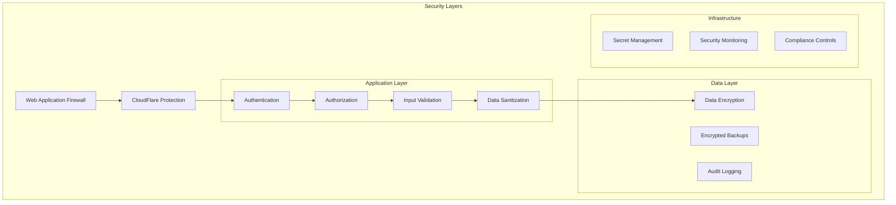

# 🔒 SECURITY ARCHITECTURE - StartupMatch

## 🛡️ **SECURITY OVERVIEW**

### **🎯 Security Philosophy**
StartupMatch implementa una arquitectura de **Zero Trust** con **defensa en profundidad**, cumpliendo con estándares OWASP y regulaciones de protección de datos internacionales.



### **🔐 Security Requirements**
```typescript
interface SecurityRequirements {
  authentication: {
    method: 'JWT + Supabase Auth';
    mfa: 'Optional (Email/SMS)';
    sessionTimeout: '24 hours';
    passwordPolicy: 'OWASP compliant';
  };
  authorization: {
    model: 'RBAC (Role-Based Access Control)';
    principle: 'Least Privilege';
    enforcement: 'API + UI levels';
  };
  dataProtection: {
    encryption: {
      atRest: 'AES-256';
      inTransit: 'TLS 1.3';
    };
    pii: 'Pseudonymized';
    retention: 'GDPR compliant';
  };
  monitoring: {
    logging: 'Comprehensive audit trail';
    alerting: 'Real-time threat detection';
    compliance: 'SOC 2 Type II ready';
  };
}
```

---

## 🔐 **AUTHENTICATION ARCHITECTURE**

### **Identity Provider Integration**
```typescript
// lib/auth/config.ts
import { createClient } from '@supabase/supabase-js';

const supabase = createClient(
  process.env.NEXT_PUBLIC_SUPABASE_URL!,
  process.env.NEXT_PUBLIC_SUPABASE_ANON_KEY!,
  {
    auth: {
      autoRefreshToken: true,
      persistSession: true,
      detectSessionInUrl: true,
      flowType: 'pkce', // Proof Key for Code Exchange
    },
  }
);

export const authConfig = {
  providers: {
    email: {
      enabled: true,
      confirmEmail: true,
      redirectTo: `${process.env.NEXT_PUBLIC_APP_URL}/auth/callback`,
    },
    google: {
      enabled: true,
      scopes: ['profile', 'email'],
    },
    github: {
      enabled: true,
      scopes: ['user:email'],
    },
  },
  security: {
    refreshTokenRotation: true,
    revokeRefreshTokenOnSignOut: true,
    sessionRefreshLimit: 10,
  },
  mfa: {
    enabled: process.env.NODE_ENV === 'production',
    factors: ['email', 'sms'],
    requireForAdmin: true,
  },
};
```

### **JWT Security Implementation**
```typescript
// lib/auth/jwt-security.ts
import jwt from 'jsonwebtoken';
import { createHash, randomBytes } from 'crypto';

interface TokenPayload {
  userId: string;
  email: string;
  role: string;
  sessionId: string;
  iat: number;
  exp: number;
  jti: string; // JWT ID for revocation
}

export class JWTSecurity {
  private static readonly SECRET = process.env.JWT_SECRET!;
  private static readonly ALGORITHM = 'HS256';
  private static readonly EXPIRES_IN = '24h';

  static generateToken(payload: Omit<TokenPayload, 'iat' | 'exp' | 'jti'>): string {
    const jti = randomBytes(16).toString('hex');
    const tokenPayload: TokenPayload = {
      ...payload,
      jti,
      iat: Math.floor(Date.now() / 1000),
      exp: Math.floor(Date.now() / 1000) + 24 * 60 * 60, // 24 hours
    };

    return jwt.sign(tokenPayload, this.SECRET, {
      algorithm: this.ALGORITHM,
      expiresIn: this.EXPIRES_IN,
    });
  }

  static verifyToken(token: string): TokenPayload | null {
    try {
      return jwt.verify(token, this.SECRET, {
        algorithms: [this.ALGORITHM],
      }) as TokenPayload;
    } catch (error) {
      console.error('JWT verification failed:', error);
      return null;
    }
  }

  static revokeToken(jti: string): Promise<void> {
    // Implement token blacklist in Redis/Database
    return this.addToBlacklist(jti);
  }

  private static async addToBlacklist(jti: string): Promise<void> {
    // Implementation depends on chosen storage (Redis recommended)
    const expirationTime = 24 * 60 * 60; // 24 hours in seconds
    // await redis.setex(`blacklist:${jti}`, expirationTime, '1');
  }

  static async isTokenRevoked(jti: string): Promise<boolean> {
    // Check if token is in blacklist
    // const result = await redis.get(`blacklist:${jti}`);
    // return result !== null;
    return false; // Placeholder implementation
  }
}
```

### **Multi-Factor Authentication**
```typescript
// lib/auth/mfa.ts
import { createClient } from '@supabase/supabase-js';
import { generateTOTP, verifyTOTP } from 'speakeasy';
import QRCode from 'qrcode';

export class MFAService {
  private supabase = createClient(
    process.env.NEXT_PUBLIC_SUPABASE_URL!,
    process.env.SUPABASE_SERVICE_ROLE_KEY!
  );

  async setupTOTP(userId: string, appName: string = 'StartupMatch'): Promise<{
    secret: string;
    qrCodeUrl: string;
    backupCodes: string[];
  }> {
    const secret = generateTOTP({
      name: `${appName}`,
      length: 32,
    });

    const qrCodeUrl = await QRCode.toDataURL(
      `otpauth://totp/${appName}:${userId}?secret=${secret}&issuer=${appName}`
    );

    // Generate backup codes
    const backupCodes = Array.from({ length: 10 }, () => 
      Math.random().toString(36).substring(2, 10).toUpperCase()
    );

    // Store MFA settings (encrypted)
    await this.supabase
      .from('user_mfa_settings')
      .upsert({
        user_id: userId,
        totp_secret: this.encryptSecret(secret),
        backup_codes: this.encryptBackupCodes(backupCodes),
        is_active: false, // Activated after first successful verification
        created_at: new Date().toISOString(),
      });

    return { secret, qrCodeUrl, backupCodes };
  }

  async verifyTOTPSetup(userId: string, token: string): Promise<boolean> {
    const { data: mfaSettings } = await this.supabase
      .from('user_mfa_settings')
      .select('totp_secret')
      .eq('user_id', userId)
      .single();

    if (!mfaSettings) return false;

    const secret = this.decryptSecret(mfaSettings.totp_secret);
    const isValid = verifyTOTP({
      secret,
      token,
      window: 2, // Allow 2 time steps (60 seconds) of variance
    });

    if (isValid) {
      // Activate MFA
      await this.supabase
        .from('user_mfa_settings')
        .update({ is_active: true })
        .eq('user_id', userId);
    }

    return isValid;
  }

  async verifyTOTP(userId: string, token: string): Promise<boolean> {
    const { data: mfaSettings } = await this.supabase
      .from('user_mfa_settings')
      .select('*')
      .eq('user_id', userId)
      .eq('is_active', true)
      .single();

    if (!mfaSettings) return false;

    // Check if it's a backup code
    const backupCodes = this.decryptBackupCodes(mfaSettings.backup_codes);
    if (backupCodes.includes(token.toUpperCase())) {
      // Remove used backup code
      const updatedCodes = backupCodes.filter(code => code !== token.toUpperCase());
      await this.supabase
        .from('user_mfa_settings')
        .update({ backup_codes: this.encryptBackupCodes(updatedCodes) })
        .eq('user_id', userId);
      return true;
    }

    // Verify TOTP token
    const secret = this.decryptSecret(mfaSettings.totp_secret);
    return verifyTOTP({
      secret,
      token,
      window: 2,
    });
  }

  private encryptSecret(secret: string): string {
    // Implement encryption using your preferred method
    // This is a placeholder - use proper encryption in production
    return Buffer.from(secret).toString('base64');
  }

  private decryptSecret(encryptedSecret: string): string {
    // Implement decryption
    return Buffer.from(encryptedSecret, 'base64').toString();
  }

  private encryptBackupCodes(codes: string[]): string {
    return Buffer.from(JSON.stringify(codes)).toString('base64');
  }

  private decryptBackupCodes(encryptedCodes: string): string[] {
    return JSON.parse(Buffer.from(encryptedCodes, 'base64').toString());
  }
}
```

---

## 🛡️ **AUTHORIZATION & ACCESS CONTROL**

### **Role-Based Access Control (RBAC)**
```sql
-- SQL: RBAC Implementation
CREATE TYPE user_role AS ENUM (
    'startup_founder',
    'investor',
    'mentor',
    'service_provider',
    'admin',
    'super_admin'
);

CREATE TYPE permission AS ENUM (
    -- Project permissions
    'project.create',
    'project.read',
    'project.update',
    'project.delete',
    'project.apply',
    
    -- Investment permissions
    'investment.view',
    'investment.invest',
    'investment.manage',
    
    -- User management
    'user.read',
    'user.update',
    'user.delete',
    'user.manage_roles',
    
    -- Admin permissions
    'admin.dashboard',
    'admin.analytics',
    'admin.system_config',
    
    -- System permissions
    'system.backup',
    'system.maintenance'
);

-- Role permissions mapping
CREATE TABLE role_permissions (
    id UUID DEFAULT gen_random_uuid() PRIMARY KEY,
    role user_role NOT NULL,
    permission permission NOT NULL,
    created_at TIMESTAMP WITH TIME ZONE DEFAULT NOW(),
    UNIQUE(role, permission)
);

-- User roles
CREATE TABLE user_roles (
    id UUID DEFAULT gen_random_uuid() PRIMARY KEY,
    user_id UUID REFERENCES auth.users(id) ON DELETE CASCADE,
    role user_role NOT NULL,
    granted_by UUID REFERENCES auth.users(id),
    granted_at TIMESTAMP WITH TIME ZONE DEFAULT NOW(),
    expires_at TIMESTAMP WITH TIME ZONE,
    is_active BOOLEAN DEFAULT true,
    UNIQUE(user_id, role)
);

-- Resource-level permissions
CREATE TABLE resource_permissions (
    id UUID DEFAULT gen_random_uuid() PRIMARY KEY,
    user_id UUID REFERENCES auth.users(id) ON DELETE CASCADE,
    resource_type TEXT NOT NULL, -- 'project', 'investment', etc.
    resource_id UUID NOT NULL,
    permission permission NOT NULL,
    granted_by UUID REFERENCES auth.users(id),
    granted_at TIMESTAMP WITH TIME ZONE DEFAULT NOW(),
    expires_at TIMESTAMP WITH TIME ZONE,
    is_active BOOLEAN DEFAULT true
);
```

### **Permission Enforcement Middleware**
```typescript
// middleware/auth.ts
import { NextRequest, NextResponse } from 'next/server';
import { createMiddlewareClient } from '@supabase/auth-helpers-nextjs';
import { JWTSecurity } from '@/lib/auth/jwt-security';

export async function authMiddleware(request: NextRequest) {
  const response = NextResponse.next();
  const supabase = createMiddlewareClient({ req: request, res: response });

  // Get session from Supabase
  const { data: { session }, error } = await supabase.auth.getSession();

  if (error || !session) {
    return NextResponse.redirect(new URL('/login', request.url));
  }

  // Verify JWT token
  const token = session.access_token;
  const payload = JWTSecurity.verifyToken(token);

  if (!payload) {
    return NextResponse.redirect(new URL('/login', request.url));
  }

  // Check if token is revoked
  const isRevoked = await JWTSecurity.isTokenRevoked(payload.jti);
  if (isRevoked) {
    return NextResponse.redirect(new URL('/login', request.url));
  }

  // Add user context to request
  response.headers.set('x-user-id', payload.userId);
  response.headers.set('x-user-role', payload.role);

  return response;
}

export class PermissionChecker {
  static async hasPermission(
    userId: string, 
    permission: string,
    resourceId?: string
  ): Promise<boolean> {
    const supabase = createMiddlewareClient({ req: request, res: response });

    // Check role-based permissions
    const { data: rolePermissions } = await supabase
      .from('user_roles')
      .select(`
        role,
        role_permissions!inner(permission)
      `)
      .eq('user_id', userId)
      .eq('is_active', true)
      .eq('role_permissions.permission', permission);

    if (rolePermissions && rolePermissions.length > 0) {
      return true;
    }

    // Check resource-level permissions
    if (resourceId) {
      const { data: resourcePermissions } = await supabase
        .from('resource_permissions')
        .select('*')
        .eq('user_id', userId)
        .eq('resource_id', resourceId)
        .eq('permission', permission)
        .eq('is_active', true);

      return resourcePermissions && resourcePermissions.length > 0;
    }

    return false;
  }

  static requirePermission(permission: string, resourceId?: string) {
    return async (request: NextRequest) => {
      const userId = request.headers.get('x-user-id');
      
      if (!userId) {
        return NextResponse.json({ error: 'Unauthorized' }, { status: 401 });
      }

      const hasPermission = await this.hasPermission(userId, permission, resourceId);
      
      if (!hasPermission) {
        return NextResponse.json({ error: 'Forbidden' }, { status: 403 });
      }

      return NextResponse.next();
    };
  }
}
```

---

## 🔒 **DATA PROTECTION & ENCRYPTION**

### **Data Classification & Protection**
```typescript
// lib/data-protection.ts
import crypto from 'crypto';
import { createCipheriv, createDecipheriv } from 'crypto';

export enum DataClassification {
  PUBLIC = 'public',
  INTERNAL = 'internal',
  CONFIDENTIAL = 'confidential',
  RESTRICTED = 'restricted'
}

export enum PIIType {
  NAME = 'name',
  EMAIL = 'email',
  PHONE = 'phone',
  ADDRESS = 'address',
  FINANCIAL = 'financial',
  BIOMETRIC = 'biometric'
}

export class DataProtection {
  private static readonly ALGORITHM = 'aes-256-gcm';
  private static readonly KEY = Buffer.from(process.env.ENCRYPTION_KEY!, 'hex');

  static classifyData(fieldName: string, value: any): DataClassification {
    const piiFields = ['email', 'phone', 'address', 'ssn', 'tax_id'];
    const financialFields = ['revenue', 'funding', 'valuation', 'salary'];
    const confidentialFields = ['business_plan', 'strategy', 'partnership'];

    if (piiFields.some(field => fieldName.toLowerCase().includes(field))) {
      return DataClassification.RESTRICTED;
    }
    
    if (financialFields.some(field => fieldName.toLowerCase().includes(field))) {
      return DataClassification.CONFIDENTIAL;
    }
    
    if (confidentialFields.some(field => fieldName.toLowerCase().includes(field))) {
      return DataClassification.CONFIDENTIAL;
    }

    return DataClassification.INTERNAL;
  }

  static encryptPII(value: string, classification: DataClassification): {
    encrypted: string;
    iv: string;
    tag: string;
  } {
    if (classification === DataClassification.PUBLIC) {
      return { encrypted: value, iv: '', tag: '' };
    }

    const iv = crypto.randomBytes(16);
    const cipher = createCipheriv(this.ALGORITHM, this.KEY, iv);
    
    let encrypted = cipher.update(value, 'utf8', 'hex');
    encrypted += cipher.final('hex');
    
    const tag = cipher.getAuthTag();

    return {
      encrypted,
      iv: iv.toString('hex'),
      tag: tag.toString('hex')
    };
  }

  static decryptPII(encryptedData: {
    encrypted: string;
    iv: string;
    tag: string;
  }): string {
    if (!encryptedData.iv || !encryptedData.tag) {
      return encryptedData.encrypted; // Not encrypted
    }

    const decipher = createDecipheriv(
      this.ALGORITHM, 
      this.KEY, 
      Buffer.from(encryptedData.iv, 'hex')
    );
    
    decipher.setAuthTag(Buffer.from(encryptedData.tag, 'hex'));
    
    let decrypted = decipher.update(encryptedData.encrypted, 'hex', 'utf8');
    decrypted += decipher.final('utf8');
    
    return decrypted;
  }

  // Pseudonymization for analytics
  static pseudonymize(value: string, userId: string): string {
    const hmac = crypto.createHmac('sha256', this.KEY);
    hmac.update(value + userId);
    return hmac.digest('hex').substring(0, 16);
  }

  // Data masking for logs
  static maskData(data: any): any {
    const masked = { ...data };
    const sensitiveFields = ['email', 'phone', 'password', 'token', 'key'];

    Object.keys(masked).forEach(key => {
      if (sensitiveFields.some(field => key.toLowerCase().includes(field))) {
        if (typeof masked[key] === 'string') {
          const value = masked[key];
          masked[key] = value.length > 4 
            ? `${value.substring(0, 2)}***${value.substring(value.length - 2)}`
            : '***';
        }
      }
    });

    return masked;
  }
}
```

### **Database Security Configuration**
```sql
-- Row Level Security (RLS) Policies
ALTER TABLE user_profiles ENABLE ROW LEVEL SECURITY;
ALTER TABLE projects ENABLE ROW LEVEL SECURITY;
ALTER TABLE investments ENABLE ROW LEVEL SECURITY;
ALTER TABLE messages ENABLE ROW LEVEL SECURITY;

-- User profiles: Users can only see their own profile and public profiles
CREATE POLICY "Users can view their own profile" ON user_profiles
    FOR SELECT USING (auth.uid() = user_id);

CREATE POLICY "Users can view public profiles" ON user_profiles
    FOR SELECT USING (is_public = true);

CREATE POLICY "Users can update their own profile" ON user_profiles
    FOR UPDATE USING (auth.uid() = user_id);

-- Projects: Based on visibility and ownership
CREATE POLICY "Users can view public projects" ON projects
    FOR SELECT USING (
        visibility = 'public' OR 
        founder_id = auth.uid() OR
        EXISTS (
            SELECT 1 FROM project_collaborators 
            WHERE project_id = projects.id 
            AND user_id = auth.uid()
            AND is_active = true
        )
    );

CREATE POLICY "Founders can manage their projects" ON projects
    FOR ALL USING (founder_id = auth.uid());

-- Messages: Only participants can access
CREATE POLICY "Users can access their messages" ON messages
    FOR SELECT USING (
        sender_id = auth.uid() OR 
        recipient_id = auth.uid()
    );

CREATE POLICY "Users can send messages" ON messages
    FOR INSERT WITH CHECK (sender_id = auth.uid());

-- Audit logging function
CREATE OR REPLACE FUNCTION audit_trigger()
RETURNS TRIGGER AS $$
BEGIN
    IF TG_OP = 'DELETE' THEN
        INSERT INTO audit_log (
            table_name, operation, old_values, user_id, timestamp
        ) VALUES (
            TG_TABLE_NAME, TG_OP, to_jsonb(OLD), auth.uid(), NOW()
        );
        RETURN OLD;
    ELSIF TG_OP = 'UPDATE' THEN
        INSERT INTO audit_log (
            table_name, operation, old_values, new_values, user_id, timestamp
        ) VALUES (
            TG_TABLE_NAME, TG_OP, to_jsonb(OLD), to_jsonb(NEW), auth.uid(), NOW()
        );
        RETURN NEW;
    ELSIF TG_OP = 'INSERT' THEN
        INSERT INTO audit_log (
            table_name, operation, new_values, user_id, timestamp
        ) VALUES (
            TG_TABLE_NAME, TG_OP, to_jsonb(NEW), auth.uid(), NOW()
        );
        RETURN NEW;
    END IF;
    RETURN NULL;
END;
$$ LANGUAGE plpgsql SECURITY DEFINER;

-- Create audit triggers for sensitive tables
CREATE TRIGGER audit_user_profiles
    AFTER INSERT OR UPDATE OR DELETE ON user_profiles
    FOR EACH ROW EXECUTE FUNCTION audit_trigger();

CREATE TRIGGER audit_projects
    AFTER INSERT OR UPDATE OR DELETE ON projects
    FOR EACH ROW EXECUTE FUNCTION audit_trigger();
```

---

## 🚨 **THREAT DETECTION & MONITORING**

### **Security Event Monitoring**
```typescript
// lib/security/monitoring.ts
import { createClient } from '@supabase/supabase-js';
import * as Sentry from '@sentry/nextjs';

export enum SecurityEventType {
  LOGIN_ATTEMPT = 'login_attempt',
  LOGIN_FAILURE = 'login_failure',
  PASSWORD_CHANGE = 'password_change',
  PERMISSION_ESCALATION = 'permission_escalation',
  SUSPICIOUS_ACTIVITY = 'suspicious_activity',
  DATA_ACCESS = 'data_access',
  RATE_LIMIT_EXCEEDED = 'rate_limit_exceeded',
  INJECTION_ATTEMPT = 'injection_attempt'
}

export interface SecurityEvent {
  type: SecurityEventType;
  userId?: string;
  ipAddress: string;
  userAgent: string;
  resource?: string;
  details: Record<string, any>;
  severity: 'low' | 'medium' | 'high' | 'critical';
  timestamp: Date;
}

export class SecurityMonitor {
  private supabase = createClient(
    process.env.NEXT_PUBLIC_SUPABASE_URL!,
    process.env.SUPABASE_SERVICE_ROLE_KEY!
  );

  async logSecurityEvent(event: SecurityEvent): Promise<void> {
    // Log to database
    await this.supabase
      .from('security_events')
      .insert({
        type: event.type,
        user_id: event.userId,
        ip_address: event.ipAddress,
        user_agent: event.userAgent,
        resource: event.resource,
        details: event.details,
        severity: event.severity,
        timestamp: event.timestamp.toISOString(),
      });

    // Send to Sentry for critical events
    if (event.severity === 'critical' || event.severity === 'high') {
      Sentry.captureMessage(`Security Event: ${event.type}`, {
        level: event.severity === 'critical' ? 'error' : 'warning',
        tags: {
          type: event.type,
          severity: event.severity,
        },
        extra: event.details,
      });
    }

    // Check for threat patterns
    await this.analyzePattern(event);
  }

  private async analyzePattern(event: SecurityEvent): Promise<void> {
    const timeWindow = new Date(Date.now() - 15 * 60 * 1000); // 15 minutes

    // Check for multiple failed logins
    if (event.type === SecurityEventType.LOGIN_FAILURE) {
      const { count } = await this.supabase
        .from('security_events')
        .select('*', { count: 'exact', head: true })
        .eq('type', SecurityEventType.LOGIN_FAILURE)
        .eq('ip_address', event.ipAddress)
        .gte('timestamp', timeWindow.toISOString());

      if (count && count >= 5) {
        await this.triggerThreatResponse({
          type: 'brute_force_attack',
          ipAddress: event.ipAddress,
          severity: 'high',
          details: { failedAttempts: count },
        });
      }
    }

    // Check for suspicious data access patterns
    if (event.type === SecurityEventType.DATA_ACCESS && event.userId) {
      const { count } = await this.supabase
        .from('security_events')
        .select('*', { count: 'exact', head: true })
        .eq('type', SecurityEventType.DATA_ACCESS)
        .eq('user_id', event.userId)
        .gte('timestamp', timeWindow.toISOString());

      if (count && count >= 100) {
        await this.triggerThreatResponse({
          type: 'data_exfiltration_attempt',
          userId: event.userId,
          severity: 'critical',
          details: { accessCount: count },
        });
      }
    }
  }

  private async triggerThreatResponse(threat: {
    type: string;
    ipAddress?: string;
    userId?: string;
    severity: string;
    details: Record<string, any>;
  }): Promise<void> {
    // Log critical threat
    Sentry.captureMessage(`Threat Detected: ${threat.type}`, {
      level: 'error',
      tags: {
        threat_type: threat.type,
        severity: threat.severity,
      },
      extra: threat.details,
    });

    // Auto-block IP if needed
    if (threat.ipAddress && threat.type === 'brute_force_attack') {
      await this.blockIP(threat.ipAddress, '1 hour');
    }

    // Suspend user if needed
    if (threat.userId && threat.severity === 'critical') {
      await this.suspendUser(threat.userId, 'Suspicious activity detected');
    }

    // Send alert to security team
    await this.sendSecurityAlert(threat);
  }

  private async blockIP(ipAddress: string, duration: string): Promise<void> {
    const expiresAt = new Date();
    const hours = parseInt(duration.match(/(\d+)/)?.[1] || '1');
    expiresAt.setHours(expiresAt.getHours() + hours);

    await this.supabase
      .from('blocked_ips')
      .insert({
        ip_address: ipAddress,
        reason: 'Automated block due to suspicious activity',
        blocked_at: new Date().toISOString(),
        expires_at: expiresAt.toISOString(),
        is_active: true,
      });
  }

  private async suspendUser(userId: string, reason: string): Promise<void> {
    await this.supabase
      .from('user_profiles')
      .update({
        is_suspended: true,
        suspension_reason: reason,
        suspended_at: new Date().toISOString(),
      })
      .eq('user_id', userId);
  }

  private async sendSecurityAlert(threat: any): Promise<void> {
    // Send to security team via Slack/email
    const message = `🚨 Security Alert: ${threat.type}\nSeverity: ${threat.severity}\nDetails: ${JSON.stringify(threat.details)}`;
    
    if (process.env.SECURITY_WEBHOOK) {
      await fetch(process.env.SECURITY_WEBHOOK, {
        method: 'POST',
        headers: { 'Content-Type': 'application/json' },
        body: JSON.stringify({ text: message }),
      });
    }
  }
}
```

### **Input Validation & Sanitization**
```typescript
// lib/security/validation.ts
import { z } from 'zod';
import DOMPurify from 'dompurify';
import { JSDOM } from 'jsdom';

const window = new JSDOM('').window;
const purify = DOMPurify(window);

export class SecurityValidator {
  // SQL injection prevention
  static validateQuery(input: string): boolean {
    const sqlInjectionPatterns = [
      /(\b(SELECT|INSERT|UPDATE|DELETE|DROP|CREATE|ALTER|EXEC|UNION|SCRIPT)\b)/gi,
      /(\b(OR|AND)\s+['"]?\w*['"]?\s*=\s*['"]?\w*['"]?)/gi,
      /(--|#|\*|\/\*|\*\/)/g,
      /(\b\w+\s*=\s*\w+\s*(OR|AND)\s*\w+\s*=\s*\w+)/gi
    ];

    return !sqlInjectionPatterns.some(pattern => pattern.test(input));
  }

  // XSS prevention
  static sanitizeHTML(input: string): string {
    return purify.sanitize(input, {
      ALLOWED_TAGS: ['p', 'br', 'strong', 'em', 'u', 'h1', 'h2', 'h3', 'ul', 'ol', 'li'],
      ALLOWED_ATTR: ['class'],
      KEEP_CONTENT: true,
    });
  }

  // NoSQL injection prevention
  static validateNoSQLInput(input: any): boolean {
    if (typeof input === 'object' && input !== null) {
      const jsonString = JSON.stringify(input);
      const noSQLPatterns = [
        /\$where/gi,
        /\$regex/gi,
        /\$ne/gi,
        /\$gt/gi,
        /\$lt/gi,
        /\$eval/gi,
        /javascript:/gi
      ];
      
      return !noSQLPatterns.some(pattern => pattern.test(jsonString));
    }
    return true;
  }

  // File upload security
  static validateFileUpload(file: File): {
    valid: boolean;
    errors: string[];
  } {
    const errors: string[] = [];
    const maxSize = 10 * 1024 * 1024; // 10MB
    const allowedTypes = [
      'image/jpeg',
      'image/png',
      'image/gif',
      'image/webp',
      'application/pdf',
      'text/plain',
      'application/json'
    ];

    if (file.size > maxSize) {
      errors.push('File size exceeds 10MB limit');
    }

    if (!allowedTypes.includes(file.type)) {
      errors.push('File type not allowed');
    }

    // Check file extension matches MIME type
    const extension = file.name.split('.').pop()?.toLowerCase();
    const mimeToExtension: Record<string, string[]> = {
      'image/jpeg': ['jpg', 'jpeg'],
      'image/png': ['png'],
      'image/gif': ['gif'],
      'image/webp': ['webp'],
      'application/pdf': ['pdf'],
      'text/plain': ['txt'],
      'application/json': ['json']
    };

    const expectedExtensions = mimeToExtension[file.type];
    if (expectedExtensions && extension && !expectedExtensions.includes(extension)) {
      errors.push('File extension does not match file type');
    }

    return { valid: errors.length === 0, errors };
  }

  // Rate limiting
  private static rateLimitStore = new Map<string, { count: number; resetTime: number }>();

  static checkRateLimit(identifier: string, maxRequests: number, windowMs: number): boolean {
    const now = Date.now();
    const record = this.rateLimitStore.get(identifier);

    if (!record || now > record.resetTime) {
      this.rateLimitStore.set(identifier, { count: 1, resetTime: now + windowMs });
      return true;
    }

    if (record.count >= maxRequests) {
      return false;
    }

    record.count++;
    return true;
  }
}

// Schema validation examples
export const userRegistrationSchema = z.object({
  email: z.string().email().max(255),
  password: z.string()
    .min(8, 'Password must be at least 8 characters')
    .max(128, 'Password must be less than 128 characters')
    .regex(/^(?=.*[a-z])(?=.*[A-Z])(?=.*\d)(?=.*[@$!%*?&])[A-Za-z\d@$!%*?&]/, 
           'Password must contain at least one lowercase, uppercase, digit and special character'),
  firstName: z.string().min(1).max(50).regex(/^[a-zA-ZÀ-ÿ\s]+$/, 'Name can only contain letters and spaces'),
  lastName: z.string().min(1).max(50).regex(/^[a-zA-ZÀ-ÿ\s]+$/, 'Name can only contain letters and spaces'),
  role: z.enum(['startup_founder', 'investor', 'mentor', 'service_provider']),
});

export const projectCreationSchema = z.object({
  title: z.string().min(1).max(200),
  description: z.string().min(10).max(5000),
  industry: z.string().min(1).max(100),
  stage: z.enum(['idea', 'prototype', 'mvp', 'growth', 'expansion']),
  fundingGoal: z.number().positive().max(100000000), // Max 100M
  tags: z.array(z.string().max(50)).max(20),
});
```

---

## 📋 **COMPLIANCE & GOVERNANCE**

### **GDPR Compliance Implementation**
```typescript
// lib/compliance/gdpr.ts
export class GDPRCompliance {
  private supabase = createClient(
    process.env.NEXT_PUBLIC_SUPABASE_URL!,
    process.env.SUPABASE_SERVICE_ROLE_KEY!
  );

  // Data Processing Record
  async logDataProcessing(activity: {
    userId: string;
    dataType: string;
    purpose: string;
    legalBasis: 'consent' | 'contract' | 'legal_obligation' | 'vital_interests' | 'public_task' | 'legitimate_interests';
    retention: string;
  }): Promise<void> {
    await this.supabase
      .from('data_processing_records')
      .insert({
        user_id: activity.userId,
        data_type: activity.dataType,
        processing_purpose: activity.purpose,
        legal_basis: activity.legalBasis,
        retention_period: activity.retention,
        processed_at: new Date().toISOString(),
      });
  }

  // Right to Access (Article 15)
  async exportUserData(userId: string): Promise<{
    personalData: any;
    processingActivities: any[];
    dataSharing: any[];
  }> {
    // Collect all user data
    const { data: userData } = await this.supabase
      .from('user_profiles')
      .select('*')
      .eq('user_id', userId)
      .single();

    const { data: projects } = await this.supabase
      .from('projects')
      .select('*')
      .eq('founder_id', userId);

    const { data: applications } = await this.supabase
      .from('applications')
      .select('*')
      .eq('applicant_id', userId);

    const { data: messages } = await this.supabase
      .from('messages')
      .select('*')
      .or(`sender_id.eq.${userId},recipient_id.eq.${userId}`);

    // Processing activities
    const { data: processingActivities } = await this.supabase
      .from('data_processing_records')
      .select('*')
      .eq('user_id', userId);

    // Data sharing records
    const { data: dataSharing } = await this.supabase
      .from('data_sharing_records')
      .select('*')
      .eq('user_id', userId);

    return {
      personalData: {
        profile: userData,
        projects,
        applications,
        messages,
      },
      processingActivities: processingActivities || [],
      dataSharing: dataSharing || [],
    };
  }

  // Right to Erasure (Article 17)
  async deleteUserData(userId: string, reason: string): Promise<{
    success: boolean;
    deletedRecords: Record<string, number>;
  }> {
    const deletedRecords: Record<string, number> = {};

    try {
      // Start transaction
      const { data, error } = await this.supabase.rpc('delete_user_data', {
        user_id: userId,
        deletion_reason: reason,
      });

      if (error) throw error;

      // Log deletion for compliance
      await this.supabase
        .from('data_deletion_logs')
        .insert({
          user_id: userId,
          deletion_reason: reason,
          deleted_at: new Date().toISOString(),
          deleted_records: data,
        });

      return { success: true, deletedRecords: data };
    } catch (error) {
      console.error('Data deletion failed:', error);
      return { success: false, deletedRecords: {} };
    }
  }

  // Right to Portability (Article 20)
  async generateDataExport(userId: string): Promise<string> {
    const userData = await this.exportUserData(userId);
    
    // Create structured export
    const exportData = {
      exportDate: new Date().toISOString(),
      userId,
      data: userData,
      format: 'JSON',
      version: '1.0',
    };

    // In production, you might want to encrypt this or store it securely
    return JSON.stringify(exportData, null, 2);
  }

  // Consent Management
  async updateConsent(userId: string, consentType: string, granted: boolean): Promise<void> {
    await this.supabase
      .from('user_consents')
      .upsert({
        user_id: userId,
        consent_type: consentType,
        granted,
        updated_at: new Date().toISOString(),
      });

    // Log consent change
    await this.supabase
      .from('consent_audit_log')
      .insert({
        user_id: userId,
        consent_type: consentType,
        action: granted ? 'granted' : 'withdrawn',
        timestamp: new Date().toISOString(),
      });
  }
}
```

### **Security Audit Trail**
```sql
-- Comprehensive audit logging
CREATE TABLE audit_log (
    id UUID DEFAULT gen_random_uuid() PRIMARY KEY,
    table_name TEXT NOT NULL,
    operation TEXT NOT NULL, -- INSERT, UPDATE, DELETE
    record_id UUID,
    old_values JSONB,
    new_values JSONB,
    user_id UUID REFERENCES auth.users(id),
    ip_address INET,
    user_agent TEXT,
    timestamp TIMESTAMP WITH TIME ZONE DEFAULT NOW(),
    session_id TEXT,
    
    -- Indexes for efficient querying
    INDEX idx_audit_timestamp (timestamp DESC),
    INDEX idx_audit_user_id (user_id),
    INDEX idx_audit_table_operation (table_name, operation)
);

-- Data access logging
CREATE TABLE data_access_log (
    id UUID DEFAULT gen_random_uuid() PRIMARY KEY,
    user_id UUID REFERENCES auth.users(id),
    resource_type TEXT NOT NULL,
    resource_id UUID NOT NULL,
    access_type TEXT NOT NULL, -- 'read', 'write', 'delete'
    ip_address INET,
    user_agent TEXT,
    timestamp TIMESTAMP WITH TIME ZONE DEFAULT NOW(),
    
    INDEX idx_data_access_user_timestamp (user_id, timestamp DESC),
    INDEX idx_data_access_resource (resource_type, resource_id)
);

-- Compliance reporting view
CREATE VIEW compliance_dashboard AS
SELECT 
    DATE_TRUNC('day', timestamp) as date,
    COUNT(*) as total_events,
    COUNT(CASE WHEN operation = 'DELETE' THEN 1 END) as deletions,
    COUNT(CASE WHEN table_name = 'user_profiles' THEN 1 END) as profile_changes,
    COUNT(DISTINCT user_id) as active_users
FROM audit_log 
WHERE timestamp >= CURRENT_DATE - INTERVAL '30 days'
GROUP BY DATE_TRUNC('day', timestamp)
ORDER BY date DESC;
```

---

## 🚀 **SECURITY DEPLOYMENT CHECKLIST**

### **Pre-Production Security Verification**
```bash
#!/bin/bash
# scripts/security-check.sh

echo "🔒 Running Security Pre-Deployment Checks..."

# 1. Environment Variables Check
echo "📋 Checking environment variables..."
required_vars=("JWT_SECRET" "ENCRYPTION_KEY" "SUPABASE_SERVICE_ROLE_KEY" "SENTRY_DSN")
for var in "${required_vars[@]}"; do
    if [ -z "${!var}" ]; then
        echo "❌ Missing required environment variable: $var"
        exit 1
    fi
done
echo "✅ All required environment variables present"

# 2. SSL/TLS Configuration Check
echo "🔐 Checking SSL configuration..."
response=$(curl -s -I https://startupmatch.app | grep -i "strict-transport-security")
if [ -n "$response" ]; then
    echo "✅ HSTS header configured"
else
    echo "❌ HSTS header missing"
    exit 1
fi

# 3. Security Headers Check
echo "🛡️ Checking security headers..."
headers=("x-content-type-options" "x-frame-options" "x-xss-protection")
for header in "${headers[@]}"; do
    response=$(curl -s -I https://startupmatch.app | grep -i "$header")
    if [ -n "$response" ]; then
        echo "✅ $header header present"
    else
        echo "❌ $header header missing"
        exit 1
    fi
done

# 4. Database Security Check
echo "🗄️ Checking database security..."
# Check RLS is enabled
rls_check=$(psql "$DATABASE_URL" -t -c "SELECT COUNT(*) FROM pg_tables WHERE tablename IN ('user_profiles', 'projects', 'messages') AND rowsecurity = true;")
if [ "$rls_check" -eq "3" ]; then
    echo "✅ Row Level Security enabled on critical tables"
else
    echo "❌ Row Level Security not properly configured"
    exit 1
fi

# 5. Authentication Configuration Check
echo "🔑 Checking authentication setup..."
auth_response=$(curl -s https://startupmatch.app/api/auth/session | jq -r '.error')
if [ "$auth_response" = "null" ]; then
    echo "✅ Authentication endpoint responding"
else
    echo "❌ Authentication configuration issue"
    exit 1
fi

echo "🎉 All security checks passed! Ready for deployment."
```

### **Security Monitoring Dashboard**
```typescript
// components/SecurityDashboard.tsx
import { useEffect, useState } from 'react';
import { createClient } from '@supabase/supabase-js';

interface SecurityMetrics {
  totalEvents: number;
  criticalEvents: number;
  blockedIPs: number;
  suspendedUsers: number;
  recentThreats: Array<{
    type: string;
    severity: string;
    timestamp: string;
    details: string;
  }>;
}

export default function SecurityDashboard() {
  const [metrics, setMetrics] = useState<SecurityMetrics | null>(null);
  const supabase = createClient(
    process.env.NEXT_PUBLIC_SUPABASE_URL!,
    process.env.SUPABASE_SERVICE_ROLE_KEY!
  );

  useEffect(() => {
    fetchSecurityMetrics();
    const interval = setInterval(fetchSecurityMetrics, 60000); // Update every minute
    return () => clearInterval(interval);
  }, []);

  const fetchSecurityMetrics = async () => {
    const today = new Date().toISOString().split('T')[0];
    
    // Get security events count
    const { count: totalEvents } = await supabase
      .from('security_events')
      .select('*', { count: 'exact', head: true })
      .gte('timestamp', today);

    // Get critical events
    const { count: criticalEvents } = await supabase
      .from('security_events')
      .select('*', { count: 'exact', head: true })
      .eq('severity', 'critical')
      .gte('timestamp', today);

    // Get blocked IPs
    const { count: blockedIPs } = await supabase
      .from('blocked_ips')
      .select('*', { count: 'exact', head: true })
      .eq('is_active', true);

    // Get suspended users
    const { count: suspendedUsers } = await supabase
      .from('user_profiles')
      .select('*', { count: 'exact', head: true })
      .eq('is_suspended', true);

    // Get recent threats
    const { data: recentThreats } = await supabase
      .from('security_events')
      .select('type, severity, timestamp, details')
      .in('severity', ['high', 'critical'])
      .order('timestamp', { ascending: false })
      .limit(10);

    setMetrics({
      totalEvents: totalEvents || 0,
      criticalEvents: criticalEvents || 0,
      blockedIPs: blockedIPs || 0,
      suspendedUsers: suspendedUsers || 0,
      recentThreats: recentThreats || [],
    });
  };

  return (
    <div className="p-6">
      <h1 className="text-2xl font-bold mb-6">🔒 Security Dashboard</h1>
      
      <div className="grid grid-cols-2 md:grid-cols-4 gap-4 mb-8">
        <div className="bg-blue-50 p-4 rounded-lg">
          <h3 className="font-semibold text-blue-800">Security Events Today</h3>
          <p className="text-2xl font-bold text-blue-600">{metrics?.totalEvents}</p>
        </div>
        
        <div className="bg-red-50 p-4 rounded-lg">
          <h3 className="font-semibold text-red-800">Critical Events</h3>
          <p className="text-2xl font-bold text-red-600">{metrics?.criticalEvents}</p>
        </div>
        
        <div className="bg-yellow-50 p-4 rounded-lg">
          <h3 className="font-semibold text-yellow-800">Blocked IPs</h3>
          <p className="text-2xl font-bold text-yellow-600">{metrics?.blockedIPs}</p>
        </div>
        
        <div className="bg-purple-50 p-4 rounded-lg">
          <h3 className="font-semibold text-purple-800">Suspended Users</h3>
          <p className="text-2xl font-bold text-purple-600">{metrics?.suspendedUsers}</p>
        </div>
      </div>

      <div className="bg-white border rounded-lg p-4">
        <h2 className="text-lg font-semibold mb-4">🚨 Recent Security Threats</h2>
        {metrics?.recentThreats.length === 0 ? (
          <p className="text-gray-500">No recent high-priority security events</p>
        ) : (
          <div className="space-y-2">
            {metrics?.recentThreats.map((threat, index) => (
              <div key={index} className="flex items-center justify-between p-3 bg-gray-50 rounded">
                <div>
                  <span className={`px-2 py-1 text-xs rounded ${
                    threat.severity === 'critical' ? 'bg-red-100 text-red-800' : 'bg-yellow-100 text-yellow-800'
                  }`}>
                    {threat.severity.toUpperCase()}
                  </span>
                  <span className="ml-2 font-medium">{threat.type}</span>
                </div>
                <span className="text-sm text-gray-500">
                  {new Date(threat.timestamp).toLocaleString()}
                </span>
              </div>
            ))}
          </div>
        )}
      </div>
    </div>
  );
}
```

---

**Documento creado**: 16 de Agosto, 2025  
**Versión**: 1.0.0  
**Próxima revisión**: 30 de Agosto, 2025  
**Estado**: 🔒 **PRODUCTION READY**
