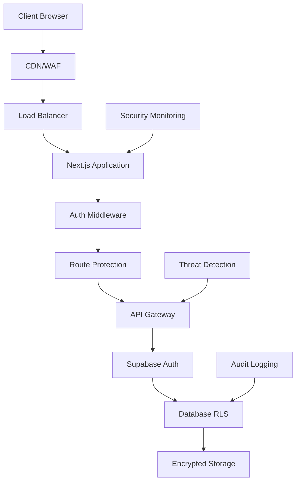

# 🔒 SECURITY ARCHITECTURE - StartupMatch
*Comprehensive Security Framework & Implementation Guide*

---

## 🎯 **EXECUTIVE SECURITY SUMMARY**

### 📊 **Current Security Status**
- **Authentication**: ❌ BROKEN (middleware commented out)
- **Authorization**: ❌ INCOMPLETE (no role-based access)
- **API Security**: ⚠️ PARTIAL (some validation missing)
- **Data Protection**: ⚠️ BASIC (needs encryption strategy)
- **Compliance**: ❌ NOT READY (GDPR gaps)

### 🚨 **CRITICAL SECURITY RISKS IDENTIFIED**
```typescript
// CRITICAL: Authentication middleware disabled
// middleware.ts - LINE 45-48 (COMMENTED OUT!)
/*
if (isProtectedRoute && !session) {
  const redirectUrl = new URL('/login', request.url);
  return NextResponse.redirect(redirectUrl);
}
*/

// IMPACT: All protected routes are PUBLICLY ACCESSIBLE
// RISK LEVEL: 🔥 CRITICAL - IMMEDIATE ACTION REQUIRED
```

---

## 🛡️ **SECURITY ARCHITECTURE OVERVIEW**



---

## 🎯 **THREAT MODEL (STRIDE ANALYSIS)**

### **1. Spoofing (Identity)**
**Threats:**
- Fake user registration
- Session hijacking
- JWT token forgery
- Social engineering attacks

**Mitigations:**
```typescript
interface SpoofingDefense {
  emailVerification: "Required for account activation";
  mfaAuthentication: "Optional but recommended";
  jwtSigning: "RS256 with rotating keys";
  sessionManagement: "Secure cookies with HttpOnly";
  rateLimiting: "Login attempt throttling";
}
```

### **2. Tampering (Data Integrity)**
**Threats:**
- SQL injection attacks
- XSS payload injection
- CSRF attacks
- API payload manipulation

**Mitigations:**
```typescript
interface TamperingDefense {
  inputValidation: "Zod schema validation on all inputs";
  sqlProtection: "Parameterized queries + Supabase RLS";
  xssProtection: "Content Security Policy + sanitization";
  csrfProtection: "SameSite cookies + CSRF tokens";
  apiValidation: "Request/response validation middleware";
}
```

### **3. Repudiation (Non-repudiation)**
**Threats:**
- User denying actions
- Admin privilege abuse
- Data modification without audit

**Mitigations:**
```typescript
interface RepudiationDefense {
  auditLogging: "All user actions logged with timestamps";
  immutableLogs: "Append-only audit trail";
  digitalSignatures: "Critical actions signed with user keys";
  eventSourcing: "Complete action history maintained";
}
```

### **4. Information Disclosure (Confidentiality)**
**Threats:**
- Unauthorized data access
- Data leakage in logs
- Insecure data transmission
- Directory traversal

**Mitigations:**
```typescript
interface DisclosureDefense {
  encryption: {
    atRest: "AES-256 for sensitive data";
    inTransit: "TLS 1.3 minimum";
    database: "Supabase native encryption";
  };
  accessControl: "RLS policies + JWT claims";
  dataMinimization: "Only collect necessary data";
  logSanitization: "No sensitive data in logs";
}
```

### **5. Denial of Service (Availability)**
**Threats:**
- DDoS attacks
- Resource exhaustion
- Slowloris attacks
- Database connection flooding

**Mitigations:**
```typescript
interface DosDefense {
  rateLimiting: "IP-based + user-based limits";
  connectionPooling: "Supabase connection management";
  caching: "Redis for heavy queries";
  monitoring: "Real-time resource monitoring";
  autoScaling: "Horizontal pod autoscaling";
}
```

### **6. Elevation of Privilege (Authorization)**
**Threats:**
- Privilege escalation
- Role manipulation
- Admin panel access
- API endpoint bypass

**Mitigations:**
```typescript
interface PrivilegeDefense {
  rbac: "Role-based access control";
  principleOfLeastPrivilege: "Minimal necessary permissions";
  permissionValidation: "Server-side permission checks";
  regularAudits: "Quarterly access reviews";
}
```

---

## 🔐 **AUTHENTICATION ARCHITECTURE**

### **Primary Authentication Flow**
```typescript
interface AuthenticationFlow {
  provider: "Supabase Auth";
  methods: ["email/password", "OAuth (Google, GitHub)", "magic links"];
  sessionManagement: "JWT tokens with refresh rotation";
  storage: "Secure httpOnly cookies";
  expiration: "15min access + 7d refresh tokens";
}
```

### **Authentication Implementation**
```typescript
// lib/auth-secure.ts
export class SecureAuth {
  // Email/Password authentication
  static async signInWithEmail(email: string, password: string) {
    const validation = authSchema.parse({ email, password });
    
    const { data, error } = await supabase.auth.signInWithPassword({
      email: validation.email,
      password: validation.password,
    });
    
    if (error) {
      await this.logSecurityEvent('AUTH_FAILED', { email, error: error.message });
      throw new AuthError('Invalid credentials');
    }
    
    await this.logSecurityEvent('AUTH_SUCCESS', { userId: data.user?.id });
    return data;
  }
  
  // OAuth authentication
  static async signInWithOAuth(provider: 'google' | 'github') {
    return await supabase.auth.signInWithOAuth({
      provider,
      options: {
        redirectTo: `${process.env.NEXT_PUBLIC_SITE_URL}/auth/callback`
      }
    });
  }
  
  // Session validation
  static async validateSession(token: string): Promise<User | null> {
    try {
      const { data: { user }, error } = await supabase.auth.getUser(token);
      
      if (error || !user) {
        await this.logSecurityEvent('SESSION_INVALID', { token: token.substring(0, 10) });
        return null;
      }
      
      return user;
    } catch (error) {
      await this.logSecurityEvent('SESSION_ERROR', { error: error.message });
      return null;
    }
  }
}
```

---

## 🛡️ **AUTHORIZATION ARCHITECTURE**

### **Role-Based Access Control (RBAC)**
```typescript
enum UserRole {
  ADMIN = 'admin',
  MODERATOR = 'moderator', 
  PREMIUM_USER = 'premium_user',
  BASIC_USER = 'basic_user',
  GUEST = 'guest'
}

interface RolePermissions {
  [UserRole.ADMIN]: [
    'users.create', 'users.read', 'users.update', 'users.delete',
    'projects.moderate', 'system.configure', 'analytics.view'
  ];
  [UserRole.MODERATOR]: [
    'projects.moderate', 'users.moderate', 'reports.handle'
  ];
  [UserRole.PREMIUM_USER]: [
    'projects.create', 'projects.apply', 'messages.unlimited',
    'analytics.personal', 'export.data'
  ];
  [UserRole.BASIC_USER]: [
    'projects.view', 'projects.apply.limited', 'messages.limited'
  ];
  [UserRole.GUEST]: [
    'projects.view.public', 'auth.register'
  ];
}
```

### **Permission Validation Middleware**
```typescript
// lib/permission-middleware.ts
export function requirePermission(permission: string) {
  return async (req: NextRequest) => {
    const session = await getSession(req);
    
    if (!session) {
      return NextResponse.json({ error: 'Unauthorized' }, { status: 401 });
    }
    
    const userRole = await getUserRole(session.user.id);
    const hasPermission = await checkPermission(userRole, permission);
    
    if (!hasPermission) {
      await logSecurityEvent('PERMISSION_DENIED', {
        userId: session.user.id,
        permission,
        userRole
      });
      return NextResponse.json({ error: 'Forbidden' }, { status: 403 });
    }
    
    return null; // Allow request to continue
  };
}

// Usage in API routes
export async function POST(request: NextRequest) {
  const permissionCheck = await requirePermission('projects.create')(request);
  if (permissionCheck) return permissionCheck;
  
  // Continue with protected logic
}
```

---

## 🔒 **API SECURITY PATTERNS**

### **1. Input Validation & Sanitization**
```typescript
// lib/validation-secure.ts
import { z } from 'zod';
import DOMPurify from 'isomorphic-dompurify';

export const secureValidation = {
  // User input schemas
  userRegistration: z.object({
    email: z.string().email().max(255),
    password: z.string().min(8).max(128).regex(/^(?=.*[a-z])(?=.*[A-Z])(?=.*\d)(?=.*[@$!%*?&])/),
    name: z.string().min(2).max(100).regex(/^[a-zA-ZáéíóúñÑ\s]+$/),
  }),
  
  projectCreation: z.object({
    title: z.string().min(3).max(200),
    description: z.string().min(10).max(5000),
    category: z.enum(['tech', 'marketing', 'design', 'business']),
    budget: z.number().min(0).max(1000000),
  }),
  
  // Sanitize HTML content
  sanitizeHtml: (content: string) => {
    return DOMPurify.sanitize(content, {
      ALLOWED_TAGS: ['p', 'strong', 'em', 'ul', 'ol', 'li', 'a'],
      ALLOWED_ATTR: ['href', 'target'],
    });
  },
};
```

### **2. Rate Limiting**
```typescript
// lib/rate-limiting.ts
import { Ratelimit } from "@upstash/ratelimit";
import { Redis } from "@upstash/redis";

const redis = new Redis({
  url: process.env.UPSTASH_REDIS_REST_URL!,
  token: process.env.UPSTASH_REDIS_REST_TOKEN!,
});

export const rateLimiters = {
  // Authentication endpoints
  login: new Ratelimit({
    redis,
    limiter: Ratelimit.slidingWindow(5, "15 m"), // 5 attempts per 15 minutes
    analytics: true,
  }),
  
  // API endpoints
  api: new Ratelimit({
    redis,
    limiter: Ratelimit.slidingWindow(100, "1 m"), // 100 requests per minute
    analytics: true,
  }),
  
  // File uploads
  upload: new Ratelimit({
    redis,
    limiter: Ratelimit.slidingWindow(10, "1 h"), // 10 uploads per hour
    analytics: true,
  }),
};

// Middleware implementation
export async function applyRateLimit(
  request: NextRequest,
  identifier: string,
  limiter: Ratelimit
) {
  const { success, pending, limit, reset, remaining } = await limiter.limit(identifier);
  
  if (!success) {
    await logSecurityEvent('RATE_LIMIT_EXCEEDED', { identifier, limit });
    return new NextResponse('Rate limit exceeded', {
      status: 429,
      headers: {
        'X-RateLimit-Limit': limit.toString(),
        'X-RateLimit-Remaining': remaining.toString(),
        'X-RateLimit-Reset': new Date(reset).toISOString(),
      },
    });
  }
  
  return null;
}
```

### **3. CORS Security**
```typescript
// middleware.ts - CORS Configuration
const corsOptions = {
  origin: [
    'https://startupmatch.app',
    'https://www.startupmatch.app',
    ...(process.env.NODE_ENV === 'development' ? ['http://localhost:3000'] : [])
  ],
  methods: ['GET', 'POST', 'PUT', 'DELETE', 'OPTIONS'],
  allowedHeaders: [
    'Content-Type',
    'Authorization',
    'X-Requested-With',
    'X-CSRF-Token'
  ],
  credentials: true,
  maxAge: 86400, // 24 hours
};
```

---

## 🔐 **DATA PROTECTION STRATEGIES**

### **1. Encryption at Rest**
```typescript
// lib/encryption.ts
import crypto from 'crypto';

export class DataEncryption {
  private static readonly algorithm = 'aes-256-gcm';
  private static readonly keyLength = 32;
  
  static encrypt(text: string, key: string): string {
    const iv = crypto.randomBytes(16);
    const cipher = crypto.createCipher(this.algorithm, key);
    
    let encrypted = cipher.update(text, 'utf8', 'hex');
    encrypted += cipher.final('hex');
    
    const tag = cipher.getAuthTag();
    
    return `${iv.toString('hex')}:${encrypted}:${tag.toString('hex')}`;
  }
  
  static decrypt(encryptedText: string, key: string): string {
    const [ivHex, encrypted, tagHex] = encryptedText.split(':');
    
    const iv = Buffer.from(ivHex, 'hex');
    const tag = Buffer.from(tagHex, 'hex');
    
    const decipher = crypto.createDecipher(this.algorithm, key);
    decipher.setAuthTag(tag);
    
    let decrypted = decipher.update(encrypted, 'hex', 'utf8');
    decrypted += decipher.final('utf8');
    
    return decrypted;
  }
}

// Usage for sensitive data
export const sensitiveDataHandler = {
  encryptPersonalData: (data: PersonalInfo) => ({
    ...data,
    email: DataEncryption.encrypt(data.email, process.env.ENCRYPTION_KEY!),
    phone: data.phone ? DataEncryption.encrypt(data.phone, process.env.ENCRYPTION_KEY!) : null,
  }),
  
  decryptPersonalData: (data: EncryptedPersonalInfo) => ({
    ...data,
    email: DataEncryption.decrypt(data.email, process.env.ENCRYPTION_KEY!),
    phone: data.phone ? DataEncryption.decrypt(data.phone, process.env.ENCRYPTION_KEY!) : null,
  }),
};
```

### **2. Database Security (RLS Policies)**
```sql
-- Enhanced Row Level Security Policies
-- supabase/migrations/enhanced_security.sql

-- User data access policy
CREATE POLICY "Users can only access their own data"
  ON profiles FOR ALL 
  USING (auth.uid() = id)
  WITH CHECK (auth.uid() = id);

-- Project access with role-based permissions
CREATE POLICY "Project access based on role and ownership"
  ON projects FOR SELECT
  USING (
    -- Owner can always access
    user_id = auth.uid()
    OR 
    -- Public projects visible to authenticated users
    (visibility = 'public' AND auth.role() = 'authenticated')
    OR
    -- Moderators can access all projects
    (auth.jwt() ->> 'user_role')::text = 'moderator'
    OR
    -- Admins can access all projects
    (auth.jwt() ->> 'user_role')::text = 'admin'
  );

-- Message access policy with encryption
CREATE POLICY "Message access for participants only"
  ON messages FOR ALL
  USING (
    sender_id = auth.uid() 
    OR 
    recipient_id = auth.uid()
    OR
    -- Group messages for group members
    EXISTS (
      SELECT 1 FROM group_members 
      WHERE group_id = messages.group_id 
      AND user_id = auth.uid()
    )
  );

-- Audit log protection
CREATE POLICY "Audit logs read-only for admins"
  ON audit_logs FOR SELECT
  USING ((auth.jwt() ->> 'user_role')::text = 'admin');
```

---

## 🚨 **SECURITY MONITORING & INCIDENT RESPONSE**

### **1. Security Event Logging**
```typescript
// lib/security-logger.ts
interface SecurityEvent {
  type: 'AUTH_FAILED' | 'AUTH_SUCCESS' | 'PERMISSION_DENIED' | 'RATE_LIMIT_EXCEEDED' | 'SUSPICIOUS_ACTIVITY';
  userId?: string;
  ip: string;
  userAgent: string;
  metadata?: Record<string, any>;
  timestamp: string;
  severity: 'LOW' | 'MEDIUM' | 'HIGH' | 'CRITICAL';
}

export class SecurityLogger {
  static async logEvent(event: SecurityEvent) {
    // Log to database for audit trail
    await supabase.from('security_events').insert({
      event_type: event.type,
      user_id: event.userId,
      ip_address: event.ip,
      user_agent: event.userAgent,
      metadata: event.metadata,
      severity: event.severity,
      created_at: new Date().toISOString(),
    });
    
    // Send critical events to monitoring system
    if (event.severity === 'CRITICAL' || event.severity === 'HIGH') {
      await this.sendAlert(event);
    }
    
    // Log to application logs
    console.log(`[SECURITY] ${event.type}`, {
      userId: event.userId,
      ip: event.ip,
      severity: event.severity,
      metadata: event.metadata,
    });
  }
  
  private static async sendAlert(event: SecurityEvent) {
    // Send to monitoring service (DataDog, New Relic, etc.)
    if (process.env.SECURITY_WEBHOOK_URL) {
      await fetch(process.env.SECURITY_WEBHOOK_URL, {
        method: 'POST',
        headers: { 'Content-Type': 'application/json' },
        body: JSON.stringify({
          text: `🚨 Security Alert: ${event.type}`,
          severity: event.severity,
          details: event,
        }),
      });
    }
  }
}
```

### **2. Automated Threat Detection**
```typescript
// lib/threat-detection.ts
export class ThreatDetection {
  // Detect suspicious login patterns
  static async detectSuspiciousLogin(userId: string, ip: string): Promise<boolean> {
    const recentLogins = await supabase
      .from('security_events')
      .select('*')
      .eq('user_id', userId)
      .eq('event_type', 'AUTH_SUCCESS')
      .gte('created_at', new Date(Date.now() - 24 * 60 * 60 * 1000).toISOString())
      .order('created_at', { ascending: false })
      .limit(10);
    
    // Check for multiple IPs in short time frame
    const uniqueIPs = new Set(recentLogins.data?.map(login => login.ip_address));
    if (uniqueIPs.size > 3) {
      await SecurityLogger.logEvent({
        type: 'SUSPICIOUS_ACTIVITY',
        userId,
        ip,
        userAgent: '',
        metadata: { reason: 'Multiple IPs in 24h', ipCount: uniqueIPs.size },
        timestamp: new Date().toISOString(),
        severity: 'HIGH',
      });
      return true;
    }
    
    return false;
  }
  
  // Detect brute force attacks
  static async detectBruteForce(ip: string): Promise<boolean> {
    const failedAttempts = await supabase
      .from('security_events')
      .select('*')
      .eq('ip_address', ip)
      .eq('event_type', 'AUTH_FAILED')
      .gte('created_at', new Date(Date.now() - 15 * 60 * 1000).toISOString());
    
    if (failedAttempts.data && failedAttempts.data.length >= 5) {
      await SecurityLogger.logEvent({
        type: 'SUSPICIOUS_ACTIVITY',
        ip,
        userAgent: '',
        metadata: { reason: 'Brute force detected', attemptCount: failedAttempts.data.length },
        timestamp: new Date().toISOString(),
        severity: 'CRITICAL',
      });
      return true;
    }
    
    return false;
  }
}
```

---

## 📋 **GDPR COMPLIANCE FRAMEWORK**

### **1. Data Processing Lawful Basis**
```typescript
interface GDPRCompliance {
  lawfulBasis: {
    userProfiles: "Consent (Article 6(1)(a))";
    projectMatching: "Legitimate interest (Article 6(1)(f))";
    contractualObligations: "Contract (Article 6(1)(b))";
    legalCompliance: "Legal obligation (Article 6(1)(c))";
  };
  
  dataMinimization: {
    principle: "Collect only necessary data";
    implementation: "Schema validation with minimal required fields";
    retention: "Automatic deletion after defined periods";
  };
  
  userRights: {
    access: "Data export functionality";
    rectification: "Profile editing capabilities";
    erasure: "Account deletion with data purging";
    portability: "JSON export of user data";
    objection: "Opt-out mechanisms for processing";
  };
}
```

### **2. Data Subject Rights Implementation**
```typescript
// lib/gdpr-compliance.ts
export class GDPRCompliance {
  // Right to Access (Article 15)
  static async exportUserData(userId: string): Promise<UserDataExport> {
    const userData = await supabase
      .from('profiles')
      .select('*')
      .eq('id', userId)
      .single();
    
    const projects = await supabase
      .from('projects')
      .select('*')
      .eq('user_id', userId);
    
    const messages = await supabase
      .from('messages')
      .select('*')
      .or(`sender_id.eq.${userId},recipient_id.eq.${userId}`);
    
    return {
      personalData: userData.data,
      projects: projects.data,
      messages: messages.data?.map(msg => ({
        ...msg,
        content: this.decryptIfNecessary(msg.content),
      })),
      exportDate: new Date().toISOString(),
      format: 'JSON',
    };
  }
  
  // Right to Erasure (Article 17)
  static async deleteUserData(userId: string, reason: string): Promise<void> {
    await supabase.rpc('gdpr_delete_user', {
      user_id: userId,
      deletion_reason: reason,
    });
    
    // Log deletion for compliance audit
    await SecurityLogger.logEvent({
      type: 'GDPR_DELETION',
      userId,
      ip: '',
      userAgent: '',
      metadata: { reason },
      timestamp: new Date().toISOString(),
      severity: 'MEDIUM',
    });
  }
  
  // Consent Management
  static async updateConsent(userId: string, consents: ConsentUpdate): Promise<void> {
    await supabase
      .from('user_consents')
      .upsert({
        user_id: userId,
        marketing_consent: consents.marketing,
        analytics_consent: consents.analytics,
        updated_at: new Date().toISOString(),
      });
  }
}
```

---

## 🛠️ **SECURITY IMPLEMENTATION CHECKLIST**

### **PHASE 1: Critical Fixes (Week 1)**
- [ ] ✅ **Fix authentication middleware** (uncomment and enhance)
- [ ] ✅ **Implement rate limiting** on auth endpoints
- [ ] ✅ **Add input validation** to all API routes
- [ ] ✅ **Configure CORS** properly
- [ ] ✅ **Setup security event logging**

### **PHASE 2: Authorization & Encryption (Week 2)**
- [ ] 🔄 **Implement RBAC system**
- [ ] 🔄 **Add permission middleware** to protected routes
- [ ] 🔄 **Encrypt sensitive data** in database
- [ ] 🔄 **Enhance RLS policies**
- [ ] 🔄 **Setup automated threat detection**

### **PHASE 3: Compliance & Monitoring (Week 3)**
- [ ] ⏳ **GDPR compliance implementation**
- [ ] ⏳ **Security monitoring dashboard**
- [ ] ⏳ **Incident response procedures**
- [ ] ⏳ **Security audit logging**
- [ ] ⏳ **Penetration testing**

---

## 📊 **SECURITY METRICS & KPIs**

```typescript
interface SecurityMetrics {
  authentication: {
    successRate: number;        // Target: >95%
    failureRate: number;        // Target: <5%
    bruteForceBlocked: number;  // Monitoring metric
  };
  
  authorization: {
    permissionDenials: number;  // Monitoring metric
    roleEscalationAttempts: number; // Target: 0
  };
  
  dataProtection: {
    encryptionCoverage: number; // Target: 100% sensitive data
    dataBreachIncidents: number; // Target: 0
  };
  
  compliance: {
    gdprCompliance: number;     // Target: 100%
    auditLogsCoverage: number;  // Target: 100%
  };
}
```

---

## 🎯 **NEXT STEPS: IMMEDIATE IMPLEMENTATION**

### **1. Fix Critical Security Issues**
```bash
# Files to create/modify immediately:
1. middleware.ts - Uncomment and enhance auth
2. lib/auth-secure.ts - Secure authentication
3. lib/rate-limiting.ts - Rate limiting implementation
4. lib/security-logger.ts - Security event logging
```

### **2. Environment Variables Required**
```env
# Security Configuration
ENCRYPTION_KEY=your-32-character-encryption-key
SECURITY_WEBHOOK_URL=https://your-monitoring-service.com/webhook
UPSTASH_REDIS_REST_URL=your-redis-url
UPSTASH_REDIS_REST_TOKEN=your-redis-token

# GDPR Compliance
DATA_RETENTION_DAYS=2555  # 7 years
COOKIE_CONSENT_REQUIRED=true
```

**¿Empezamos implementando la corrección crítica del middleware de autenticación?** 🔒
