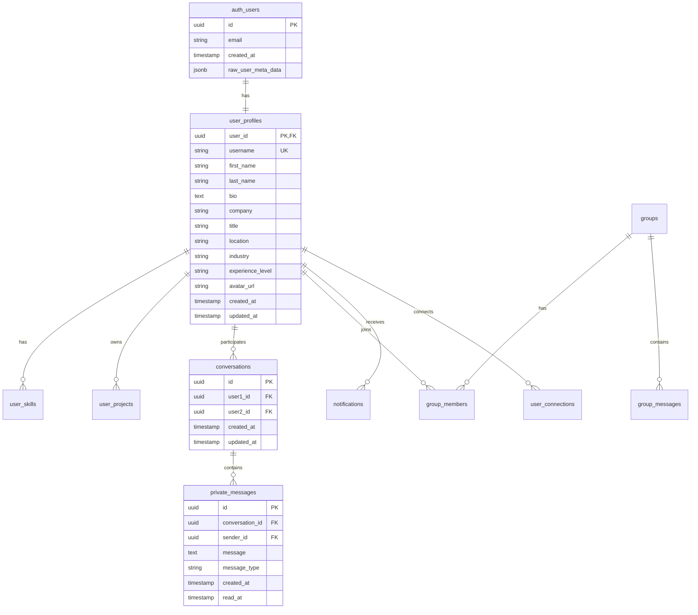

# 🗄️ Documentación de Base de Datos - StartupMatch

## 🏗️ Arquitectura de la Base de Datos

### Overview del Sistema
StartupMatch utiliza **Supabase PostgreSQL** como base de datos principal, aprovechando características avanzadas como Row Level Security (RLS), triggers, funciones personalizadas y capacidades de tiempo real para crear una plataforma robusta y escalable.



---

## 📊 Esquema de Tablas

### Core Tables

#### 1. **auth.users** (Supabase Auth)
```sql
-- Tabla de autenticación de Supabase (gestionada por el sistema)
CREATE TABLE auth.users (
    id UUID PRIMARY KEY DEFAULT gen_random_uuid(),
    email VARCHAR(255) UNIQUE NOT NULL,
    encrypted_password VARCHAR(255),
    email_confirmed_at TIMESTAMPTZ,
    invited_at TIMESTAMPTZ,
    confirmation_token VARCHAR(255),
    confirmation_sent_at TIMESTAMPTZ,
    recovery_token VARCHAR(255),
    recovery_sent_at TIMESTAMPTZ,
    email_change_token_new VARCHAR(255),
    email_change VARCHAR(255),
    email_change_sent_at TIMESTAMPTZ,
    last_sign_in_at TIMESTAMPTZ,
    raw_app_meta_data JSONB,
    raw_user_meta_data JSONB,
    is_super_admin BOOLEAN,
    created_at TIMESTAMPTZ DEFAULT NOW(),
    updated_at TIMESTAMPTZ DEFAULT NOW(),
    phone VARCHAR(15),
    phone_confirmed_at TIMESTAMPTZ,
    phone_change VARCHAR(15),
    phone_change_token VARCHAR(255),
    phone_change_sent_at TIMESTAMPTZ,
    confirmed_at TIMESTAMPTZ,
    email_change_token_current VARCHAR(255),
    email_change_confirm_status SMALLINT,
    banned_until TIMESTAMPTZ,
    reauthentication_token VARCHAR(255),
    reauthentication_sent_at TIMESTAMPTZ,
    is_sso_user BOOLEAN DEFAULT FALSE,
    deleted_at TIMESTAMPTZ,
    is_anonymous BOOLEAN DEFAULT FALSE
);
```

#### 2. **user_profiles** (Perfiles de Usuario)
```sql
CREATE TABLE user_profiles (
    id UUID NOT NULL DEFAULT gen_random_uuid() PRIMARY KEY,
    user_id UUID NOT NULL UNIQUE REFERENCES auth.users(id) ON DELETE CASCADE,
    username VARCHAR NOT NULL,
    first_name VARCHAR NOT NULL,
    last_name VARCHAR NOT NULL,
    email VARCHAR NOT NULL,
    phone VARCHAR,
    avatar_url TEXT,
    role VARCHAR NOT NULL,
    company VARCHAR,
    industry VARCHAR NOT NULL,
    location VARCHAR NOT NULL,
    experience_years INTEGER DEFAULT 0,
    availability_hours INTEGER DEFAULT 40,
    bio TEXT,
    headline VARCHAR,
    linkedin_url TEXT,
    github_url TEXT,
    portfolio_url TEXT,
    twitter_url TEXT,
    profile_visibility VARCHAR DEFAULT 'public' CHECK (profile_visibility IN ('public', 'private', 'connections')),
    email_notifications BOOLEAN DEFAULT TRUE,
    push_notifications BOOLEAN DEFAULT TRUE,
    marketing_emails BOOLEAN DEFAULT FALSE,
    profile_completed_at TIMESTAMP WITHOUT TIME ZONE,
    last_active_at TIMESTAMP WITHOUT TIME ZONE DEFAULT NOW(),
    created_at TIMESTAMP WITHOUT TIME ZONE DEFAULT NOW(),
    updated_at TIMESTAMP WITHOUT TIME ZONE DEFAULT NOW()
);

-- Indexes para optimización
CREATE INDEX idx_user_profiles_username ON user_profiles(username);
CREATE INDEX idx_user_profiles_user_id ON user_profiles(user_id);
CREATE INDEX idx_user_profiles_industry ON user_profiles(industry);
CREATE INDEX idx_user_profiles_location ON user_profiles(location);
CREATE INDEX idx_user_profiles_role ON user_profiles(role);
CREATE INDEX idx_user_profiles_created ON user_profiles(created_at);

-- Trigger para actualizar timestamp
CREATE OR REPLACE FUNCTION update_updated_at_column()
RETURNS TRIGGER AS $$
BEGIN
    NEW.updated_at = NOW();
    RETURN NEW;
END;
$$ language 'plpgsql';

CREATE TRIGGER update_user_profiles_updated_at 
    BEFORE UPDATE ON user_profiles 
    FOR EACH ROW EXECUTE FUNCTION update_updated_at_column();
```

#### 3. **user_skills** (Habilidades de Usuario)
```sql
CREATE TABLE user_skills (
    id UUID DEFAULT gen_random_uuid() PRIMARY KEY,
    user_id UUID NOT NULL REFERENCES auth.users(id) ON DELETE CASCADE,
    skill_name VARCHAR NOT NULL,
    skill_level INTEGER CHECK (skill_level >= 1 AND skill_level <= 10),
    skill_category VARCHAR DEFAULT 'other',
    is_primary BOOLEAN DEFAULT FALSE,
    created_at TIMESTAMP WITHOUT TIME ZONE DEFAULT NOW()
);

-- Índices
CREATE INDEX idx_user_skills_user_id ON user_skills(user_id);
CREATE INDEX idx_user_skills_name ON user_skills(skill_name);
CREATE INDEX idx_user_skills_category ON user_skills(skill_category);
CREATE INDEX idx_user_skills_primary ON user_skills(is_primary) WHERE is_primary = TRUE;

-- Constraint para evitar habilidades duplicadas por usuario
CREATE UNIQUE INDEX unique_user_skill ON user_skills(user_id, skill_name);
```

### Communication Tables

#### 4. **conversations** (Conversaciones Privadas)
```sql
CREATE TABLE conversations (
    id UUID NOT NULL DEFAULT gen_random_uuid() PRIMARY KEY,
    user1_id UUID NOT NULL REFERENCES auth.users(id) ON DELETE CASCADE,
    user2_id UUID NOT NULL REFERENCES auth.users(id) ON DELETE CASCADE,
    last_message TEXT,
    last_message_at TIMESTAMP WITHOUT TIME ZONE,
    created_at TIMESTAMP WITHOUT TIME ZONE DEFAULT NOW()
);

-- Índices para optimización
CREATE INDEX idx_conversations_user1 ON conversations(user1_id);
CREATE INDEX idx_conversations_user2 ON conversations(user2_id);
CREATE INDEX idx_conversations_last_message ON conversations(last_message_at);

-- Constraint para evitar conversaciones duplicadas
CREATE UNIQUE INDEX unique_conversation 
ON conversations(LEAST(user1_id, user2_id), GREATEST(user1_id, user2_id));

-- Constraint para evitar autoconversaciones
ALTER TABLE conversations ADD CONSTRAINT no_self_conversation 
CHECK (user1_id != user2_id);
```

#### 5. **private_messages** (Mensajes Privados)
```sql
CREATE TABLE private_messages (
    id UUID NOT NULL DEFAULT gen_random_uuid() PRIMARY KEY,
    conversation_id UUID NOT NULL REFERENCES conversations(id) ON DELETE CASCADE,
    sender_id UUID NOT NULL REFERENCES auth.users(id) ON DELETE CASCADE,
    message TEXT NOT NULL,
    message_type VARCHAR DEFAULT 'text',
    file_url TEXT,
    read_at TIMESTAMP WITHOUT TIME ZONE,
    created_at TIMESTAMP WITHOUT TIME ZONE DEFAULT NOW()
);

-- Índices críticos para performance
CREATE INDEX idx_private_messages_conversation ON private_messages(conversation_id, created_at DESC);
CREATE INDEX idx_private_messages_sender ON private_messages(sender_id);
CREATE INDEX idx_private_messages_unread ON private_messages(conversation_id, read_at) WHERE read_at IS NULL;
CREATE INDEX idx_private_messages_created ON private_messages(created_at);

-- Full-text search index
CREATE INDEX idx_private_messages_search ON private_messages USING gin(to_tsvector('spanish', message));
```

### Additional User Tables

#### 6. **user_experience** (Experiencia Laboral)
```sql
CREATE TABLE user_experience (
    id UUID NOT NULL DEFAULT gen_random_uuid() PRIMARY KEY,
    user_id UUID NOT NULL REFERENCES auth.users(id) ON DELETE CASCADE,
    company_name VARCHAR NOT NULL,
    position VARCHAR NOT NULL,
    description TEXT,
    start_date DATE NOT NULL,
    end_date DATE,
    is_current BOOLEAN DEFAULT FALSE,
    location VARCHAR,
    created_at TIMESTAMP WITHOUT TIME ZONE DEFAULT NOW(),
    updated_at TIMESTAMP WITHOUT TIME ZONE DEFAULT NOW()
);

-- Índices
CREATE INDEX idx_user_experience_user_id ON user_experience(user_id);
CREATE INDEX idx_user_experience_current ON user_experience(user_id, is_current) WHERE is_current = TRUE;
CREATE INDEX idx_user_experience_dates ON user_experience(start_date, end_date);
```

#### 7. **user_objectives** (Objetivos de Usuario)
```sql
CREATE TABLE user_objectives (
    id UUID NOT NULL DEFAULT gen_random_uuid() PRIMARY KEY,
    user_id UUID NOT NULL REFERENCES auth.users(id) ON DELETE CASCADE,
    objective_type VARCHAR NOT NULL,
    priority INTEGER DEFAULT 1 CHECK (priority >= 1 AND priority <= 5),
    created_at TIMESTAMP WITHOUT TIME ZONE DEFAULT NOW()
);

-- Índices
CREATE INDEX idx_user_objectives_user_id ON user_objectives(user_id);
CREATE INDEX idx_user_objectives_type ON user_objectives(objective_type);
CREATE INDEX idx_user_objectives_priority ON user_objectives(priority);
```

#### 8. **user_projects** (Proyectos de Usuario)
```sql
CREATE TABLE user_projects (
    id UUID NOT NULL DEFAULT gen_random_uuid() PRIMARY KEY,
    user_id UUID NOT NULL REFERENCES auth.users(id) ON DELETE CASCADE,
    project_name VARCHAR NOT NULL,
    project_description TEXT,
    project_url TEXT,
    project_status VARCHAR DEFAULT 'active' CHECK (project_status IN ('active', 'completed', 'paused')),
    start_date DATE,
    end_date DATE,
    technologies TEXT[], -- Array de tecnologías
    created_at TIMESTAMP WITHOUT TIME ZONE DEFAULT NOW(),
    updated_at TIMESTAMP WITHOUT TIME ZONE DEFAULT NOW()
);

-- Índices
CREATE INDEX idx_user_projects_user_id ON user_projects(user_id);
CREATE INDEX idx_user_projects_status ON user_projects(project_status);
CREATE INDEX idx_user_projects_technologies ON user_projects USING gin(technologies);
```

### Connection & Networking Tables

#### 9. **groups** (Grupos/Comunidades)
```sql
CREATE TABLE groups (
    id UUID NOT NULL DEFAULT gen_random_uuid() PRIMARY KEY,
    name VARCHAR NOT NULL,
    description TEXT,
    category VARCHAR NOT NULL,
    avatar_url TEXT,
    cover_url TEXT,
    is_private BOOLEAN DEFAULT FALSE,
    is_verified BOOLEAN DEFAULT FALSE,
    member_limit INTEGER DEFAULT 100,
    tags TEXT[], -- Array de tags
    created_by UUID NOT NULL REFERENCES auth.users(id) ON DELETE CASCADE,
    created_at TIMESTAMP WITHOUT TIME ZONE DEFAULT NOW(),
    updated_at TIMESTAMP WITHOUT TIME ZONE DEFAULT NOW()
);

-- Índices
CREATE INDEX idx_groups_created_by ON groups(created_by);
CREATE INDEX idx_groups_category ON groups(category);
CREATE INDEX idx_groups_is_private ON groups(is_private);
CREATE INDEX idx_groups_tags ON groups USING gin(tags);
```

#### 10. **group_memberships** (Miembros de Grupos)
```sql
CREATE TABLE group_memberships (
    id UUID NOT NULL DEFAULT gen_random_uuid() PRIMARY KEY,
    group_id UUID NOT NULL REFERENCES groups(id) ON DELETE CASCADE,
    user_id UUID NOT NULL REFERENCES auth.users(id) ON DELETE CASCADE,
    role VARCHAR DEFAULT 'member',
    joined_at TIMESTAMP WITHOUT TIME ZONE DEFAULT NOW()
);

-- Índices
CREATE INDEX idx_group_memberships_group_id ON group_memberships(group_id);
CREATE INDEX idx_group_memberships_user_id ON group_memberships(user_id);
CREATE INDEX idx_group_memberships_role ON group_memberships(role);

-- Evitar membresías duplicadas
CREATE UNIQUE INDEX unique_group_membership ON group_memberships(group_id, user_id);
```

#### 11. **group_messages** (Mensajes de Grupo)
```sql
CREATE TABLE group_messages (
    id UUID NOT NULL DEFAULT gen_random_uuid() PRIMARY KEY,
    group_id UUID NOT NULL REFERENCES groups(id) ON DELETE CASCADE,
    user_id UUID NOT NULL REFERENCES auth.users(id) ON DELETE CASCADE,
    message TEXT NOT NULL,
    message_type VARCHAR DEFAULT 'text',
    file_url TEXT,
    reply_to UUID REFERENCES group_messages(id),
    created_at TIMESTAMP WITHOUT TIME ZONE DEFAULT NOW()
);

-- Índices
CREATE INDEX idx_group_messages_group_id ON group_messages(group_id, created_at DESC);
CREATE INDEX idx_group_messages_user_id ON group_messages(user_id);
CREATE INDEX idx_group_messages_reply_to ON group_messages(reply_to) WHERE reply_to IS NOT NULL;
```

### Additional Tables

#### 12. **notifications** (Notificaciones)
```sql
CREATE TABLE notifications (
    id UUID DEFAULT gen_random_uuid() PRIMARY KEY,
    user_id UUID REFERENCES auth.users(id) ON DELETE CASCADE,
    type VARCHAR(50) NOT NULL,
    title VARCHAR(200) NOT NULL,
    message TEXT,
    data JSONB,
    is_read BOOLEAN DEFAULT FALSE,
    action_url TEXT,
    created_at TIMESTAMP WITHOUT TIME ZONE DEFAULT NOW(),
    read_at TIMESTAMP WITHOUT TIME ZONE
);

-- Índices
CREATE INDEX idx_notifications_user ON notifications(user_id, created_at DESC);
CREATE INDEX idx_notifications_unread ON notifications(user_id, is_read) WHERE is_read = FALSE;
CREATE INDEX idx_notifications_type ON notifications(type);
```

#### 11. **user_projects** (Proyectos de Usuario)
```sql
CREATE TABLE user_projects (
    id UUID DEFAULT gen_random_uuid() PRIMARY KEY,
    user_id UUID REFERENCES user_profiles(user_id) ON DELETE CASCADE,
    title VARCHAR(200) NOT NULL,
    description TEXT,
    status VARCHAR(20) DEFAULT 'active' CHECK (status IN ('planning', 'active', 'completed', 'paused')),
    project_type VARCHAR(30),
    technologies JSONB,
    start_date DATE,
    end_date DATE,
    repository_url TEXT,
    demo_url TEXT,
    is_featured BOOLEAN DEFAULT FALSE,
    is_public BOOLEAN DEFAULT TRUE,
    created_at TIMESTAMP WITH TIME ZONE DEFAULT NOW(),
    updated_at TIMESTAMP WITH TIME ZONE DEFAULT NOW()
);

-- Índices
CREATE INDEX idx_user_projects_user ON user_projects(user_id);
CREATE INDEX idx_user_projects_status ON user_projects(status);
CREATE INDEX idx_user_projects_featured ON user_projects(is_featured) WHERE is_featured = TRUE;
```

---

## 🔒 Row Level Security (RLS)

### Security Architecture
Supabase RLS proporciona seguridad a nivel de fila, asegurando que los usuarios solo puedan acceder a sus propios datos y datos públicos apropiados.

#### User Profiles Security
```sql
-- Habilitar RLS
ALTER TABLE user_profiles ENABLE ROW LEVEL SECURITY;

-- Política: Ver perfiles públicos
CREATE POLICY "Public profiles are viewable by everyone" 
ON user_profiles FOR SELECT
USING (profile_visibility = 'public' OR profile_visibility = 'connections');

-- Política: Usuarios pueden actualizar su propio perfil
CREATE POLICY "Users can update own profile" 
ON user_profiles FOR UPDATE
USING (auth.uid() = user_id);

-- Política: Usuarios pueden insertar su propio perfil
CREATE POLICY "Users can insert own profile" 
ON user_profiles FOR INSERT
WITH CHECK (auth.uid() = user_id);
```

#### Conversations Security
```sql
ALTER TABLE conversations ENABLE ROW LEVEL SECURITY;

-- Política: Ver conversaciones propias
CREATE POLICY "Users can view their conversations" 
ON conversations FOR SELECT
USING (auth.uid() = user1_id OR auth.uid() = user2_id);

-- Política: Crear conversaciones
CREATE POLICY "Users can create conversations" 
ON conversations FOR INSERT
WITH CHECK (auth.uid() = user1_id OR auth.uid() = user2_id);

-- Política: Actualizar conversaciones propias
CREATE POLICY "Users can update their conversations" 
ON conversations FOR UPDATE
USING (auth.uid() = user1_id OR auth.uid() = user2_id);
```

#### Messages Security
```sql
ALTER TABLE private_messages ENABLE ROW LEVEL SECURITY;

-- Política: Ver mensajes de conversaciones propias
CREATE POLICY "Users can view their messages" 
ON private_messages FOR SELECT
USING (
    EXISTS (
        SELECT 1 FROM conversations 
        WHERE id = conversation_id 
        AND (user1_id = auth.uid() OR user2_id = auth.uid())
    )
);

-- Política: Enviar mensajes
CREATE POLICY "Users can send messages" 
ON private_messages FOR INSERT
WITH CHECK (
    sender_id = auth.uid() AND
    EXISTS (
        SELECT 1 FROM conversations 
        WHERE id = conversation_id 
        AND (user1_id = auth.uid() OR user2_id = auth.uid())
    )
);

-- Política: Actualizar mensajes propios (para marcar como leído)
CREATE POLICY "Users can update their messages" 
ON private_messages FOR UPDATE
USING (
    EXISTS (
        SELECT 1 FROM conversations 
        WHERE id = conversation_id 
        AND (user1_id = auth.uid() OR user2_id = auth.uid())
    )
);
```

#### Skills Security
```sql
ALTER TABLE user_skills ENABLE ROW LEVEL SECURITY;

-- Política: Ver habilidades públicas
CREATE POLICY "Skills are viewable by everyone" 
ON user_skills FOR SELECT
USING (true);

-- Política: Usuarios pueden gestionar sus habilidades
CREATE POLICY "Users can manage own skills" 
ON user_skills FOR ALL
USING (user_id = auth.uid())
WITH CHECK (user_id = auth.uid());
```

#### Experience Security
```sql
ALTER TABLE user_experience ENABLE ROW LEVEL SECURITY;

-- Política: Ver experiencia pública
CREATE POLICY "Experience is viewable by everyone" 
ON user_experience FOR SELECT
USING (true);

-- Política: Usuarios pueden gestionar su experiencia
CREATE POLICY "Users can manage own experience" 
ON user_experience FOR ALL
USING (user_id = auth.uid())
WITH CHECK (user_id = auth.uid());
```

#### Projects Security
```sql
ALTER TABLE user_projects ENABLE ROW LEVEL SECURITY;

-- Política: Ver proyectos públicos
CREATE POLICY "Public projects are viewable by everyone" 
ON user_projects FOR SELECT
USING (project_status != 'private');

-- Política: Usuarios pueden gestionar sus proyectos
CREATE POLICY "Users can manage own projects" 
ON user_projects FOR ALL
USING (user_id = auth.uid())
WITH CHECK (user_id = auth.uid());
```

---

## 🔧 Funciones y Triggers

### Database Functions

#### 1. **Update Conversation Timestamp**
```sql
-- Función para actualizar last_message_at en conversations
CREATE OR REPLACE FUNCTION update_conversation_timestamp()
RETURNS TRIGGER AS $$
BEGIN
    UPDATE conversations 
    SET 
        last_message_at = NEW.created_at,
        last_message = NEW.message
    WHERE id = NEW.conversation_id;
    RETURN NEW;
END;
$$ LANGUAGE plpgsql;

-- Trigger
CREATE TRIGGER update_conversation_on_message
    AFTER INSERT ON private_messages
    FOR EACH ROW
    EXECUTE FUNCTION update_conversation_timestamp();
```

#### 2. **User Search Function**
```sql
-- Función de búsqueda de usuarios (actualizada para esquema real)
CREATE OR REPLACE FUNCTION search_users(
    search_term TEXT DEFAULT '',
    industry_filter TEXT DEFAULT '',
    location_filter TEXT DEFAULT '',
    role_filter TEXT DEFAULT '',
    limit_count INTEGER DEFAULT 50
)
RETURNS TABLE (
    id UUID,
    user_id UUID,
    username VARCHAR,
    first_name VARCHAR,
    last_name VARCHAR,
    bio TEXT,
    company VARCHAR,
    role VARCHAR,
    location VARCHAR,
    industry VARCHAR,
    experience_years INTEGER,
    avatar_url TEXT,
    relevance_score REAL
) AS $$
BEGIN
    RETURN QUERY
    SELECT 
        up.id,
        up.user_id,
        up.username,
        up.first_name,
        up.last_name,
        up.bio,
        up.company,
        up.role,
        up.location,
        up.industry,
        up.experience_years,
        up.avatar_url,
        CASE 
            WHEN search_term = '' THEN 1.0
            ELSE 
                ts_rank(
                    to_tsvector('spanish', COALESCE(up.first_name, '') || ' ' || 
                                         COALESCE(up.last_name, '') || ' ' || 
                                         COALESCE(up.bio, '') || ' ' || 
                                         COALESCE(up.company, '') || ' ' || 
                                         COALESCE(up.headline, '')), 
                    plainto_tsquery('spanish', search_term)
                )
        END AS relevance_score
    FROM user_profiles up
    WHERE 
        up.profile_visibility IN ('public', 'connections')
        AND (search_term = '' OR 
             to_tsvector('spanish', COALESCE(up.first_name, '') || ' ' || 
                                    COALESCE(up.last_name, '') || ' ' || 
                                    COALESCE(up.bio, '') || ' ' || 
                                    COALESCE(up.company, '') || ' ' || 
                                    COALESCE(up.headline, '')) @@ plainto_tsquery('spanish', search_term))
        AND (industry_filter = '' OR up.industry = industry_filter)
        AND (location_filter = '' OR up.location ILIKE '%' || location_filter || '%')
        AND (role_filter = '' OR up.role = role_filter)
    ORDER BY relevance_score DESC, up.created_at DESC
    LIMIT limit_count;
END;
$$ LANGUAGE plpgsql;
```

#### 3. **Get Unread Messages Count**
```sql
-- Función para contar mensajes no leídos (actualizada)
CREATE OR REPLACE FUNCTION get_unread_count(target_user_id UUID)
RETURNS INTEGER AS $$
DECLARE
    unread_count INTEGER;
BEGIN
    SELECT COUNT(*)
    INTO unread_count
    FROM private_messages pm
    JOIN conversations c ON pm.conversation_id = c.id
    WHERE 
        (c.user1_id = target_user_id OR c.user2_id = target_user_id)
        AND pm.sender_id != target_user_id
        AND pm.read_at IS NULL;
        
    RETURN COALESCE(unread_count, 0);
END;
$$ LANGUAGE plpgsql;
```

#### 4. **Get User Conversations with Details**
```sql
-- Función para obtener conversaciones del usuario con detalles
CREATE OR REPLACE FUNCTION get_user_conversations(target_user_id UUID)
RETURNS TABLE (
    conversation_id UUID,
    other_user_id UUID,
    other_user_name VARCHAR,
    other_user_avatar TEXT,
    last_message TEXT,
    last_message_at TIMESTAMP WITHOUT TIME ZONE,
    unread_count BIGINT
) AS $$
BEGIN
    RETURN QUERY
    SELECT 
        c.id as conversation_id,
        CASE 
            WHEN c.user1_id = target_user_id THEN c.user2_id
            ELSE c.user1_id
        END as other_user_id,
        CASE 
            WHEN c.user1_id = target_user_id THEN up2.first_name || ' ' || up2.last_name
            ELSE up1.first_name || ' ' || up1.last_name
        END as other_user_name,
        CASE 
            WHEN c.user1_id = target_user_id THEN up2.avatar_url
            ELSE up1.avatar_url
        END as other_user_avatar,
        c.last_message,
        c.last_message_at,
        COUNT(pm.id) FILTER (WHERE pm.sender_id != target_user_id AND pm.read_at IS NULL) as unread_count
    FROM conversations c
    LEFT JOIN user_profiles up1 ON c.user1_id = up1.user_id
    LEFT JOIN user_profiles up2 ON c.user2_id = up2.user_id
    LEFT JOIN private_messages pm ON c.id = pm.conversation_id
    WHERE 
        (c.user1_id = target_user_id OR c.user2_id = target_user_id)
    GROUP BY 
        c.id, c.user1_id, c.user2_id, up1.first_name, up1.last_name, up1.avatar_url,
        up2.first_name, up2.last_name, up2.avatar_url, c.last_message, c.last_message_at
    ORDER BY COALESCE(c.last_message_at, c.created_at) DESC;
END;
$$ LANGUAGE plpgsql;
```

---

## 🚀 Realtime Features

### Supabase Realtime Configuration
```sql
-- Habilitar realtime para mensajería
ALTER PUBLICATION supabase_realtime ADD TABLE private_messages;
ALTER PUBLICATION supabase_realtime ADD TABLE conversations;
ALTER PUBLICATION supabase_realtime ADD TABLE notifications;

-- Configurar replica identity para optimizar realtime
ALTER TABLE private_messages REPLICA IDENTITY FULL;
ALTER TABLE conversations REPLICA IDENTITY FULL;
```

### Real-time Subscriptions
```typescript
// Suscripción a mensajes en tiempo real
export const subscribeToMessages = (conversationId: string, callback: (message: Message) => void) => {
  return supabase
    .channel(`messages:${conversationId}`)
    .on(
      'postgres_changes',
      {
        event: 'INSERT',
        schema: 'public',
        table: 'private_messages',
        filter: `conversation_id=eq.${conversationId}`
      },
      (payload) => callback(payload.new as Message)
    )
    .subscribe();
};

// Suscripción a actualizaciones de conversaciones
export const subscribeToConversations = (userId: string, callback: (conversation: Conversation) => void) => {
  return supabase
    .channel(`conversations:${userId}`)
    .on(
      'postgres_changes',
      {
        event: '*',
        schema: 'public',
        table: 'conversations',
        filter: `or(user1_id.eq.${userId},user2_id.eq.${userId})`
      },
      (payload) => callback(payload.new as Conversation)
    )
    .subscribe();
};
```

---

## 📈 Performance Optimization

### Query Optimization

#### 1. **Índices Estratégicos**
```sql
-- Índices compuestos para consultas frecuentes
CREATE INDEX idx_conversations_users_status ON conversations(user1_id, user2_id, status);
CREATE INDEX idx_messages_conversation_timestamp ON private_messages(conversation_id, created_at DESC);
CREATE INDEX idx_connections_user_status ON user_connections(requester_id, addressee_id, status);

-- Índices parciales para casos específicos
CREATE INDEX idx_unread_messages ON private_messages(conversation_id) WHERE read_at IS NULL;
CREATE INDEX idx_active_conversations ON conversations(updated_at DESC) WHERE status = 'active';
CREATE INDEX idx_featured_projects ON user_projects(user_id, created_at) WHERE is_featured = TRUE;

-- Índices para búsqueda full-text
CREATE INDEX idx_profiles_search ON user_profiles USING gin(
    to_tsvector('spanish', 
        COALESCE(first_name, '') || ' ' || 
        COALESCE(last_name, '') || ' ' || 
        COALESCE(bio, '') || ' ' || 
        COALESCE(company, '')
    )
);
```

#### 2. **Query Patterns Optimizadas**
```sql
-- Consulta optimizada para dashboard del usuario
WITH user_stats AS (
    SELECT 
        (SELECT COUNT(*) FROM user_connections 
         WHERE (requester_id = $1 OR addressee_id = $1) AND status = 'accepted') as connections_count,
        (SELECT COUNT(*) FROM private_messages pm 
         JOIN conversations c ON pm.conversation_id = c.id 
         WHERE (c.user1_id = $1 OR c.user2_id = $1) AND pm.sender_id != $1 AND pm.read_at IS NULL) as unread_count,
        (SELECT COUNT(*) FROM user_projects WHERE user_id = $1 AND status = 'active') as projects_count
),
recent_conversations AS (
    SELECT DISTINCT ON (c.id)
        c.id,
        c.updated_at,
        CASE WHEN c.user1_id = $1 THEN c.user2_id ELSE c.user1_id END as other_user_id,
        pm.message as last_message,
        pm.created_at as last_message_at
    FROM conversations c
    LEFT JOIN private_messages pm ON c.id = pm.conversation_id
    WHERE (c.user1_id = $1 OR c.user2_id = $1) AND c.status = 'active'
    ORDER BY c.id, pm.created_at DESC
    LIMIT 5
)
SELECT 
    us.*,
    json_agg(
        json_build_object(
            'conversation_id', rc.id,
            'other_user_id', rc.other_user_id,
            'last_message', rc.last_message,
            'last_message_at', rc.last_message_at
        )
    ) as recent_conversations
FROM user_stats us, recent_conversations rc
GROUP BY us.connections_count, us.unread_count, us.projects_count;
```

### Database Monitoring

#### 1. **Performance Views**
```sql
-- Vista para monitorear queries lentas
CREATE OR REPLACE VIEW slow_queries AS
SELECT 
    query,
    calls,
    total_time,
    mean_time,
    rows,
    100.0 * shared_blks_hit / nullif(shared_blks_hit + shared_blks_read, 0) AS hit_percent
FROM pg_stat_statements
WHERE mean_time > 100 -- queries que toman más de 100ms en promedio
ORDER BY mean_time DESC;

-- Vista para monitorear uso de índices
CREATE OR REPLACE VIEW index_usage AS
SELECT 
    schemaname,
    tablename,
    indexname,
    idx_tup_read,
    idx_tup_fetch,
    idx_scan
FROM pg_stat_user_indexes
ORDER BY idx_scan DESC;
```

#### 2. **Maintenance Procedures**
```sql
-- Función para análisis automático de tablas
CREATE OR REPLACE FUNCTION analyze_tables()
RETURNS void AS $$
DECLARE
    table_name TEXT;
BEGIN
    FOR table_name IN 
        SELECT tablename FROM pg_tables WHERE schemaname = 'public'
    LOOP
        EXECUTE 'ANALYZE ' || table_name;
    END LOOP;
END;
$$ LANGUAGE plpgsql;

-- Scheduled job para ejecutar análisis (requiere pg_cron extension)
-- SELECT cron.schedule('analyze-tables', '0 2 * * *', 'SELECT analyze_tables();');
```

---

## 🔄 Data Migration & Versioning

### Migration Scripts

#### Version 1.0.0 - Initial Schema
```sql
-- migrations/001_initial_schema.sql
BEGIN;

-- Enable necessary extensions
CREATE EXTENSION IF NOT EXISTS "uuid-ossp";
CREATE EXTENSION IF NOT EXISTS "pg_trgm";

-- Create user_profiles table
CREATE TABLE user_profiles (
    -- [Schema definition as shown above]
);

-- Create indexes and constraints
-- [Index definitions as shown above]

-- Set up RLS policies
-- [RLS policies as shown above]

COMMIT;
```

#### Version 1.1.0 - Add Projects
```sql
-- migrations/002_add_projects.sql
BEGIN;

CREATE TABLE user_projects (
    -- [Schema definition as shown above]
);

-- Add new indexes
CREATE INDEX idx_user_projects_user ON user_projects(user_id);
CREATE INDEX idx_user_projects_status ON user_projects(status);

-- Update RLS
ALTER TABLE user_projects ENABLE ROW LEVEL SECURITY;

CREATE POLICY "Users can manage own projects" 
ON user_projects FOR ALL
USING (user_id = auth.uid())
WITH CHECK (user_id = auth.uid());

COMMIT;
```

#### Version 1.2.0 - Enhanced Messaging
```sql
-- migrations/003_enhanced_messaging.sql
BEGIN;

-- Add new columns to private_messages
ALTER TABLE private_messages 
ADD COLUMN message_type VARCHAR(20) DEFAULT 'text',
ADD COLUMN file_url TEXT,
ADD COLUMN metadata JSONB;

-- Update constraint
ALTER TABLE private_messages 
DROP CONSTRAINT IF EXISTS private_messages_message_type_check,
ADD CONSTRAINT private_messages_message_type_check 
CHECK (message_type IN ('text', 'image', 'file', 'link'));

-- Add new index for file messages
CREATE INDEX idx_private_messages_files 
ON private_messages(conversation_id, message_type) 
WHERE message_type != 'text';

COMMIT;
```

### Data Seeding

#### Development Seed Data
```sql
-- seeds/dev_data.sql
-- Insert test users (only for development)
INSERT INTO user_profiles (user_id, username, first_name, last_name, bio, company, title, location, industry, experience_level)
VALUES 
    ('550e8400-e29b-41d4-a716-446655440001', 'john_doe', 'John', 'Doe', 'Experienced full-stack developer', 'TechCorp', 'Senior Developer', 'San Francisco, CA', 'Technology', 'senior'),
    ('550e8400-e29b-41d4-a716-446655440002', 'jane_smith', 'Jane', 'Smith', 'Product manager with startup experience', 'StartupXYZ', 'Product Manager', 'New York, NY', 'Technology', 'mid'),
    ('550e8400-e29b-41d4-a716-446655440003', 'mike_wilson', 'Mike', 'Wilson', 'Designer passionate about UX', 'DesignStudio', 'UX Designer', 'Austin, TX', 'Design', 'senior');

-- Insert test skills
INSERT INTO user_skills (user_id, skill_name, category, proficiency_level, years_experience)
VALUES 
    ('550e8400-e29b-41d4-a716-446655440001', 'JavaScript', 'technical', 5, 8),
    ('550e8400-e29b-41d4-a716-446655440001', 'React', 'technical', 5, 6),
    ('550e8400-e29b-41d4-a716-446655440001', 'Node.js', 'technical', 4, 5),
    ('550e8400-e29b-41d4-a716-446655440002', 'Product Strategy', 'soft', 4, 7),
    ('550e8400-e29b-41d4-a716-446655440002', 'Agile', 'technical', 5, 8),
    ('550e8400-e29b-41d4-a716-446655440003', 'Figma', 'technical', 5, 4),
    ('550e8400-e29b-41d4-a716-446655440003', 'User Research', 'soft', 4, 6);
```

---

## 📊 Analytics & Reporting

### Analytics Tables

#### 1. **User Activity Tracking**
```sql
CREATE TABLE user_activity_logs (
    id UUID DEFAULT gen_random_uuid() PRIMARY KEY,
    user_id UUID REFERENCES user_profiles(user_id) ON DELETE CASCADE,
    activity_type VARCHAR(50) NOT NULL,
    page_url TEXT,
    metadata JSONB,
    ip_address INET,
    user_agent TEXT,
    created_at TIMESTAMP WITH TIME ZONE DEFAULT NOW()
);

-- Índices para analytics
CREATE INDEX idx_activity_logs_user ON user_activity_logs(user_id, created_at);
CREATE INDEX idx_activity_logs_type ON user_activity_logs(activity_type, created_at);
CREATE INDEX idx_activity_logs_daily ON user_activity_logs(DATE(created_at));
```

#### 2. **Platform Metrics**
```sql
-- Vista para métricas diarias
CREATE OR REPLACE VIEW daily_metrics AS
WITH daily_stats AS (
    SELECT 
        DATE(created_at) as date,
        COUNT(*) FILTER (WHERE activity_type = 'login') as daily_logins,
        COUNT(DISTINCT user_id) as daily_active_users,
        COUNT(*) FILTER (WHERE activity_type = 'message_sent') as messages_sent,
        COUNT(*) FILTER (WHERE activity_type = 'profile_view') as profile_views,
        COUNT(*) FILTER (WHERE activity_type = 'connection_request') as connection_requests
    FROM user_activity_logs
    WHERE created_at >= CURRENT_DATE - INTERVAL '30 days'
    GROUP BY DATE(created_at)
)
SELECT 
    date,
    daily_logins,
    daily_active_users,
    messages_sent,
    profile_views,
    connection_requests,
    LAG(daily_active_users) OVER (ORDER BY date) as previous_day_users,
    ROUND(
        (daily_active_users::NUMERIC - LAG(daily_active_users) OVER (ORDER BY date)) / 
        NULLIF(LAG(daily_active_users) OVER (ORDER BY date), 0) * 100, 
        2
    ) as user_growth_percent
FROM daily_stats
ORDER BY date DESC;
```

---

## 🛠️ Backup & Recovery

### Backup Strategy
```bash
#!/bin/bash
# backup_script.sh - Automated backup script

# Variables
DB_HOST="your-supabase-host"
DB_NAME="postgres"
DB_USER="postgres"
BACKUP_DIR="/backups/supabase"
DATE=$(date +%Y%m%d_%H%M%S)

# Create backup directory
mkdir -p $BACKUP_DIR

# Full database backup
pg_dump -h $DB_HOST -U $DB_USER -d $DB_NAME \
    --verbose --clean --no-owner --no-privileges \
    --format=custom \
    --file=$BACKUP_DIR/full_backup_$DATE.dump

# Schema-only backup
pg_dump -h $DB_HOST -U $DB_USER -d $DB_NAME \
    --schema-only --verbose \
    --file=$BACKUP_DIR/schema_backup_$DATE.sql

# Data-only backup for critical tables
pg_dump -h $DB_HOST -U $DB_USER -d $DB_NAME \
    --data-only --verbose \
    --table=user_profiles \
    --table=private_messages \
    --table=conversations \
    --file=$BACKUP_DIR/critical_data_$DATE.sql

echo "Backup completed: $DATE"
```

### Recovery Procedures
```sql
-- Recovery script template
-- 1. Restore schema
-- psql -h $DB_HOST -U $DB_USER -d $DB_NAME -f schema_backup_DATE.sql

-- 2. Restore data
-- pg_restore -h $DB_HOST -U $DB_USER -d $DB_NAME --verbose --clean full_backup_DATE.dump

-- 3. Verify data integrity
SELECT 
    schemaname,
    tablename,
    n_tup_ins as inserts,
    n_tup_upd as updates,
    n_tup_del as deletes,
    n_live_tup as live_rows,
    n_dead_tup as dead_rows
FROM pg_stat_user_tables
ORDER BY tablename;

-- 4. Refresh statistics
ANALYZE;
```

---

## 🔧 Environment Configuration

### Database Settings
```sql
-- Recommended PostgreSQL settings for StartupMatch

-- Connection settings
ALTER SYSTEM SET max_connections = 200;
ALTER SYSTEM SET shared_buffers = '256MB';
ALTER SYSTEM SET effective_cache_size = '1GB';

-- Performance tuning
ALTER SYSTEM SET work_mem = '16MB';
ALTER SYSTEM SET maintenance_work_mem = '64MB';
ALTER SYSTEM SET checkpoint_completion_target = 0.8;
ALTER SYSTEM SET wal_buffers = '16MB';

-- Logging for monitoring
ALTER SYSTEM SET log_min_duration_statement = 1000; -- Log queries > 1s
ALTER SYSTEM SET log_checkpoints = on;
ALTER SYSTEM SET log_connections = on;
ALTER SYSTEM SET log_disconnections = on;

-- Apply changes
SELECT pg_reload_conf();
```

---

**Última actualización**: Agosto 12, 2025  
**Versión de la base de datos**: 1.2.0  
**PostgreSQL Version**: 15.x  
**Supabase Version**: Latest
