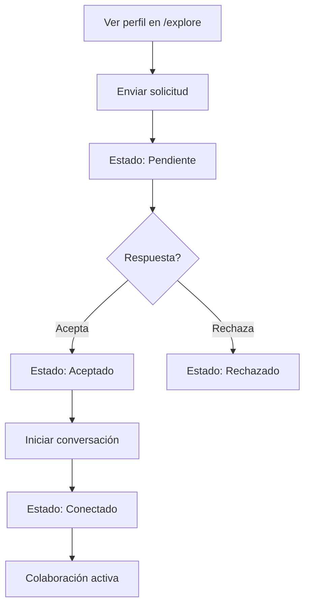

# 🚀 Funcionalidades - StartupMatch

## 📋 Resumen de Características

Esta documentación detalla todas las funcionalidades implementadas en StartupMatch, incluyendo casos de uso, flujos de usuario y especificaciones técnicas.

---

## 🎯 Funcionalidades Principales

### 1. 🔐 Sistema de Autenticación

#### **Descripción**
Sistema completo de autenticación integrado con Supabase Auth, que permite registro, login, recuperación de contraseña y gestión de perfiles.

#### **Características Implementadas**
- ✅ **Registro de usuarios** con validación de email
- ✅ **Login seguro** con manejo de errores
- ✅ **Recuperación de contraseña** por email
- ✅ **Protección de rutas** con middleware
- ✅ **Estados de autenticación** persistentes
- ✅ **Logout seguro** con limpieza de sesión

#### **Flujo de Usuario**
```mermaid
graph TD
    A[Usuario nuevo] --> B[/register]
    B --> C[Verificación email]
    C --> D[/dashboard]
    
    E[Usuario existente] --> F[/login]
    F --> D[/dashboard]
    
    D --> G{Autenticado?}
    G -->|Sí| H[Acceso completo]
    G -->|No| I[Redirect /login]
```

#### **Archivos Relacionados**
- `/app/login/page.tsx`
- `/app/register/page.tsx`
- `/contexts/AuthProvider.tsx`
- `/middleware.ts`

---

### 2. 🏠 Dashboard Principal

#### **Descripción**
Centro de control principal de la aplicación con navegación completa, resumen de actividades y acceso rápido a todas las funcionalidades.

#### **Características Implementadas**
- ✅ **Sidebar navegable** con indicadores
- ✅ **Estadísticas en tiempo real** de la cuenta
- ✅ **Actividad reciente** del usuario
- ✅ **Accesos rápidos** a funciones principales
- ✅ **Notificaciones** integradas
- ✅ **Perfil colapsible** con opciones
- ✅ **Tema oscuro/claro** (preparado)

#### **Métricas Mostradas**
- Total de conexiones
- Matches pendientes
- Mensajes no leídos
- Perfil completado (%)
- Actividad semanal

#### **Navegación Incluida**
```typescript
const sidebarItems = [
  { label: "Dashboard", icon: Home, href: "/dashboard" },
  { label: "Matches", icon: Heart, href: "/matches" },
  { label: "Explorar", icon: Search, href: "/explore" },
  { label: "Mensajes", icon: MessageSquare, href: "/messages" },
  { label: "Proyectos", icon: Rocket, href: "/projects" },
  // ... más items
];
```

---

### 3. 🔍 Exploración de Perfiles (/explore)

#### **Descripción**
Motor de descubrimiento inteligente que permite a los usuarios encontrar y conectar con otros emprendedores según criterios específicos.

#### **Características Avanzadas**
- ✅ **Filtros multidimensionales**
  - Por industria (SaaS, FinTech, HealthTech, etc.)
  - Por experiencia (Junior, Mid, Senior, Lead)
  - Por objetivos (Co-founder, CTO, Investment, etc.)
  - Por ubicación geográfica
- ✅ **Búsqueda semántica** en tiempo real
- ✅ **Sistema de compatibilidad** con porcentajes
- ✅ **Ordenamiento inteligente** (compatibilidad, recientes, activos)
- ✅ **Cards interactivas** con hover states
- ✅ **Modal de detalles** completo
- ✅ **Acciones directas**: Conectar, Mensaje, Ver perfil

#### **Algoritmo de Compatibilidad**
```typescript
const calculateCompatibility = (userProfile, targetProfile) => {
  let score = 0;
  
  // Skills complementarias (30%)
  const skillsMatch = calculateSkillsOverlap(userProfile.skills, targetProfile.skills);
  score += skillsMatch * 0.3;
  
  // Objetivos compatibles (25%)
  const objectivesMatch = calculateObjectivesCompatibility(userProfile.objectives, targetProfile.objectives);
  score += objectivesMatch * 0.25;
  
  // Industria similar (20%)
  const industryMatch = userProfile.industry === targetProfile.industry ? 1 : 0.5;
  score += industryMatch * 0.2;
  
  // Ubicación (15%)
  const locationMatch = calculateLocationProximity(userProfile.location, targetProfile.location);
  score += locationMatch * 0.15;
  
  // Actividad reciente (10%)
  const activityMatch = calculateActivityScore(targetProfile.lastActivity);
  score += activityMatch * 0.1;
  
  return Math.round(score * 100);
};
```

#### **Casos de Uso**
1. **Entrepreneur buscando CTO**
   ```typescript
   // Filtros aplicados:
   - Industry: "SaaS"
   - Experience: "Senior"
   - Objectives: "CTO", "Technical Co-founder"
   - Skills: "React", "Node.js", "AWS"
   ```

2. **Inversor buscando startups**
   ```typescript
   // Filtros aplicados:
   - Objectives: "Investment", "Funding"
   - Stage: "Seed", "Series A"
   - Industry: Multiple selection
   ```

---

### 4. 🎯 Gestión de Matches (/matches)

#### **Descripción**
Sistema completo para gestionar conexiones existentes, desde solicitudes pendientes hasta colaboraciones activas.

#### **Estados de Conexión**
- 🟡 **Pendiente**: Solicitud enviada, esperando respuesta
- 🔵 **Aceptado**: Ambos interesados, pueden iniciar conversación
- 🟢 **Conectado**: Conversación activa, intercambio frecuente
- 🔴 **Rechazado**: No hay interés mutuo

#### **Características Implementadas**
- ✅ **Lista organizada** de todas las conexiones
- ✅ **Filtros por estado** de conexión
- ✅ **Búsqueda rápida** por nombre/empresa
- ✅ **Indicadores visuales**
  - Estado online/offline
  - Mensajes no leídos
  - Verificación de perfil
  - Nuevas conexiones
- ✅ **Acciones contextuales**
  - Iniciar conversación
  - Ver perfil completo
  - Agendar reunión
  - Eliminar conexión
- ✅ **Estadísticas detalladas**
  - Compatibilidad %
  - Conexiones mutuas
  - Tasa de respuesta
  - Fecha de match

#### **Flujo de Interacción**


---

### 5. 💬 Sistema de Mensajería (/messages)

#### **Descripción**
Chat en tiempo real completo con Socket.IO, incluyendo conversaciones privadas y grupales.

#### **Características Implementadas**
- ✅ **Chat en tiempo real** con Socket.IO
- ✅ **Conversaciones privadas** 1:1
- ✅ **Conversaciones grupales** con múltiples participantes
- ✅ **Estados de mensaje**: Enviado, Entregado, Leído
- ✅ **Indicadores de escritura** ("usuario está escribiendo...")
- ✅ **Historial de mensajes** persistente
- ✅ **Búsqueda en conversaciones**
- ✅ **Adjuntos de archivos** (preparado)
- ✅ **Emojis y reacciones** (preparado)

#### **UI/UX del Chat**
```typescript
// Estilo WhatsApp-like
const MessageBubble = {
  sent: {
    background: 'linear-gradient(135deg, #dcf8c6 0%, #d4f1c5 100%)',
    alignSelf: 'flex-end',
    borderRadius: '18px 18px 4px 18px'
  },
  received: {
    background: '#ffffff',
    border: '1px solid #e5e7eb',
    alignSelf: 'flex-start',
    borderRadius: '18px 18px 18px 4px'
  }
};
```

#### **Funcionalidades Real-time**
- ✅ **Socket.IO server** configurado
- ✅ **Salas de conversación** dinámicas
- ✅ **Eventos de conexión/desconexión**
- ✅ **Persistencia de mensajes** en Supabase
- ✅ **Notificaciones** en tiempo real

---

### 6. 👤 Perfil de Usuario Completo

#### **Descripción**
Sistema completo de perfiles con información personal, profesional y de preferencias.

#### **Secciones del Perfil**
1. **Información Personal**
   - Nombre completo
   - Username único
   - Avatar personalizable
   - Ubicación
   - Bio descriptiva

2. **Información Profesional**
   - Título/Rol actual
   - Empresa/Organización
   - Industria
   - Nivel de experiencia
   - Skills técnicas

3. **Objetivos y Búsquedas**
   - Qué busca (Co-founder, Investment, etc.)
   - Qué ofrece (Skills, Experiencia, etc.)
   - Disponibilidad
   - Tipo de colaboración

4. **Verificaciones**
   - Email verificado
   - LinkedIn conectado
   - GitHub conectado (para developers)
   - Verificación de empresa

#### **Configuraciones de Privacidad**
```typescript
const privacySettings = {
  profileVisibility: 'public' | 'network' | 'private',
  contactInfo: 'visible' | 'hidden',
  onlineStatus: 'visible' | 'hidden',
  activityStatus: 'visible' | 'hidden'
};
```

---

### 7. ⚙️ Sistema de Configuración

#### **Descripción**
Panel completo de configuraciones personalizables para la experiencia del usuario.

#### **Categorías de Configuración**
1. **Cuenta y Perfil**
   - Información personal
   - Configuración de privacidad
   - Verificaciones de cuenta

2. **Notificaciones**
   - Email notifications
   - Push notifications
   - In-app notifications
   - Frecuencia de resúmenes

3. **Matching y Descubrimiento**
   - Criterios de compatibilidad
   - Filtros automáticos
   - Distancia máxima
   - Industrias de interés

4. **Comunicación**
   - Configuración de chat
   - Auto-respuestas
   - Disponibilidad
   - Idioma preferido

---

## 🔄 Funcionalidades en Desarrollo

### 📊 Analytics Dashboard
- **Estado**: En diseño
- **Funcionalidad**: 
  - Métricas de perfil (visualizaciones, conexiones)
  - ROI de networking
  - Análisis de compatibilidad
  - Reportes de actividad

### 🎥 Video Llamadas
- **Estado**: Planificado
- **Tecnología**: WebRTC + Agora.io
- **Funcionalidad**:
  - Llamadas 1:1
  - Reuniones grupales
  - Screen sharing
  - Grabación de sesiones

### 📱 Mobile Apps
- **Estado**: Investigación
- **Tecnología**: React Native o Flutter
- **Features específicas mobile**:
  - Push notifications nativas
  - Geolocation avanzada
  - Offline mode
  - Camera integration

### 🤖 AI Matching
- **Estado**: Investigación
- **Tecnología**: OpenAI API + Vector databases
- **Funcionalidad**:
  - Análisis semántico de perfiles
  - Predicción de compatibilidad
  - Recomendaciones inteligentes
  - Auto-tagging de skills

---

## 📈 Métricas y KPIs

### Métricas de Usuario
- **User Engagement**: Sesiones por semana, tiempo en plataforma
- **Match Success Rate**: % de matches que se convierten en conversaciones
- **Conversion Rate**: % de visitors que se registran
- **Retention Rate**: % usuarios activos después de 30 días

### Métricas de Negocio
- **Network Growth**: Nuevos usuarios por mes
- **Connection Quality**: Calidad de matches (feedback)
- **Platform Stickiness**: Frecuencia de uso
- **Premium Conversion**: % usuarios que se suscriben

---

## 🚀 Roadmap de Funcionalidades

### Q2 2025
- [ ] Sistema de eventos integrado
- [ ] Marketplace de servicios
- [ ] Integración con calendarios
- [ ] Advanced search filters

### Q3 2025
- [ ] AI-powered matching
- [ ] Video conferencing
- [ ] Mobile applications
- [ ] Payment system

### Q4 2025
- [ ] API pública
- [ ] Third-party integrations
- [ ] Enterprise features
- [ ] Advanced analytics

---

**Última actualización**: Agosto 12, 2025  
**Próxima revisión**: Septiembre 1, 2025
