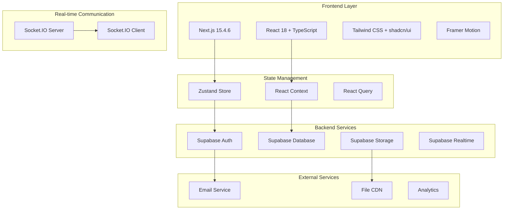

# 🔧 Documentación Técnica - StartupMatch

## 🏗️ Arquitectura del Sistema

### Overview General
StartupMatch utiliza una arquitectura moderna de full-stack con React/Next.js en el frontend y Supabase como backend-as-a-service, complementado con Socket.IO para comunicación en tiempo real.



---

## 🛠️ Stack Tecnológico Detallado

### Frontend
```json
{
  "framework": "Next.js 15.4.6",
  "runtime": "React 18.3.1",
  "language": "TypeScript 5.5.4",
  "styling": "Tailwind CSS 3.4.10",
  "ui_components": "shadcn/ui",
  "animations": "Framer Motion 11.3.21",
  "state_management": ["Zustand 4.5.4", "React Context API"],
  "forms": "React Hook Form",
  "routing": "Next.js App Router",
  "icons": "Lucide React 0.427.0"
}
```

### Backend & Services
```json
{
  "database": "Supabase (PostgreSQL 15)",
  "authentication": "Supabase Auth",
  "realtime": ["Socket.IO 4.7.5", "Supabase Realtime"],
  "file_storage": "Supabase Storage",
  "email": "Supabase Email Templates",
  "api": "Next.js API Routes",
  "orm": "Supabase Client SDK"
}
```

### DevOps & Tools
```json
{
  "package_manager": "npm",
  "bundler": "Next.js (Webpack + Turbopack)",
  "linting": "ESLint 8.57.0",
  "formatting": "Prettier 3.3.3",
  "git_hooks": "Husky + lint-staged",
  "deployment": "Vercel Ready",
  "environment": ".env.local"
}
```

---

## 📁 Estructura del Proyecto

### Directorio Principal
```
StartupMatch/
├── 📱 app/                    # App Router (Next.js 13+)
│   ├── 🔐 (auth)/             # Auth routes group
│   ├── 🏠 dashboard/          # Dashboard pages
│   ├── 🔍 explore/            # Profile discovery
│   ├── 🎯 matches/            # Match management
│   ├── 💬 messages/           # Real-time chat
│   ├── 👤 profile/            # User profiles
│   ├── ⚙️ settings/           # User settings
│   ├── 📡 api/                # API routes
│   └── 📄 globals.css         # Global styles
├── 🧩 components/             # Reusable components
│   ├── 🎨 ui/                 # shadcn/ui components
│   └── 📦 [feature]/          # Feature-specific components
├── 🎭 contexts/               # React contexts
├── 🪝 hooks/                  # Custom hooks
├── 📚 lib/                    # Utilities & config
├── 🏪 store/                  # Zustand stores
├── 🎯 types/                  # TypeScript definitions
├── 📖 docs/                   # Documentation
└── 🔧 config files            # Next.js, Tailwind, etc.
```

### Componentes Arquitectónicos

#### 1. **App Router Structure**
```typescript
// app/layout.tsx - Root layout
export default function RootLayout({ children }: {
  children: React.ReactNode
}) {
  return (
    <html lang="es">
      <body className={inter.className}>
        <AuthProvider>
          <div id="root">{children}</div>
          <Toaster />
        </AuthProvider>
      </body>
    </html>
  )
}

// app/dashboard/layout.tsx - Dashboard layout
export default function DashboardLayout({ children }: {
  children: React.ReactNode
}) {
  return (
    <div className="flex h-screen bg-gray-50">
      <Sidebar />
      <main className="flex-1 overflow-hidden">
        {children}
      </main>
    </div>
  )
}
```

#### 2. **Context Architecture**
```typescript
// contexts/AuthProvider.tsx
interface AuthContextType {
  user: User | null;
  signUp: (email: string, password: string, metadata: any) => Promise<AuthResponse>;
  signIn: (email: string, password: string) => Promise<AuthResponse>;
  signOut: () => Promise<void>;
  loading: boolean;
}

// contexts/SocketProvider.tsx
interface SocketContextType {
  socket: Socket | null;
  isConnected: boolean;
  sendMessage: (message: Message) => void;
  joinRoom: (roomId: string) => void;
  leaveRoom: (roomId: string) => void;
}
```

#### 3. **State Management Architecture**
```typescript
// store/appStore.ts - Global app state
interface AppState {
  // UI State
  sidebarCollapsed: boolean;
  theme: 'light' | 'dark';
  
  // User State
  currentUser: User | null;
  userPreferences: UserPreferences;
  
  // Navigation
  currentPage: string;
  breadcrumbs: Breadcrumb[];
  
  // Actions
  setSidebarCollapsed: (collapsed: boolean) => void;
  setTheme: (theme: 'light' | 'dark') => void;
  updateUserPreferences: (prefs: Partial<UserPreferences>) => void;
}

// store/chatStore.ts - Chat state
interface ChatState {
  conversations: Conversation[];
  activeConversation: string | null;
  messages: Record<string, Message[]>;
  typingUsers: Record<string, string[]>;
  
  // Actions
  setActiveConversation: (id: string) => void;
  addMessage: (conversationId: string, message: Message) => void;
  markAsRead: (conversationId: string) => void;
}
```

---

## 🔌 APIs y Integraciones

### Supabase Integration

#### 1. **Database Schema**
```sql
-- Users and Profiles
CREATE TABLE user_profiles (
    user_id UUID REFERENCES auth.users(id) PRIMARY KEY,
    username VARCHAR(50) UNIQUE NOT NULL,
    first_name VARCHAR(100),
    last_name VARCHAR(100),
    bio TEXT,
    company VARCHAR(100),
    title VARCHAR(100),
    location VARCHAR(100),
    industry VARCHAR(50),
    experience_level VARCHAR(20),
    avatar_url TEXT,
    created_at TIMESTAMP WITH TIME ZONE DEFAULT NOW(),
    updated_at TIMESTAMP WITH TIME ZONE DEFAULT NOW()
);

-- Skills
CREATE TABLE user_skills (
    id UUID DEFAULT gen_random_uuid() PRIMARY KEY,
    user_id UUID REFERENCES user_profiles(user_id),
    skill_name VARCHAR(50) NOT NULL,
    proficiency_level INTEGER CHECK (proficiency_level BETWEEN 1 AND 5),
    created_at TIMESTAMP WITH TIME ZONE DEFAULT NOW()
);

-- Conversations
CREATE TABLE conversations (
    id UUID DEFAULT gen_random_uuid() PRIMARY KEY,
    user1_id UUID REFERENCES user_profiles(user_id),
    user2_id UUID REFERENCES user_profiles(user_id),
    created_at TIMESTAMP WITH TIME ZONE DEFAULT NOW(),
    updated_at TIMESTAMP WITH TIME ZONE DEFAULT NOW()
);

-- Messages
CREATE TABLE private_messages (
    id UUID DEFAULT gen_random_uuid() PRIMARY KEY,
    conversation_id UUID REFERENCES conversations(id),
    sender_id UUID REFERENCES user_profiles(user_id),
    message TEXT NOT NULL,
    created_at TIMESTAMP WITH TIME ZONE DEFAULT NOW(),
    read_at TIMESTAMP WITH TIME ZONE,
    message_type VARCHAR(20) DEFAULT 'text'
);
```

#### 2. **Row Level Security (RLS)**
```sql
-- Enable RLS
ALTER TABLE user_profiles ENABLE ROW LEVEL SECURITY;
ALTER TABLE conversations ENABLE ROW LEVEL SECURITY;
ALTER TABLE private_messages ENABLE ROW LEVEL SECURITY;

-- Policies
CREATE POLICY "Users can view public profiles" ON user_profiles
    FOR SELECT USING (true);

CREATE POLICY "Users can update their own profile" ON user_profiles
    FOR UPDATE USING (auth.uid() = user_id);

CREATE POLICY "Users can view their conversations" ON conversations
    FOR SELECT USING (
        auth.uid() = user1_id OR auth.uid() = user2_id
    );

CREATE POLICY "Users can view their messages" ON private_messages
    FOR SELECT USING (
        EXISTS (
            SELECT 1 FROM conversations 
            WHERE id = conversation_id 
            AND (user1_id = auth.uid() OR user2_id = auth.uid())
        )
    );
```

#### 3. **Supabase Client Configuration**
```typescript
// lib/supabase.ts
import { createClient } from '@supabase/supabase-js';

const supabaseUrl = process.env.NEXT_PUBLIC_SUPABASE_URL!;
const supabaseAnonKey = process.env.NEXT_PUBLIC_SUPABASE_ANON_KEY!;

export const supabase = createClient(supabaseUrl, supabaseAnonKey, {
  auth: {
    autoRefreshToken: true,
    persistSession: true,
    detectSessionInUrl: true
  },
  realtime: {
    params: {
      eventsPerSecond: 10
    }
  }
});

// Types
export interface Database {
  public: {
    Tables: {
      user_profiles: {
        Row: UserProfile;
        Insert: Omit<UserProfile, 'created_at' | 'updated_at'>;
        Update: Partial<Omit<UserProfile, 'user_id' | 'created_at'>>;
      };
      conversations: {
        Row: Conversation;
        Insert: Omit<Conversation, 'id' | 'created_at' | 'updated_at'>;
        Update: Partial<Omit<Conversation, 'id' | 'created_at'>>;
      };
      private_messages: {
        Row: Message;
        Insert: Omit<Message, 'id' | 'created_at'>;
        Update: Partial<Omit<Message, 'id' | 'created_at'>>;
      };
    };
  };
}
```

### Socket.IO Integration

#### 1. **Server Configuration**
```typescript
// app/api/socketio/route.ts
import { Server as ServerIO } from 'socket.io';
import { NextRequest, NextResponse } from 'next/server';

const SocketHandler = async (req: NextRequest) => {
  const io = new ServerIO(httpServer, {
    path: '/api/socketio',
    addTrailingSlash: false,
    cors: {
      origin: process.env.NODE_ENV === 'production' ? process.env.NEXTAUTH_URL : "*",
      methods: ["GET", "POST"]
    }
  });

  io.on('connection', (socket) => {
    console.log(`🔌 Usuario conectado: ${socket.id}`);

    // Join user's personal room
    socket.on('join-user-room', (userId: string) => {
      socket.join(`user:${userId}`);
    });

    // Join conversation room
    socket.on('join-conversation', (conversationId: string) => {
      socket.join(`conversation:${conversationId}`);
    });

    // Handle messages
    socket.on('send-message', async (data) => {
      const { conversationId, message, userId } = data;
      
      // Save to database
      const { data: newMessage, error } = await supabase
        .from('private_messages')
        .insert({
          conversation_id: conversationId,
          sender_id: userId,
          message: message
        })
        .select()
        .single();

      if (!error) {
        // Broadcast to conversation room
        io.to(`conversation:${conversationId}`).emit('new-message', {
          id: newMessage.id,
          conversation_id: conversationId,
          sender_id: userId,
          message: message,
          created_at: newMessage.created_at
        });
      }
    });

    // Typing indicators
    socket.on('typing-start', (data) => {
      socket.to(`conversation:${data.conversationId}`)
            .emit('user-typing', { userId: data.userId });
    });

    socket.on('typing-stop', (data) => {
      socket.to(`conversation:${data.conversationId}`)
            .emit('user-stopped-typing', { userId: data.userId });
    });

    socket.on('disconnect', () => {
      console.log(`🔌 Usuario desconectado: ${socket.id}`);
    });
  });

  return new NextResponse('Socket server started', { status: 200 });
};

export { SocketHandler as GET, SocketHandler as POST };
```

#### 2. **Client Configuration**
```typescript
// hooks/useSocket.ts
import { useEffect, useState } from 'react';
import io, { Socket } from 'socket.io-client';

export const useSocket = (userId?: string) => {
  const [socket, setSocket] = useState<Socket | null>(null);
  const [isConnected, setIsConnected] = useState(false);

  useEffect(() => {
    const socketInstance = io(process.env.NEXT_PUBLIC_SITE_URL!, {
      path: '/api/socketio',
      addTrailingSlash: false,
    });

    socketInstance.on('connect', () => {
      console.log('🔌 Conectado al servidor Socket.IO');
      setIsConnected(true);
      
      if (userId) {
        socketInstance.emit('join-user-room', userId);
      }
    });

    socketInstance.on('disconnect', () => {
      console.log('🔌 Desconectado del servidor Socket.IO');
      setIsConnected(false);
    });

    setSocket(socketInstance);

    return () => {
      socketInstance.close();
    };
  }, [userId]);

  return { socket, isConnected };
};
```

---

## 🎨 Sistema de Componentes

### Design System Foundation

#### 1. **Tailwind Configuration**
```typescript
// tailwind.config.ts
import { Config } from 'tailwindcss';

const config: Config = {
  content: [
    './pages/**/*.{js,ts,jsx,tsx,mdx}',
    './components/**/*.{js,ts,jsx,tsx,mdx}',
    './app/**/*.{js,ts,jsx,tsx,mdx}',
  ],
  theme: {
    extend: {
      colors: {
        // Primary palette
        primary: {
          50: '#f8fafc',
          500: '#64748b',
          900: '#0f172a'
        },
        // Success palette
        success: {
          50: '#f0fdf4',
          500: '#10b981',
          700: '#047857'
        }
      },
      fontFamily: {
        sans: ['Inter', 'system-ui', 'sans-serif'],
      },
      animation: {
        'fade-in-up': 'fadeInUp 0.6s ease-out',
        'float': 'float 3s ease-in-out infinite',
      }
    },
  },
  plugins: [require('@tailwindcss/forms')],
};
```

#### 2. **Component Architecture**
```typescript
// components/ui/button.tsx
interface ButtonProps extends React.ButtonHTMLAttributes<HTMLButtonElement> {
  variant?: 'default' | 'destructive' | 'outline' | 'secondary' | 'ghost' | 'link';
  size?: 'default' | 'sm' | 'lg' | 'icon';
}

const Button = React.forwardRef<HTMLButtonElement, ButtonProps>(
  ({ className, variant = "default", size = "default", ...props }, ref) => {
    return (
      <button
        className={cn(buttonVariants({ variant, size, className }))}
        ref={ref}
        {...props}
      />
    );
  }
);

// Variants with cva (class-variance-authority)
const buttonVariants = cva(
  "inline-flex items-center justify-center rounded-md text-sm font-medium ring-offset-background transition-colors focus-visible:outline-none focus-visible:ring-2 focus-visible:ring-ring focus-visible:ring-offset-2 disabled:pointer-events-none disabled:opacity-50",
  {
    variants: {
      variant: {
        default: "bg-primary text-primary-foreground hover:bg-primary/90",
        destructive: "bg-destructive text-destructive-foreground hover:bg-destructive/90",
        outline: "border border-input bg-background hover:bg-accent hover:text-accent-foreground",
        secondary: "bg-secondary text-secondary-foreground hover:bg-secondary/80",
        ghost: "hover:bg-accent hover:text-accent-foreground",
        link: "text-primary underline-offset-4 hover:underline",
      },
      size: {
        default: "h-10 px-4 py-2",
        sm: "h-9 rounded-md px-3",
        lg: "h-11 rounded-md px-8",
        icon: "h-10 w-10",
      },
    },
    defaultVariants: {
      variant: "default",
      size: "default",
    },
  }
);
```

### Component Library

#### Core Components
```typescript
// Implemented components
const componentLibrary = {
  // Layout
  'Layout': 'Main app layout with sidebar',
  'Sidebar': 'Navigation sidebar with collapsible items',
  'Header': 'Top navigation with user menu',
  
  // UI Elements
  'Button': 'Multi-variant button component',
  'Card': 'Container component with header/content',
  'Badge': 'Status and category indicators',
  'Avatar': 'User profile images and initials',
  'Input': 'Form input with validation states',
  'Select': 'Dropdown selection component',
  'Dialog': 'Modal dialogs and overlays',
  
  // Data Display
  'Table': 'Data tables with sorting/filtering',
  'List': 'Formatted lists with actions',
  'Timeline': 'Activity and progress timelines',
  'Stats': 'Metrics and KPI displays',
  
  // Feedback
  'Toast': 'Notification messages',
  'Loading': 'Loading states and spinners',
  'Empty': 'Empty state illustrations',
  'Error': 'Error boundaries and messages',
  
  // Navigation
  'Breadcrumb': 'Navigation breadcrumbs',
  'Pagination': 'Page navigation controls',
  'Tabs': 'Content organization tabs',
  
  // Forms
  'FormField': 'Form field with label and validation',
  'Checkbox': 'Checkbox input component',
  'RadioGroup': 'Radio button groups',
  'Switch': 'Toggle switches'
};
```

---

## 🔒 Seguridad y Autenticación

### Security Architecture

#### 1. **Authentication Flow**
```typescript
// middleware.ts - Route protection
import { createMiddlewareClient } from '@supabase/auth-helpers-nextjs';
import { NextResponse } from 'next/server';
import type { NextRequest } from 'next/server';

export async function middleware(req: NextRequest) {
  const res = NextResponse.next();
  const supabase = createMiddlewareClient({ req, res });
  
  const {
    data: { session },
  } = await supabase.auth.getSession();

  // Protected routes
  const protectedPaths = ['/dashboard', '/matches', '/explore', '/messages', '/profile', '/settings'];
  const isProtectedPath = protectedPaths.some(path => req.nextUrl.pathname.startsWith(path));

  if (isProtectedPath && !session) {
    return NextResponse.redirect(new URL('/login', req.url));
  }

  // Redirect authenticated users from auth pages
  const authPaths = ['/login', '/register'];
  const isAuthPath = authPaths.some(path => req.nextUrl.pathname.startsWith(path));
  
  if (isAuthPath && session) {
    return NextResponse.redirect(new URL('/dashboard', req.url));
  }

  return res;
}

export const config = {
  matcher: ['/((?!api|_next/static|_next/image|favicon.ico).*)'],
};
```

#### 2. **Input Validation & Sanitization**
```typescript
// lib/validation.ts
import { z } from 'zod';

// User profile validation
export const userProfileSchema = z.object({
  firstName: z.string().min(1, 'First name is required').max(50),
  lastName: z.string().min(1, 'Last name is required').max(50),
  username: z.string().min(3, 'Username must be at least 3 characters').max(30),
  bio: z.string().max(500, 'Bio must be less than 500 characters').optional(),
  company: z.string().max(100).optional(),
  title: z.string().max(100).optional(),
  location: z.string().max(100).optional(),
  industry: z.string().max(50).optional()
});

// Message validation
export const messageSchema = z.object({
  message: z.string().min(1, 'Message cannot be empty').max(1000, 'Message too long'),
  conversationId: z.string().uuid('Invalid conversation ID'),
  messageType: z.enum(['text', 'image', 'file']).default('text')
});

// Sanitization utility
export const sanitizeInput = (input: string): string => {
  return input
    .trim()
    .replace(/<script\b[^<]*(?:(?!<\/script>)<[^<]*)*<\/script>/gi, '')
    .replace(/javascript:/gi, '')
    .replace(/on\w+\s*=/gi, '');
};
```

#### 3. **Error Handling**
```typescript
// lib/error-handler.ts
export class AppError extends Error {
  public readonly statusCode: number;
  public readonly isOperational: boolean;

  constructor(message: string, statusCode: number, isOperational: boolean = true) {
    super(message);
    this.statusCode = statusCode;
    this.isOperational = isOperational;
    
    Error.captureStackTrace(this, this.constructor);
  }
}

export const errorHandler = (error: AppError | Error, req: NextRequest) => {
  let message = 'Something went wrong';
  let statusCode = 500;

  if (error instanceof AppError) {
    message = error.message;
    statusCode = error.statusCode;
  }

  console.error('Error:', {
    message: error.message,
    stack: error.stack,
    url: req.url,
    method: req.method,
    timestamp: new Date().toISOString()
  });

  return NextResponse.json(
    { error: message, statusCode },
    { status: statusCode }
  );
};
```

---

## 📊 Performance y Optimización

### Performance Strategies

#### 1. **Code Splitting & Lazy Loading**
```typescript
// Lazy loaded components
const ExplorePage = dynamic(() => import('../explore/page'), {
  loading: () => <Loading />,
  ssr: false
});

const ChatArea = dynamic(() => import('../components/ChatArea'), {
  loading: () => <ChatSkeleton />
});
```

#### 2. **Image Optimization**
```typescript
// next.config.js
const nextConfig = {
  images: {
    domains: ['supabase-storage-url.com'],
    formats: ['image/webp', 'image/avif'],
    minimumCacheTTL: 60 * 60 * 24 * 30, // 30 days
  },
  experimental: {
    optimizeCss: true,
    optimizeServerReact: true,
  }
};
```

#### 3. **Database Optimization**
```sql
-- Indexes for performance
CREATE INDEX idx_user_profiles_username ON user_profiles(username);
CREATE INDEX idx_conversations_users ON conversations(user1_id, user2_id);
CREATE INDEX idx_messages_conversation ON private_messages(conversation_id, created_at);
CREATE INDEX idx_user_skills_user ON user_skills(user_id);

-- Composite indexes for complex queries
CREATE INDEX idx_profiles_industry_experience ON user_profiles(industry, experience_level);
CREATE INDEX idx_messages_unread ON private_messages(conversation_id, read_at) WHERE read_at IS NULL;
```

#### 4. **Caching Strategy**
```typescript
// lib/cache.ts
import { Redis } from 'ioredis';

const redis = new Redis(process.env.REDIS_URL);

export const cacheGet = async (key: string) => {
  try {
    const cached = await redis.get(key);
    return cached ? JSON.parse(cached) : null;
  } catch (error) {
    console.error('Cache get error:', error);
    return null;
  }
};

export const cacheSet = async (key: string, value: any, ttl: number = 300) => {
  try {
    await redis.setex(key, ttl, JSON.stringify(value));
  } catch (error) {
    console.error('Cache set error:', error);
  }
};

// Usage in API routes
export async function GET(request: NextRequest) {
  const cacheKey = `profiles:${searchParams.toString()}`;
  const cached = await cacheGet(cacheKey);
  
  if (cached) {
    return NextResponse.json(cached);
  }
  
  const profiles = await fetchProfiles(searchParams);
  await cacheSet(cacheKey, profiles, 600); // 10 minutes
  
  return NextResponse.json(profiles);
}
```

---

## 🧪 Testing Strategy

### Testing Architecture
```typescript
// jest.config.js
const nextJest = require('next/jest');

const createJestConfig = nextJest({
  dir: './',
});

const customJestConfig = {
  setupFilesAfterEnv: ['<rootDir>/jest.setup.js'],
  moduleNameMapping: {
    '^@/components/(.*)$': '<rootDir>/components/$1',
    '^@/app/(.*)$': '<rootDir>/app/$1',
    '^@/lib/(.*)$': '<rootDir>/lib/$1',
  },
  testEnvironment: 'jest-environment-jsdom',
  collectCoverageFrom: [
    'components/**/*.{js,jsx,ts,tsx}',
    'app/**/*.{js,jsx,ts,tsx}',
    'lib/**/*.{js,jsx,ts,tsx}',
    '!**/*.d.ts',
    '!**/node_modules/**',
  ],
  coverageThreshold: {
    global: {
      branches: 70,
      functions: 70,
      lines: 70,
      statements: 70,
    },
  },
};

module.exports = createJestConfig(customJestConfig);
```

---

## 🚀 Deployment & DevOps

### Deployment Configuration
```yaml
# .github/workflows/deploy.yml
name: Deploy to Production

on:
  push:
    branches: [main]

jobs:
  test:
    runs-on: ubuntu-latest
    steps:
      - uses: actions/checkout@v3
      - uses: actions/setup-node@v3
        with:
          node-version: '18'
      - run: npm ci
      - run: npm run test
      - run: npm run build

  deploy:
    needs: test
    runs-on: ubuntu-latest
    steps:
      - uses: actions/checkout@v3
      - uses: vercel/action@v28
        with:
          vercel-token: ${{ secrets.VERCEL_TOKEN }}
          vercel-org-id: ${{ secrets.ORG_ID }}
          vercel-project-id: ${{ secrets.PROJECT_ID }}
          vercel-args: '--prod'
```

---

**Última actualización**: Agosto 12, 2025  
**Versión de la documentación**: 1.0.0
